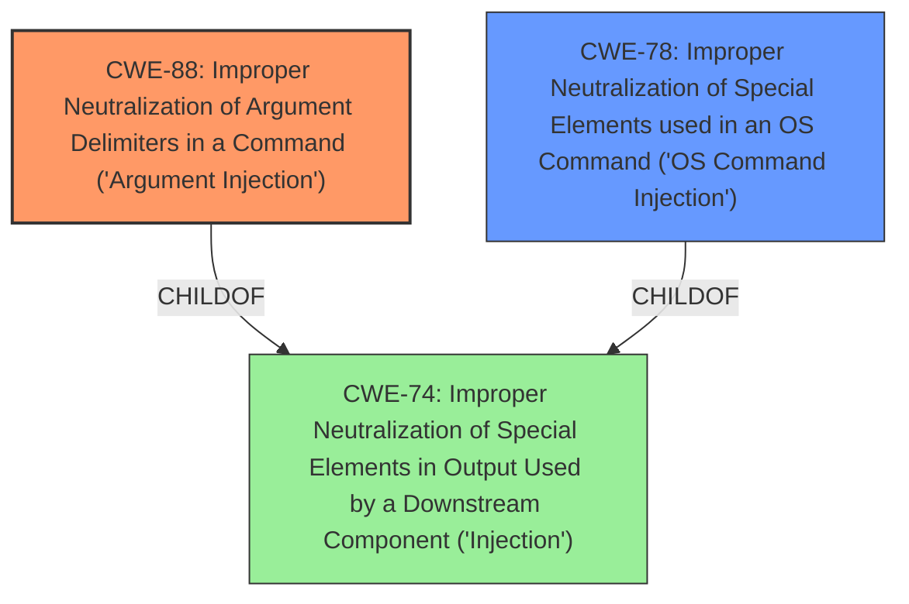

# Analysis Report for CVE-2024-52308

# Vulnerability Analysis Report: CVE-2024-52308

## Description

The GitHub CLI version 2.6.1 and earlier are vulnerable to remote code execution through a malicious codespace SSH server when using `gh codespace ssh` or `gh codespace logs` commands. This has been patched in the cli v2.62.0. Developers connect to remote codespaces through an SSH server running within the devcontainer, which is generally provided through the [default devcontainer image]( https//docs.github.com/en/codespaces/setting-up-your-project-for-codespaces/adding-a-dev-container-... https//docs.github.com/en/codespaces/setting-up-your-project-for-codespaces/adding-a-dev-container-configuration/introduction-to-dev-containers#using-the-default-dev-container-configuration) . GitHub CLI [retrieves SSH connection details]( https//github.com/cli/cli/blob/30066b0042d0c5928d959e288144300cb28196c9/internal/codespaces/rpc/inv... https//github.com/cli/cli/blob/30066b0042d0c5928d959e288144300cb28196c9/internal/codespaces/rpc/invoker.go#L230-L244 ), such as remote username, which is used in [executing `ssh` commands]( https//github.com/cli/cli/blob/e356c69a6f0125cfaac782c35acf77314f18908d/pkg/cmd/codespace/ssh.go#L2... https//github.com/cli/cli/blob/e356c69a6f0125cfaac782c35acf77314f18908d/pkg/cmd/codespace/ssh.go#L263 ) for `gh codespace ssh` or `gh codespace logs` commands. This exploit occurs when a malicious third-party devcontainer contains a modified SSH server that injects `ssh` arguments within the SSH connection details. `gh codespace ssh` and `gh codespace logs` commands could execute arbitrary code on the users workstation if the remote username contains something like `-oProxyCommand=echo hacked #`. The `-oProxyCommand` flag causes `ssh` to execute the provided command while `#` shell comment causes any other `ssh` arguments to be ignored. In `2.62.0`, the remote username information is being validated before being used.

## Vulnerability Description Key Phrases

- **Weakness:** improper input validation
- **Impact:** ['execute arbitrary code', 'remote code execution']
- **Vector:** malicious third-party devcontainer
- **Product:** GitHub CLI
- **Version:** 2.6.1 and earlier
- **Component:** gh codespace ssh and gh codespace logs commands

## Analysis (with Relationship Data)

# Summary
| CWE ID | CWE Name | Confidence | CWE Abstraction Level | CWE Vulnerability Mapping Label | CWE-Vulnerability Mapping Notes |
|---|---|---|---|---|---|
| CWE-88 | Improper Neutralization of Argument Delimiters in a Command ('Argument Injection') | 0.9 | Base | Allowed | Primary CWE: The root cause is the **improper neutralization of argument delimiters** in the command. |
| CWE-78 | Improper Neutralization of Special Elements used in an OS Command ('OS Command Injection') | 0.8 | Base | Allowed | Secondary: This is a specific type of command injection. |

## Evidence and Confidence

*   **Confidence Score:** 0.9
*   **Evidence Strength:** HIGH

## Relationship Analysis
The primary CWE is CWE-88 (Improper Neutralization of Argument Delimiters in a Command ('Argument Injection')). CWE-88 is a child of CWE-74 (Improper Neutralization of Special Elements in Output Used by a Downstream Component ('Injection')). CWE-78 (Improper Neutralization of Special Elements used in an OS Command ('OS Command Injection')) is also a child of CWE-74. The vulnerability is specifically related to command injection in an OS command, making CWE-78 a relevant secondary consideration, however the **improper neutralization of argument delimiters** is the root cause. Choosing CWE-88 offers a more precise classification of the root cause. The relationship shows the vulnerability arising from **improper neutralization**, leading to command injection.



## Vulnerability Chain
1.  **Root Cause:** **Improper input validation** of the remote username.
2.  **Weakness:** **Improper Neutralization of Argument Delimiters** (CWE-88)
3.  **Impact:** Arbitrary code execution on the user's workstation.

## Summary of Analysis
The initial analysis focused on identifying the root cause of the vulnerability. The vulnerability description and CVE Reference Links Content Summary clearly point to **improper input validation** as the core issue. The `gh` CLI tool **fails to properly sanitize the remote username**, allowing an attacker to inject malicious arguments into the `ssh` command.

The retriever results also listed CWE-78 (Improper Neutralization of Special Elements used in an OS Command ('OS Command Injection')) as a possible candidate. However, CWE-88 (Improper Neutralization of Argument Delimiters in a Command ('Argument Injection')) is a more precise fit because the vulnerability specifically involves injecting arguments into a command, and is the root cause. The vulnerability description states, "This exploit occurs when a malicious third-party devcontainer contains a modified SSH server that injects `ssh` arguments within the SSH connection details."

I am confident in my assessment because the evidence strongly supports the conclusion that the root cause is the **improper handling of argument delimiters**.

Relevant CWE Information:
- Vulnerability Description Key Phrases: "**weakness:** **improper input validation**"
- CVE Reference Links Content Summary: "**Insufficient Input Sanitization:** The primary weakness is the lack of sanitization or validation of the remote username obtained from the Codespace."
- CVE Reference Links Content Summary: "The vulnerability lies in how GitHub CLI handles SSH connection details retrieved from a Codespace. Specifically, the CLI does not properly sanitize the remote username before using it in an `ssh` command. This allows an attacker to inject malicious arguments into the `ssh` command via a crafted remote username."

Other CWEs Considered:
- CWE-78: While command injection is the impact, the root cause is the improper handling of arguments.
- CWE-74: This is a high-level class, and more specific CWEs are available.


## CWE Relationship Analysis

Current CWEs represent these abstraction levels: .


### Vulnerability Chain Analysis

**Chain starting from CWE-74:**
- 74 (Improper Neutralization of Special Elements in Output Used by a Downstream Component ('Injection')) - ROOT


**Chain starting from CWE-78:**
- 78 (Improper Neutralization of Special Elements used in an OS Command ('OS Command Injection')) - ROOT


### CWE Relationship Diagram

```mermaid
graph TD
    classDef primary fill:#f96,stroke:#333,stroke-width:2px
    classDef secondary fill:#69f,stroke:#333
    classDef tertiary fill:#9e9,stroke:#333
```


*Report generated on 2025-07-13 21:09:52*
