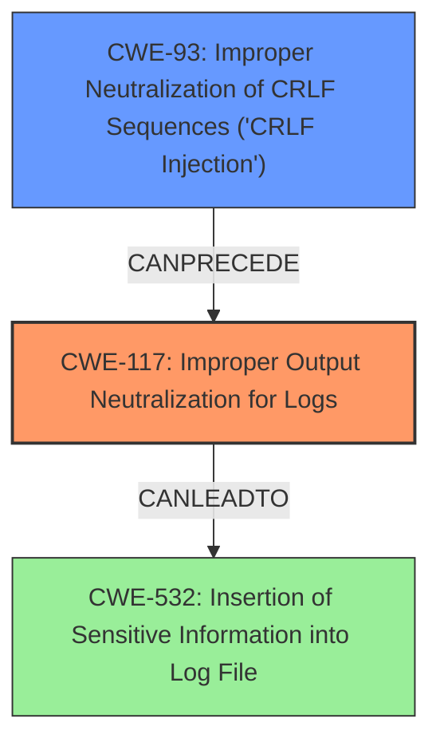

# Analysis for CVE-2024-52337

# Summary
| CWE ID | CWE Name | Confidence | CWE Abstraction Level | CWE Vulnerability Mapping Label | CWE-Vulnerability Mapping Notes |
|---|---|---|---|---|---|
| CWE-117 | Improper Output Neutralization for Logs | 0.9 | Base | Allowed | Primary CWE - Root Cause |
| CWE-93 | Improper Neutralization of CRLF Sequences ('CRLF Injection') | 0.7 | Base | Allowed | Secondary Candidate - Contributing Factor |
| CWE-532 | Insertion of Sensitive Information into Log File | 0.6 | Base | Allowed | Secondary Candidate - Impact |

## Evidence and Confidence

*   **Confidence Score:** 0.8
*   **Evidence Strength:** HIGH

## Relationship Analysis
The primary weakness is **CWE-117 Improper Output Neutralization for Logs**. This vulnerability stems from the `tuned` package's failure to properly sanitize API arguments before writing them to logs. **CWE-93 CRLF Injection** is a contributing factor because the **improper sanitization** allows for the injection of newline characters. The impact of the vulnerability is **CWE-532 Insertion of Sensitive Information into Log File** due to the log spoofing.

## Vulnerability Chain
The vulnerability chain starts with **CWE-117 Improper Output Neutralization for Logs**, the **root cause** which is the **improper sanitization of API arguments**. This leads to **CWE-93 Improper Neutralization of CRLF Sequences ('CRLF Injection')**, allowing an attacker to inject newline characters. The final impact is **CWE-532 Insertion of Sensitive Information into Log File**, resulting in log spoofing and potential terminal manipulation.

## Summary of Analysis
The analysis is based on the provided evidence, especially the "Vulnerability Description Key Phrases" and "CVE Reference Links Content Summary". The key phrase "**improper sanitization of API arguments**" points to a neutralization issue, and the summary confirms the **lack of input sanitization**.

The graph relationships helped to clarify the sequence of events. **CWE-117** is the primary weakness as it's the initial flaw. **CWE-93** contributes by allowing the injection, and **CWE-532** is the final impact.

The selected CWEs are at the optimal level of specificity. **CWE-117** is a Base CWE that directly addresses the **improper output neutralization** in logs. **CWE-93** is a Base CWE that highlights the specific type of injection. **CWE-532** is a Base CWE that accurately describes the insertion of sensitive information into the log file.

Relevant CWE Information:

*   **CWE-117 Improper Output Neutralization for Logs**: The product does not neutralize or incorrectly neutralizes output that is written to logs. This aligns perfectly with the vulnerability description, where the `tuned` package fails to sanitize API arguments before logging them.
*   **CWE-93 Improper Neutralization of CRLF Sequences ('CRLF Injection')**: The product uses CRLF (carriage return line feeds) as a special element, e.g. to separate lines or records, but it does not neutralize or incorrectly neutralizes CRLF sequences from inputs. The vulnerability allows injecting newline characters, which directly corresponds to this CWE.
*   **CWE-532 Insertion of Sensitive Information into Log File**: The product writes sensitive information to a log file. The log spoofing results in the insertion of attacker-controlled data into the logs, making this CWE relevant.

CWEs Considered but Not Used:

*   CWE-74, CWE-78, CWE-88, CWE-94, CWE-138, CWE-116: These are related to injection and improper neutralization, but they are either too general or focused on specific injection types (e.g., OS command injection, code injection) that don't precisely match the vulnerability. While there is injection of CRLF sequences (**CWE-93**), the **root cause** is the **improper output neutralization** for logs (**CWE-117**).
*   CWE-79: Improper Neutralization of Input During Web Page Generation ('Cross-site Scripting'): This is specific to web applications, so it is not relevant to this vulnerability.
*   CWE-532: While the end result is insertion into the log file, that is an impact of the root cause, so that is secondary.