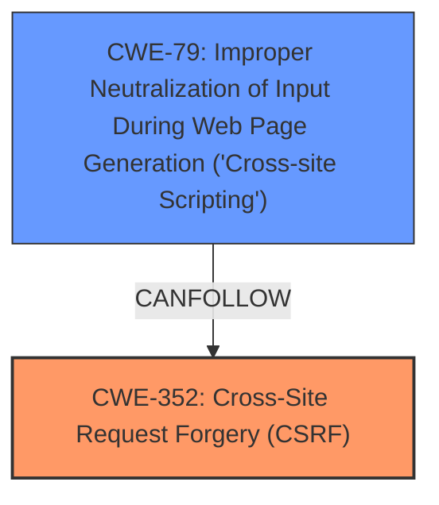

# Analysis for CVE-2024-52424

# Summary
| CWE ID  | CWE Name                                                                   | Confidence | CWE Abstraction Level | CWE Vulnerability Mapping Label | CWE-Vulnerability Mapping Notes |
| :-------- | :------------------------------------------------------------------------- | :--------- | :-------------------- | :------------------------------ | :------------------------------ |
| CWE-352   | Cross-Site Request Forgery (CSRF)                                        | 0.9        | Compound              | Primary                       | Allowed                       |
| CWE-79 | Improper Neutralization of Input During Web Page Generation ('Cross-site Scripting') | 0.9        | Base              | Secondary                       | Allowed                       |

## Evidence and Confidence

*   **Confidence Score:** 0.9
*   **Evidence Strength:** HIGH

## Relationship Analysis
The primary relationship is that the **lack of CSRF protection** (CWE-352) allows for a stored **XSS** vulnerability (CWE-79). CWE-352 is a compound weakness, representing multiple underlying issues. CWE-79 is a base weakness and is a direct result of the **lack of CSRF protection**. The Mermaid diagram illustrates this relationship.

## Vulnerability Chain
The vulnerability chain starts with the **lack of CSRF protection** (CWE-352). This allows an attacker to inject malicious input, which is then improperly neutralized during web page generation, leading to stored **XSS** (CWE-79).

*   Root Cause: **Lack of CSRF protection** (CWE-352)
*   Weakness: Improper Neutralization of Input (CWE-79)

## Summary of Analysis
The initial analysis identified two key weaknesses: **lack of CSRF protection** and stored **XSS**. The **lack of CSRF protection** allows an attacker to perform actions on behalf of a user without their consent, and the stored **XSS** allows the attacker to inject malicious scripts into the web page.

The primary CWE is CWE-352 because the **lack of CSRF protection** is the root cause that enables the **XSS** vulnerability. If CSRF protection were in place, the attacker would not be able to inject the malicious input. The secondary CWE is CWE-79 because it represents the specific type of vulnerability that occurs as a result of the **lack of CSRF protection**.

The evidence for this assessment is derived directly from the vulnerability description: "Cross-Site Request Forgery (CSRF) vulnerability ... allows Stored **XSS**." This statement clearly indicates that the **lack of CSRF protection** is the cause, and the **XSS** is the resulting vulnerability.

The selected CWEs are at the optimal level of specificity because they accurately represent the root cause and the specific type of vulnerability. CWE-352 is a compound weakness that captures the **lack of CSRF protection**, and CWE-79 is a base weakness that captures the stored **XSS** vulnerability.

Relevant CWE Information:

# Enhanced Context (25 CWEs)
The following CWEs were identified as potentially relevant to this vulnerability:

## CWE-80: Improper Neutralization of Script-Related HTML Tags in a Web Page (Basic XSS)
**Abstraction Level**: Variant
**Similarity Score**: 0.76

## CWE-472: External Control of Assumed-Immutable Web Parameter
**Abstraction Level**: Base
**Similarity Score**: 0.74

## CWE-425: Direct Request ('Forced Browsing')
**Abstraction Level**: Base
**Similarity Score**: 0.74

## CWE-116: Improper Encoding or Escaping of Output
**Abstraction Level**: Class
**Similarity Score**: 0.73

## CWE-451: User Interface (UI) Misrepresentation of Critical Information
**Abstraction Level**: Class
**Similarity Score**: 0.73

## CWE-807: Reliance on Untrusted Inputs in a Security Decision
**Abstraction Level**: Base
**Similarity Score**: 0.73

## CWE-74: Improper Neutralization of Special Elements in Output Used by a Downstream Component ('Injection')
**Abstraction Level**: Class
**Similarity Score**: 0.73

## CWE-1391: Use of Weak Credentials
**Abstraction Level**: Class
**Similarity Score**: 0.73

## CWE-303: Incorrect Implementation of Authentication Algorithm
**Abstraction Level**: Base
**Similarity Score**: 0.73

## CWE-184: Incomplete List of Disallowed Inputs
**Abstraction Level**: Base
**Similarity Score**: 0.73

## CWE-116: Improper Encoding or Escaping of Output
**Abstraction Level**: Class
**Similarity Score**: 2379.89

## CWE-89: Improper Neutralization of Special Elements used in an SQL Command ('SQL Injection')
**Abstraction Level**: Base
**Similarity Score**: 2375.06

## CWE-79: Improper Neutralization of Input During Web Page Generation ('Cross-site Scripting')
**Abstraction Level**: Base
**Similarity Score**: 2295.89

## CWE-434: Unrestricted Upload of File with Dangerous Type
**Abstraction Level**: Base
**Similarity Score**: 2290.02

## CWE-352: Cross-Site Request Forgery (CSRF)
**Abstraction Level**: Compound
**Similarity Score**: 2275.00

## CWE-79: Improper Neutralization of Input During Web Page Generation ('Cross-site Scripting')
**Abstraction Level**: base
**Similarity Score**: 4.59

## CWE-89: Improper Neutralization of Special Elements used in an SQL Command ('SQL Injection')
**Abstraction Level**: base
**Similarity Score**: 3.07

## CWE-471: Modification of Assumed-Immutable Data (MAID)
**Abstraction Level**: base
**Similarity Score**: 2.72

## CWE-425: Direct Request ('Forced Browsing')
**Abstraction Level**: Base
**Similarity Score**: 2.49

## CWE-434: Unrestricted Upload of File with Dangerous Type
**Abstraction Level**: Base
**Similarity Score**: 2.48

## CWE-601: URL Redirection to Untrusted Site ('Open Redirect')
**Abstraction Level**: base
**Similarity Score**: 2.33

## CWE-73: External Control of File Name or Path
**Abstraction Level**: base
**Similarity Score**: 2.21

## CWE-494: Download of Code Without Integrity Check
**Abstraction Level**: base
**Similarity Score**: 2.21

## CWE-183: Permissive List of Allowed Inputs
**Abstraction Level**: base
**Similarity Score**: 2.21

## CWE-385: Covert Timing Channel
**Abstraction Level**: base
**Similarity Score**: 2.21