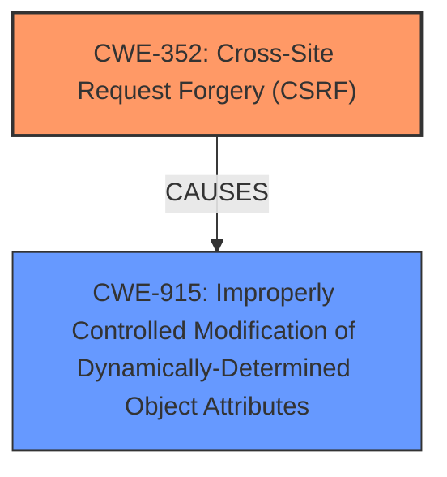

# Analysis Report for CVE-2024-52446

# Vulnerability Analysis Report: CVE-2024-52446

## Description

**Cross-Site Request Forgery** (CSRF) vulnerability in Buying Buddy Buying Buddy IDX CRM allows Object Injection.This issue affects Buying Buddy IDX CRM from n/a through 1.1.12.

## Vulnerability Description Key Phrases

- **Rootcause:** Cross-Site Request Forgery
- **Impact:** Object Injection
- **Product:** Buying Buddy IDX CRM
- **Version:** n/a through 1.1.12

## Analysis (with Relationship Data)

# Summary

| CWE ID | CWE Name | Confidence | CWE Abstraction Level | CWE Vulnerability Mapping Label | CWE-Vulnerability Mapping Notes |
|---|---|---|---|---|---|
| CWE-352 | Cross-Site Request Forgery (CSRF) | 1.0 | Compound | Allowed | Primary CWE |
| CWE-915 | Improperly Controlled Modification of Dynamically-Determined Object Attributes | 0.7 | Base | Allowed | Secondary Candidate |

## Evidence and Confidence

*   **Confidence Score:** 0.85
*   **Evidence Strength:** HIGH

## Relationship Analysis

The primary relationship is that CWE-352 [Cross-Site Request Forgery (CSRF)] represents the **rootcause** of the vulnerability. There's no direct parent-child or chain relationship evident between CWE-352 and CWE-915 [Improperly Controlled Modification of Dynamically-Determined Object Attributes]. The vulnerability involves CSRF leading to Object Injection, which can be seen as a form of uncontrolled modification of object attributes. The abstraction level influenced the selection in that a Compound CWE was selected because it fully encapsulates the **Cross-Site Request Forgery (CSRF)** vulnerability.



## Vulnerability Chain

The vulnerability chain starts with **Cross-Site Request Forgery (CSRF)** (CWE-352), which allows an attacker to induce an authenticated user into performing actions they did not intend. This leads to Object Injection, which can be mapped to CWE-915 [Improperly Controlled Modification of Dynamically-Determined Object Attributes]. The initial flaw is the **lack of CSRF** protection which causes the Object Injection.

## Summary of Analysis

The primary assessment is based on the vulnerability description, which explicitly states a "**Cross-Site Request Forgery (CSRF)** vulnerability" leading to "Object Injection". The "CVE Reference Links Content Summary" confirms that the **root_cause** is "**Cross-Site Request Forgery (CSRF)**" and the "weaknesses" include "**Cross-Site Request Forgery (CSRF)**".

CWE-352 [Cross-Site Request Forgery (CSRF)] is selected as the primary CWE because it directly reflects the stated vulnerability.

CWE-915 [Improperly Controlled Modification of Dynamically-Determined Object Attributes] is considered as a secondary CWE because the CSRF leads to unintended modification of object attributes.

The selected CWEs are at an appropriate level of specificity. CWE-352 [Cross-Site Request Forgery (CSRF)] is a Compound CWE, which is appropriate because it represents a combination of weaknesses. CWE-915 [Improperly Controlled Modification of Dynamically-Determined Object Attributes] is a Base CWE, which is also an appropriate level of abstraction.

The retriever results provided several CWEs that were considered but not ultimately selected as primary or secondary.
* CWE-89 [Improper Neutralization of Special Elements used in an SQL Command ('SQL Injection')], CWE-918 [Server-Side Request Forgery (SSRF)], CWE-601 [URL Redirection to Untrusted Site ('Open Redirect')], CWE-79 [Improper Neutralization of Input During Web Page Generation ('Cross-site Scripting')], CWE-113 [Improper Neutralization of CRLF Sequences in HTTP Headers ('HTTP Request/Response Splitting')], CWE-1275 [Sensitive Cookie with Improper SameSite Attribute], CWE-1004 [Sensitive Cookie Without 'HttpOnly' Flag], CWE-91 [XML Injection (aka Blind XPath Injection)], CWE-184 [Incomplete List of Disallowed Inputs] were not selected because they did not directly map to the described vulnerability of CSRF leading to Object Injection.

Relevant CWE Information:

# Enhanced Context (25 CWEs)
The following CWEs were identified as potentially relevant to this vulnerability:

## CWE-352: Cross-Site Request Forgery (CSRF)
**Abstraction Level**: Compound
**Similarity Score**: 0.73
**Source**: dense

**Description**:
The web application does not, or can not, sufficiently verify whether a well-formed, valid, consistent request was intentionally provided by the user who submitted the request.

**Mapping Guidance**:
- Usage: Allowed
- Rationale: This is a well-known Composite of multiple weaknesses that must all occur simultaneously, although it is attack-oriented in nature.

## CWE-425: Direct Request ('Forced Browsing')
**Abstraction Level**: Base
**Similarity Score**: 0.72
**Source**: dense

**Description**:
The web application does not adequately enforce appropriate authorization on all restricted URLs, scripts, or files.

**Mapping Guidance**:
- Usage: Allowed
- Rationale: This CWE entry is at the Base level of abstraction, which is a preferred level of abstraction for mapping to the root causes of vulnerabilities.

## CWE-472: External Control of Assumed-Immutable Web Parameter
**Abstraction Level**: Base
**Similarity Score**: 0.72
**Source**: dense

**Description**:
The web application does not sufficiently verify inputs that are assumed to be immutable but are actually externally controllable, such as hidden form fields.

**Mapping Guidance**:
- Usage: Allowed
- Rationale: This CWE entry is at the Base level of abstraction, which is a preferred level of abstraction for mapping to the root causes of vulnerabilities.

## CWE-80: Improper Neutralization of Script-Related HTML Tags in a Web Page (Basic XSS)
**Abstraction Level**: Variant
**Similarity Score**: 0.72
**Source**: dense

**Description**:
The product receives input from an upstream component, but it does not neutralize or incorrectly neutralizes special characters such as "<", ">", and "&" that could be interpreted as web-scripting elements when they are sent to a downstream component that processes web pages.

**Mapping Guidance**:
- Usage: Allowed
- Rationale: This CWE entry is at the Variant level of abstraction, which is a preferred level of abstraction for mapping to the root causes of vulnerabilities.

## CWE-74: Improper Neutralization of Special Elements in Output Used by a Downstream Component ('Injection')
**Abstraction Level**: Class
**Similarity Score**: 0.71
**Source**: dense

**Description**:
The product constructs all or part of a command, data structure, or record using externally-influenced input from an upstream component, but it does not neutralize or incorrectly neutralizes special elements that could modify how it is parsed or interpreted when it is sent to a downstream component.

**Mapping Guidance**:
- Usage: Discouraged
- Rationale: CWE-74 is high-level and often misused when lower-level weaknesses are more appropriate.

## CWE-918: Server-Side Request Forgery (SSRF)
**Abstraction Level**: Base
**Similarity Score**: 0.71
**Source**: dense

**Description**:
The web server receives a URL or similar request from an upstream component and retrieves the contents of this URL, but it does not sufficiently ensure that the request is being sent to the expected destination.

**Mapping Guidance**:
- Usage: Allowed
- Rationale: This CWE entry is at the Base level of abstraction, which is a preferred level of abstraction for mapping to the root causes of vulnerabilities.

## CWE-79: Improper Neutralization of Input During Web Page Generation ('Cross-site Scripting')
**Abstraction Level**: Base
**Similarity Score**: 0.71
**Source**: dense

**Description**:
The product does not neutralize or incorrectly neutralizes user-controllable input before it is placed in output that is used as a web page that is served to other users.

**Mapping Guidance**:
- Usage: Allowed
- Rationale: This CWE entry is at the Base level of abstraction, which is a preferred level of abstraction for mapping to the root causes of vulnerabilities.

## CWE-116: Improper Encoding or Escaping of Output
**Abstraction Level**: Class
**Similarity Score**: 0.71
**Source**: dense

**Description**:
The product prepares a structured message for communication with another component, but encoding or escaping of the data is either missing or done incorrectly. As a result, the intended structure of the message is not preserved.

**Mapping Guidance**:
- Usage: Allowed-with-Review
- Rationale: This CWE entry is a Class and might have Base-level children that would be more appropriate

## CWE-639: Authorization Bypass Through User-Controlled Key
**Abstraction Level**: Base
**Similarity Score**: 0.70
**Source**: dense

**Description**:
The system's authorization functionality does not prevent one user from gaining access to another user's data or record by modifying the key value identifying the data.

**Mapping Guidance**:
- Usage: Allowed
- Rationale: This CWE entry is at the Base level of abstraction, which is a preferred level of abstraction


## CWE Relationship Analysis

Current CWEs represent these abstraction levels: .


### Vulnerability Chain Analysis

**Chain starting from CWE-89:**
- 89 (Improper Neutralization of Special Elements used in an SQL Command ('SQL Injection')) - ROOT


**Chain starting from CWE-91:**
- 91 (XML Injection (aka Blind XPath Injection)) - ROOT


### CWE Relationship Diagram

```mermaid
graph TD
    classDef primary fill:#f96,stroke:#333,stroke-width:2px
    classDef secondary fill:#69f,stroke:#333
    classDef tertiary fill:#9e9,stroke:#333
```


*Report generated on 2025-07-13 21:16:01*
