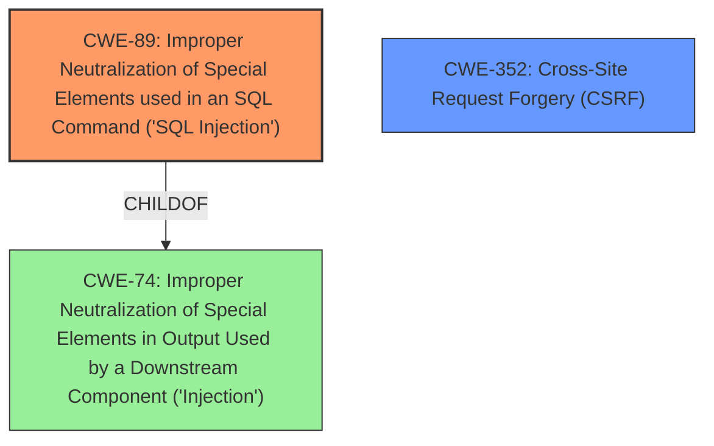

# Analysis for CVE-2024-52451

# Summary
| CWE ID | CWE Name | Confidence | CWE Abstraction Level | CWE Vulnerability Mapping Label | CWE-Vulnerability Mapping Notes |
|---|---|---|---|---|---|
| CWE-89 | Improper Neutralization of Special Elements used in an SQL Command ('SQL Injection') | 1.0 | Base | Primary | Allowed |
| CWE-352 | Cross-Site Request Forgery (CSRF) | 0.7 | Compound | Secondary | Allowed |

## Evidence and Confidence

*   **Confidence Score:** 0.85
*   **Evidence Strength:** HIGH

## Relationship Analysis
The primary weakness is **SQL Injection** (CWE-89), which is a child of the broader category **Improper Neutralization of Special Elements in Output Used by a Downstream Component ('Injection')** (CWE-74). The vulnerability description also mentions a **lack of CSRF protection**, which leads to the secondary weakness **Cross-Site Request Forgery (CSRF)** (CWE-352). These two CWEs are largely independent, though CWE-352 can sometimes enable or exacerbate other vulnerabilities.

## Vulnerability Chain
The vulnerability chain starts with the **lack of CSRF protection** (CWE-352), which allows an attacker to potentially inject malicious SQL commands. This leads to **Improper Neutralization of Special Elements used in an SQL Command ('SQL Injection')** (CWE-89) and can lead to information theft.

## Summary of Analysis
The primary vulnerability present is **SQL Injection** (CWE-89) due to the **lack of input validation or sanitization** when constructing SQL queries. This is supported by the vulnerability description, which explicitly mentions "SQL Injection" as the weakness, and the CVE Reference Links Content Summary, which states "The Post Ideas WordPress plugin is vulnerable to SQL Injection." Additionally, the **lack of CSRF protection** (CWE-352) is a secondary vulnerability as the issue would not be able to execute if the user session had proper CSRF protection.

The retriever results also support **SQL Injection** (CWE-89) as the top candidate, with a score of 1.000.

**CWE-89** is selected because it accurately represents the **root cause** of the vulnerability, which is the **improper neutralization** of special elements used in SQL commands. This allows attackers to inject arbitrary SQL code, potentially leading to unauthorized data access or modification. The evidence for this mapping comes directly from the vulnerability description and the CVE Reference Links Content Summary.

**CWE-352** is also selected as a secondary weakness because the vulnerability description mentions a Cross-Site Request Forgery (CSRF) vulnerability. The retriever results also support this.

Other CWEs Considered:

*   CWE-79 (**Improper Neutralization of Input During Web Page Generation ('Cross-site Scripting')**): While XSS is a common web vulnerability, it doesn't directly fit the description of this particular vulnerability, which focuses on SQL Injection.
*   CWE-434 (**Unrestricted Upload of File with Dangerous Type**): This CWE is not relevant as the vulnerability does not involve file uploads.
*   CWE-601 (**URL Redirection to Untrusted Site ('Open Redirect')**): This CWE is not relevant as the vulnerability does not involve URL redirection.
*   CWE-96 (**Improper Neutralization of Directives in Statically Saved Code ('Static Code Injection')**): This CWE is not relevant as the vulnerability is SQL Injection, not static code injection.
*   CWE-73 (**External Control of File Name or Path**): This CWE is not relevant as the vulnerability does not involve file names or paths.