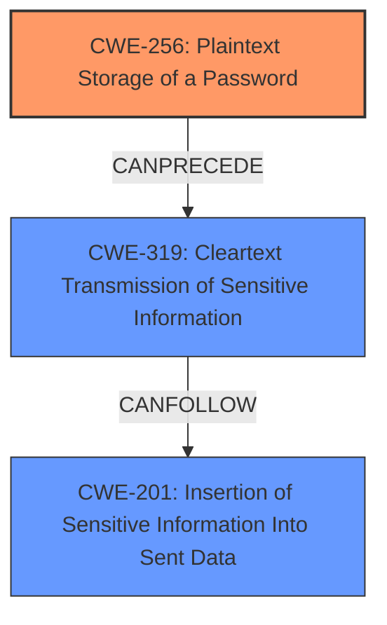

# Raw Analyzer Response for CVE-2024-52517

# Summary

| CWE ID | CWE Name | Confidence | CWE Abstraction Level | CWE Vulnerability Mapping Label | CWE-Vulnerability Mapping Notes |
|---|---|---|---|---|---|
| CWE-256 | Plaintext Storage of a Password | 1.0 | Base | Allowed | Primary CWE. The credentials are stored in plain text and then exposed. |
| CWE-319 | Cleartext Transmission of Sensitive Information | 0.7 | Base | Allowed | Secondary CWE. The credentials are sent to the frontend in plaintext. |
| CWE-201 | Insertion of Sensitive Information Into Sent Data | 0.6 | Base | Allowed | Secondary CWE. Sensitive information is sent to the frontend. |

## Evidence and Confidence

*   **Confidence Score:** 0.8
*   **Evidence Strength:** HIGH

## Relationship Analysis
The primary weakness is **CWE-256 Plaintext Storage of a Password** because the credentials are **stored in plain text** on the server. This leads to the secondary weakness of **CWE-319 Cleartext Transmission of Sensitive Information** as the credentials are then sent to the frontend without encryption or proper protection. **CWE-201 Insertion of Sensitive Information Into Sent Data** is also applicable, as the credentials are being sent to an actor (the frontend) that should not have access to them in plaintext.

## Vulnerability Chain
The vulnerability chain starts with **CWE-256 Plaintext Storage of a Password**. Because the global credentials are **stored in plain text**, they are then exposed via the API. This leads to **CWE-319 Cleartext Transmission of Sensitive Information**, as the credentials are sent to the frontend in plaintext. Finally, **CWE-201 Insertion of Sensitive Information Into Sent Data** occurs, as the credentials are sent to an actor that should not have access to them.

## Summary of Analysis
The analysis is based on the provided evidence, specifically the description stating that after **storing Global credentials on the server**, the API returns them and adds them into the frontend again, allowing to **read them in plain text**.

The graph relationships highlight the flow of the vulnerability: the initial **storage in plain text** directly leads to the exposure and transmission of the sensitive data.

The selected CWEs are at the optimal level of specificity because they accurately represent the specific weaknesses present in the vulnerability: **plaintext storage**, **cleartext transmission**, and **insertion of sensitive information** into sent data.

**CWE-256: Plaintext Storage of a Password** is the most specific and accurate representation of the root cause, as it directly addresses the **storage of credentials in plain text**.

**CWE-319: Cleartext Transmission of Sensitive Information** is included because the vulnerability involves sending the **stored credentials in plaintext to the frontend**.

**CWE-201: Insertion of Sensitive Information Into Sent Data** is included because the vulnerability description indicates that the API returns the stored "Global credentials", so sending them to the frontend is inappropriate.

Other CWEs Considered but Not Used:

*   CWE-532: Insertion of Sensitive Information into Log File - While sensitive information is exposed, it's not explicitly stated that it's being logged.
*   CWE-209: Generation of Error Message Containing Sensitive Information - The vulnerability is not about error messages.
*   CWE-1390: Weak Authentication - The vulnerability is not about weak authentication mechanisms.
*   CWE-522: Insufficiently Protected Credentials - While related, the core issue is the **plaintext storage** and transmission, making **CWE-256** and **CWE-319** more specific.
*   CWE-639: Authorization Bypass Through User-Controlled Key - The vulnerability is not about authorization bypass.
*   CWE-93: Improper Neutralization of CRLF Sequences ('CRLF Injection') - This is not relevant to the vulnerability.
*   CWE-117: Improper Output Neutralization for Logs - The vulnerability doesn't explicitly involve logging.