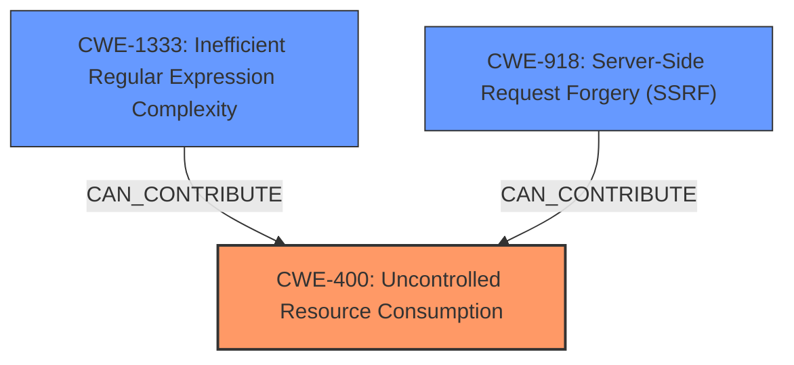

# Analysis Report for CVE-2024-52520

# Vulnerability Analysis Report: CVE-2024-52520

## Description

Nextcloud Server is a self hosted personal cloud system. Due to a pre-flighted HEAD request, the link reference provider could be tricked into downloading bigger websites than intended, to find open-graph data. It is recommended that the Nextcloud Server is upgraded to 28.0.10 or 29.0.7 and Nextcloud Enterprise Server is upgraded to 27.1.11.8, 28.0.10 or 29.0.7.

## Vulnerability Description Key Phrases

- **Product:** Nextcloud Server
- **Component:** link reference provider

## Analysis (with Relationship Data)

# Summary
| CWE ID | CWE Name | Confidence | CWE Abstraction Level | CWE Vulnerability Mapping Label | CWE-Vulnerability Mapping Notes |
|---|---|---|---|---|---|
| CWE-400 | Uncontrolled Resource Consumption | 0.9 | Base | Allowed | Primary CWE. The Nextcloud server consumes excessive bandwidth and resources due to downloading large files. |
| CWE-1333 | Inefficient Regular Expression Complexity | 0.6 | Base | Allowed | Secondary candidate. The link reference provider downloads bigger websites than intended, to find open-graph data. |
| CWE-918 | Server-Side Request Forgery (SSRF) | 0.4 | Base | Allowed | Secondary candidate. The web server receives a URL from an upstream component and retrieves the contents of this URL, but it does not sufficiently ensure that the request is being sent to the expected destination. |

## Evidence and Confidence

*   **Confidence Score:** 0.7
*   **Evidence Strength:** MEDIUM

## Relationship Analysis
The primary CWE is CWE-400, which represents the uncontrolled consumption of resources, specifically bandwidth and memory. CWE-1333 is considered as a contributing factor if the open-graph data extraction involves complex regex operations, thus exacerbating the resource consumption. CWE-918 is considered since the server is fetching external content without proper validation.



## Vulnerability Chain
The vulnerability chain starts with the Nextcloud server's **failure to properly validate the size of the linked resource** based on the HEAD request, which leads to downloading large files. This **uncontrolled resource consumption** can result in a denial-of-service condition. If the vulnerability were due to inefficient processing (regex) during data extraction, then CWE-1333 would be part of the chain. If Nextcloud is fetching external content without proper validation, then CWE-918 would be part of the chain.

## Summary of Analysis
The primary weakness is **uncontrolled resource consumption** (CWE-400) due to the **lack of proper size validation** of downloaded resources. The vulnerability description explicitly states that the link reference provider can be tricked into downloading bigger websites than intended, leading to excessive bandwidth and resource consumption.

The evidence supporting CWE-400 is: "the link reference provider could be tricked into downloading bigger websites than intended" and "An attacker can cause the Nextcloud server to download large files, potentially consuming excessive bandwidth and resources, leading to a denial-of-service condition."

The retriever results listed several CWEs related to sensitive information, such as CWE-209, CWE-532, and CWE-201, however, these are not relevant to the **root cause** of this vulnerability, which is the excessive consumption of resources.

CWE-918 was considered because the Nextcloud server is fetching external content. However, the primary issue is not the forgery of requests, but the **lack of proper validation of the size of the resource**, which leads to resource exhaustion. Therefore, CWE-400 is a more direct representation of the vulnerability.

CWE-1333 was considered because the link reference provider downloads bigger websites than intended, to find open-graph data. This could involve inefficient regex operations, thus exacerbating the resource consumption.

The selected CWEs are at the base level of abstraction, providing a specific and accurate representation of the vulnerabilities.


## CWE Relationship Analysis

Current CWEs represent these abstraction levels: .


### Vulnerability Chain Analysis

**Chain starting from CWE-400:**
- 400 (Uncontrolled Resource Consumption) - ROOT


**Chain starting from CWE-201:**
- 201 (Insertion of Sensitive Information Into Sent Data) - ROOT


### CWE Relationship Diagram

```mermaid
graph TD
    classDef primary fill:#f96,stroke:#333,stroke-width:2px
    classDef secondary fill:#69f,stroke:#333
    classDef tertiary fill:#9e9,stroke:#333
```


*Report generated on 2025-07-13 21:20:37*
