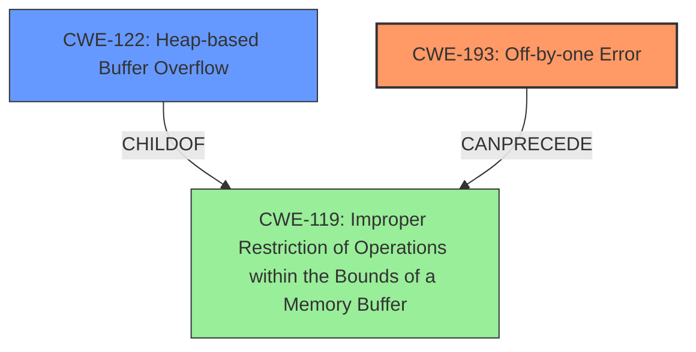

# Analysis for CVE-2024-52533

# Summary
| CWE ID | CWE Name | Confidence | CWE Abstraction Level | CWE Vulnerability Mapping Label | CWE-Vulnerability Mapping Notes |
|---|---|---|---|---|---|
| CWE-193 | Off-by-one Error | 0.9 | Base | Primary | Allowed |
| CWE-122 | Heap-based Buffer Overflow | 0.7 | Variant | Secondary | Allowed |

## Evidence and Confidence

*   **Confidence Score:** 0.8
*   **Evidence Strength:** HIGH

## Relationship Analysis
The primary CWE is CWE-193, which is a root cause leading to CWE-122, a heap-based buffer overflow. CWE-193 can precede CWE-119 (Improper Restriction of Operations within the Bounds of a Memory Buffer), which is a parent of CWE-122. This hierarchical and chain relationship supports mapping both the root cause (off-by-one) and the resulting buffer overflow. The abstraction levels are appropriate as CWE-193 is a Base and CWE-122 is a Variant, providing specific details about the vulnerability.

## Vulnerability Chain
The vulnerability chain starts with CWE-193 (**Off-by-one Error**) in the calculation of the buffer size. This leads to CWE-122 (**Heap-based Buffer Overflow**) when data is written beyond the allocated buffer in the heap. The initial **incorrect** calculation is the root cause, and the resulting overflow is the direct consequence.

## Summary of Analysis
The analysis is strongly based on the provided evidence, specifically the vulnerability description key phrases, which identifies the **off-by-one error** as the root cause and the **buffer overflow** as the weakness. The CVE Reference Links Content Summary confirms that the allocated buffer size (`SOCKS4_CONN_MSG_LEN`) does not account for the null terminator, leading to a write beyond the allocated buffer.

The graph relationships influenced the selection by highlighting the connection between the **off-by-one error** and the **buffer overflow**. The chosen CWEs are at the optimal level of specificity because they accurately represent the root cause (CWE-193) and the specific type of buffer overflow (CWE-122).

CWE-119 (Improper Restriction of Operations within the Bounds of a Memory Buffer) was considered but not selected as the primary CWE because it is a more general class. The vulnerability description and the CVE details point to a specific **off-by-one error** causing a heap-based overflow, making CWE-193 and CWE-122 more appropriate. CWE-120 was considered because it is a classic buffer overflow, but it was less specific than CWE-122 which indicated the overflow occurred on the heap.

Relevant CWE Information:

# Enhanced Context (25 CWEs)
The following CWEs were identified as potentially relevant to this vulnerability:

## CWE-193: Off-by-one Error
gio/gsocks4aproxy.c in GNOME GLib before 2.82.1 has an **off-by-one error** and resultant **buffer overflow** because SOCKS4_CONN_MSG_LEN is not sufficient for a trailing \0 character. The allocated buffer size (`SOCKS4_CONN_MSG_LEN`) does not account for the null terminator that is appended after the hostname during message construction, leading to writing one byte beyond the allocated buffer when the hostname is long enough.
#
The **off-by-one error** is the root cause of the **buffer overflow**, so CWE-193 is the best primary CWE.
## CWE-122: Heap-based Buffer Overflow
The function constructs a SOCKS4 connection message. The allocated buffer size (`SOCKS4_CONN_MSG_LEN`) does not account for the null terminator that is appended after the hostname during message construction. This leads to writing one byte beyond the allocated buffer when the hostname is long enough, which is a heap-based buffer overflow.
#
The **buffer overflow** occurred on the heap, so CWE-122 is the best secondary CWE.