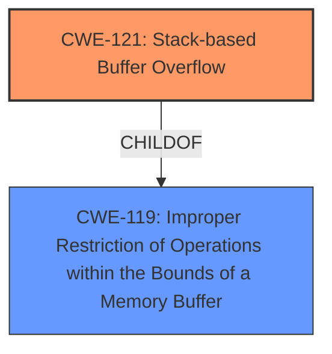

# Analysis for CVE-2024-52544

# Summary
| CWE ID | CWE Name | Confidence | CWE Abstraction Level | CWE Vulnerability Mapping Label | CWE-Vulnerability Mapping Notes |
|---|---|---|---|---|---|
| CWE-121 | Stack-based Buffer Overflow | 1.0 | Variant | Primary | Allowed |
| CWE-119 | Improper Restriction of Operations within the Bounds of a Memory Buffer | 0.7 | Class | Secondary | Discouraged |

## Evidence and Confidence

*   **Confidence Score:** 0.9
*   **Evidence Strength:** HIGH

## Relationship Analysis
The primary CWE is CWE-121, which is a variant of CWE-119. The hierarchical relationship indicates that CWE-121 provides more specific information about the location of the buffer overflow (stack) compared to CWE-119, which is a more general class. This specificity is warranted because the vulnerability description explicitly mentions a "stack based buffer overflow".

## Vulnerability Chain
The vulnerability chain starts with a **stack based buffer overflow** (CWE-121). This allows an unauthenticated attacker to overwrite memory. This leads to the ability to reset the admin password and eventually gain root-level access.

## Summary of Analysis
The initial assessment strongly points to CWE-121 due to the explicit mention of a "stack-based buffer overflow" in the vulnerability description. The retriever results also list CWE-121 as a candidate, although it is not the top-ranked one. However, given the direct reference in the vulnerability description and the fact that CWE-121 is a Variant of CWE-119, it is more specific and appropriate than the general CWE-119.

The final decision is based on the following evidence:

*   **Vulnerability Description:** "**stack based buffer overflow**"
*   **CVE Reference Links Content Summary:** "The vulnerability is a stack-based buffer overflow."
*   **Retriever Results:** Includes CWE-121 as a candidate.

CWE-121 is selected because it is at the Variant level of abstraction and directly matches the vulnerability description. CWE-119 is considered as a related weakness but is less specific.

Relevant CWE Information:

# Enhanced Context (25 CWEs)
The following CWEs were identified as potentially relevant to this vulnerability:

## CWE-119: Improper Restriction of Operations within the Bounds of a Memory Buffer
**Abstraction Level**: Class
**Similarity Score**: 0.76
**Source**: dense

**Description**:
The product performs operations on a memory buffer, but it reads from or writes to a memory location outside the buffer's intended boundary. This may result in read or write operations on unexpected memory locations that could be linked to other variables, data structures, or internal program data.

**Mapping Guidance**:
- Usage: Discouraged
- Rationale: CWE-119 is commonly misused in low-information vulnerability reports when lower-level CWEs could be used instead, or when more details about the vulnerability are available.

*Technical Explanation:*
CWE-119 (Improper Restriction of Operations within the Bounds of a Memory Buffer) describes a general class of buffer overflow vulnerabilities. While it's technically correct, it's less specific than CWE-121. The vulnerability involves writing data beyond the allocated buffer on the stack. The security implication is that an attacker can overwrite adjacent memory locations, potentially gaining control of the program's execution flow.
*CWE Relationships:*
CWE-121 is a child of CWE-119, making CWE-119 a more general classification.
*Mapping Guidance Influence:*
The MITRE mapping guidance discourages the use of CWE-119 when more specific CWEs are available. This further supports the selection of CWE-121.
*Why Not Primary?:*
While related, CWE-119 is not the primary CWE because the vulnerability description provides more specific information.

## CWE-121: Stack-based Buffer Overflow
**Abstraction Level**: Variant
**Similarity Score**: 0.75
**Source**: dense

**Description**:
A stack-based buffer overflow condition is a condition where the buffer being overwritten is allocated on the stack (i.e., is a local variable or, rarely, a parameter to a function).

*Technical Explanation:*
CWE-121 (Stack-based Buffer Overflow) is a specific type of buffer overflow where the overflow occurs on the stack. This usually involves overwriting local variables or function return addresses. The security implication is that an attacker can gain control of the program by hijacking the execution flow. This allows for arbitrary code execution.
*CWE Relationships:*
CWE-121 is a variant of CWE-119.
*Mapping Guidance Influence:*
The MITRE mapping guidance allows for the use of CWE-121.
*Why Primary?:*
CWE-121 is the primary CWE because the vulnerability description clearly states that it is a "stack-based buffer overflow". This is the most specific and accurate classification.

## Other Considered CWEs:
- CWE-120: Buffer Copy without Checking Size of Input ('Classic Buffer Overflow'): This CWE was considered but not selected because the description does not explicitly state that the vulnerability occurs due to a buffer copy operation without size checking. While this might be the underlying cause, the description focuses on the location (stack) and the overflow itself.
- CWE-131: Incorrect Calculation of Buffer Size: This CWE was considered but not selected because the vulnerability description does not provide information on whether the buffer size was incorrectly calculated. It simply states that a buffer overflow occurred on the stack.
- CWE-190: Integer Overflow or Wraparound: This CWE was considered but not selected because the description does not indicate that an integer overflow or wraparound is involved in the vulnerability.
- CWE-125: Out-of-bounds Read: This CWE was considered but not selected because the vulnerability involves writing past the buffer's boundary (overflow), not reading.
- CWE-787: Out-of-bounds Write: While related to buffer overflows in general, it does not specify the location of the overflow like CWE-121.