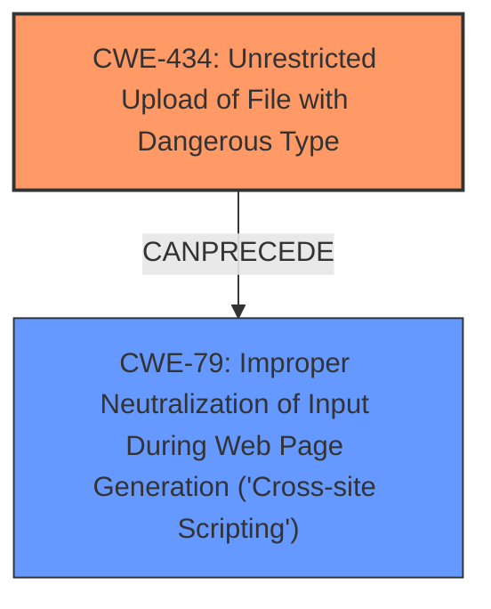

# Raw Analyzer Response for CVE-2024-5278

# Summary

| CWE ID   | CWE Name                                                               | Confidence | CWE Abstraction Level | CWE Vulnerability Mapping Label | CWE-Vulnerability Mapping Notes |
| :--------- | :--------------------------------------------------------------------- | :--------- | :-------------------- | :------------------------------ | :------------------------------ |
| CWE-434    | Unrestricted Upload of File with Dangerous Type                       | 1          | Base                  | Primary                         | Allowed                       |
| CWE-79     | Improper Neutralization of Input During Web Page Generation ('Cross-site Scripting') | 0.9          | Base                  | Secondary                       | Allowed                       |

## Evidence and Confidence

*   **Confidence Score:** 0.95
*   **Evidence Strength:** HIGH

## Relationship Analysis

The primary weakness is CWE-434 [CWE-434: Unrestricted Upload of File with Dangerous Type], which allows for the upload of arbitrary files. This can then lead to secondary weaknesses, such as CWE-79 [CWE-79: Improper Neutralization of Input During Web Page Generation ('Cross-site Scripting')] if the uploaded file contains malicious scripts that are not properly neutralized when displayed. The relationship is that CWE-434 can precede CWE-79. Both CWEs are at the Base level of abstraction, which is the preferred level.

## Vulnerability Chain

The vulnerability chain starts with **insufficient validation of uploaded file types** (CWE-434 [CWE-434: Unrestricted Upload of File with Dangerous Type]), which allows attackers to upload arbitrary files, including those containing **XSS** payloads. When these files are accessed, the **XSS** payload is executed in the user's browser (CWE-79 [CWE-79: Improper Neutralization of Input During Web Page Generation ('Cross-site Scripting')]), potentially leading to **remote code execution (RCE)**.

## Summary of Analysis

The analysis is based on the provided vulnerability description, which clearly states that the application **does not sanitize or validate the file extension or content type of uploaded files**. This aligns directly with the definition of CWE-434 [CWE-434: Unrestricted Upload of File with Dangerous Type]. The description also mentions the possibility of stored **XSS** attacks due to the **unrestricted file upload**, making CWE-79 [CWE-79: Improper Neutralization of Input During Web Page Generation ('Cross-site Scripting')] a relevant secondary weakness.

The relationship between CWE-434 [CWE-434: Unrestricted Upload of File with Dangerous Type] and CWE-79 [CWE-79: Improper Neutralization of Input During Web Page Generation ('Cross-site Scripting')] is that the former can lead to the latter. The **unrestricted file upload** allows for the introduction of malicious scripts, which are then executed due to the **improper neutralization of input**.

The selected CWEs are at the optimal level of specificity because they directly address the **root cause** (CWE-434 [CWE-434: Unrestricted Upload of File with Dangerous Type]) and a likely consequence (CWE-79 [CWE-79: Improper Neutralization of Input During Web Page Generation ('Cross-site Scripting')]).

CWE-22 [CWE-22: Improper Limitation of a Pathname to a Restricted Directory ('Path Traversal')] and CWE-23 [CWE-23: Relative Path Traversal] were considered because the vulnerability involves file uploads, but they were not selected because the description does not mention any path traversal issues. The vulnerability is about uploading dangerous file types, not about accessing files outside of a restricted directory.

CWE-138 [CWE-138: Improper Neutralization of Special Elements] was also considered, but it is a Class-level CWE and less specific than CWE-79 [CWE-79: Improper Neutralization of Input During Web Page Generation ('Cross-site Scripting')] for the **XSS** aspect of the vulnerability.

CWE-352 [CWE-352: Cross-Site Request Forgery (CSRF)] was considered, but it is not directly related to the vulnerability. The description does not mention any **CSRF** issues.

I am overriding the retriever results by selecting CWE-79 [CWE-79: Improper Neutralization of Input During Web Page Generation ('Cross-site Scripting')] as a secondary CWE, even though it has a lower score than other CWEs. This is because the description explicitly mentions the possibility of stored **XSS** attacks, making CWE-79 [CWE-79: Improper Neutralization of Input During Web Page Generation ('Cross-site Scripting')] a relevant secondary weakness.