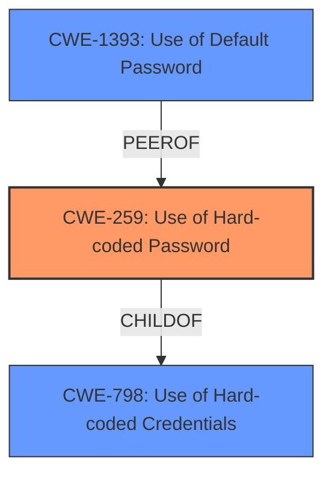

# Enhanced Analysis for CVE-2024-52789

# Summary
| CWE ID | CWE Name | Confidence | CWE Abstraction Level | CWE Vulnerability Mapping Label | CWE-Vulnerability Mapping Notes |
|---|---|---|---|---|---|
| CWE-259 | Use of Hard-coded Password | 1.0 | Variant | Primary | Allowed |
| CWE-798 | Use of Hard-coded Credentials | 0.7 | Base | Secondary Candidate | Allowed |
| CWE-1393 | Use of Default Password | 0.6 | Base | Secondary Candidate | Allowed |

## Evidence and Confidence

*   **Confidence Score:** 0.9
*   **Evidence Strength:** HIGH

## Relationship Analysis
The primary CWE is CWE-259, a variant of CWE-798. CWE-1393 is also related as a potential instance of weak credentials. The relationships suggest a path from generic credential issues (CWE-798) to more specific instances involving passwords (CWE-259, CWE-1393).



## Vulnerability Chain
The vulnerability chain starts with the **hardcoded password** (CWE-259), leading directly to the ability for attackers to log in as root. The root cause is the existence of the **hardcoded password**, and the impact is unauthorized root access.

## Summary of Analysis
The analysis is based on the provided evidence, which clearly states the presence of a **hardcoded password** in `/etc_ro/shadow`, allowing attackers to log in as root.

The primary CWE selected is CWE-259 (Use of Hard-coded Password), as it directly addresses the root cause described in the vulnerability. The relationships highlighted in the Enhanced Context further support this selection, specifically the child-of relationship with CWE-798.

CWE-798 (Use of Hard-coded Credentials) was considered but not selected as the primary because the description specifically mentions a password, making CWE-259 a more precise match. CWE-1393 (Use of Default Password) was considered a secondary candidate because while the password is hardcoded, it could also be considered a default. However, "hardcoded" is more directly supported by the vulnerability description.

The selected CWEs are at the optimal level of specificity because CWE-259 is a Variant, which is preferred, and accurately reflects the **weakness** (the use of a **hardcoded password**).

Relevant CWE Information:

# Enhanced Context (25 CWEs)
The following CWEs were identified as potentially relevant to this vulnerability:

## CWE-259: Use of Hard-coded Password
**Abstraction Level**: Variant
**Similarity Score**: 0.78
**Source**: dense

**Description**:
The product contains a **hard-coded password**, which it uses for its own inbound authentication or for outbound communication to external components.

**Mapping Guidance**:
- Usage: Allowed
- Rationale: This CWE entry is at the Variant level of abstraction, which is a preferred level of abstraction for mapping to the root causes of vulnerabilities.

**Technical Explanation**: The vulnerability description directly states that there is a **hardcoded password**. This aligns precisely with the description of CWE-259, which defines it as a product containing a **hardcoded password**. The security implication is that anyone who knows the password can gain unauthorized access. This is the primary **weakness**.
**Confidence:** 1.0

## CWE-798: Use of Hard-coded Credentials
**Abstraction Level**: Base
**Similarity Score**: 0.74
**Source**: dense

**Description**:
The product contains **hard-coded credentials**, such as a password or cryptographic key.

**Mapping Guidance**:
- Usage: Allowed
- Rationale: This CWE entry is at the Base level of abstraction, which is a preferred level of abstraction for mapping to the root causes of vulnerabilities.

**Technical Explanation**: This is a broader category that includes passwords. While the description mentions a "password," the more specific CWE-259 is preferred.
**Confidence:** 0.7

## CWE-1393: Use of Default Password
**Abstraction Level**: Base
**Similarity Score**: 0.70
**Source**: dense

**Description**:
The product uses default passwords for potentially critical functionality.

**Mapping Guidance**:
- Usage: Allowed
- Rationale: This CWE entry is at the Base level of abstraction, which is a preferred level of abstraction for mapping to the root causes of vulnerabilities.

**Technical Explanation**: This is a potential alternative if the **hardcoded password** is also the default. However, without further evidence, focusing on "hardcoded" is more accurate.
**Confidence:** 0.6

## CWE-321: Use of Hard-coded Cryptographic Key
**Abstraction Level**: Variant
**Similarity Score**: 0.71
**Source**: dense

**Description**:
The use of a **hard-coded cryptographic key** significantly increases the possibility that encrypted data may be recovered.

**Mapping Guidance**:
- Usage: Allowed
- Rationale: This CWE entry is at the Variant level of abstraction, which is a preferred level of abstraction for mapping to the root causes of vulnerabilities.

**Technical Explanation**: This is not the correct CWE since the vulnerability is related to a **password** and not a cryptographic key.
**Confidence:** 0

## CWE-288: Authentication Bypass Using an Alternate Path or Channel
**Abstraction Level**: Base
**Similarity Score**: 0.71
**Source**: dense

**Description**:
The product requires authentication, but the product has an alternate path or channel that does not require authentication.

**Mapping Guidance**:
- Usage: Allowed
- Rationale: This CWE entry is at the Base level of abstraction, which is a preferred level of abstraction for mapping to the root causes of vulnerabilities.

**Technical Explanation**: This is not the correct CWE because the vulnerability is due to a **hardcoded password**, not an authentication bypass.
**Confidence:** 0

## CWE-1188: Initialization of a Resource with an Insecure Default
**Abstraction Level**: Base
**Similarity Score**: 0.71
**Source**: dense

**Description**:
The product initializes or sets a resource with a default that is intended to be changed by the administrator, but the default is not secure.

**Mapping Guidance**:
- Usage: Allowed
- Rationale: This CWE entry is at the Base level of abstraction, which is a preferred level of abstraction for mapping to the root causes of vulnerabilities.

**Technical Explanation**: This CWE doesn't describe the **rootcause**, as it relates to the default value which might not be the case.
**Confidence:** 0

## CWE-425: Direct Request ('Forced Browsing')
**Abstraction Level**: Base
**Similarity Score**: 0.69
**Source**: dense

**Description**:
The web application does not adequately enforce appropriate authorization on all restricted URLs, scripts, or files.

**Mapping Guidance**:
- Usage: Allowed
- Rationale: This CWE entry is at the Base level of abstraction, which is a preferred level of abstraction for mapping to the root causes of vulnerabilities.

**Technical Explanation**: Not relevant as it is a direct request and not a **hardcoded password**.
**Confidence:** 0

## CWE-290: Authentication Bypass by Spoofing
**Abstraction Level**: Base
**Similarity Score**: 0.69
**Source**: dense

**Description**:
This attack-focused weakness is caused by incorrectly implemented authentication schemes that are subject to spoofing attacks.

**Mapping Guidance**:
- Usage: Allowed
- Rationale: This CWE entry is at the Base level of abstraction, which is a preferred level of abstraction for mapping to the root causes of vulnerabilities.

**Technical Explanation**: Not relevant as it is due to a spoofing attack and not a **hardcoded password**.
**Confidence:** 0


## CWE Relationship Analysis

Current CWEs represent these abstraction levels: .


### Vulnerability Chain Analysis

**Chain starting from CWE-288:**
- 288 (Authentication Bypass Using an Alternate Path or Channel) - ROOT


**Chain starting from CWE-321:**
- 321 (Use of Hard-coded Cryptographic Key) - ROOT


### CWE Relationship Diagram

```mermaid
graph TD
    classDef primary fill:#f96,stroke:#333,stroke-width:2px
    classDef secondary fill:#69f,stroke:#333
    classDef tertiary fill:#9e9,stroke:#333
```