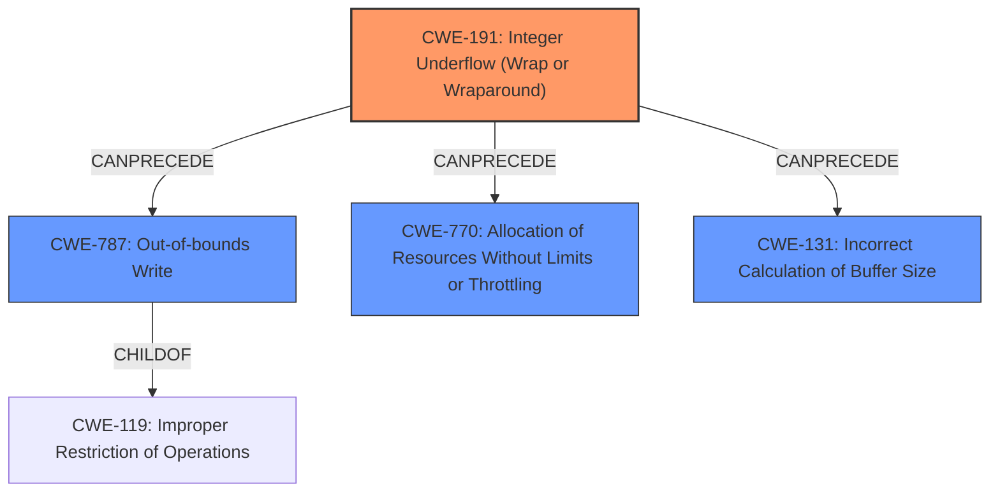

# Raw Analyzer Response for CVE-2024-52811

# Summary
| CWE ID    | CWE Name                                                          | Confidence | CWE Abstraction Level | CWE Vulnerability Mapping Label | CWE-Vulnerability Mapping Notes |
| :---------- | :---------------------------------------------------------------- | :--------- | :---------------------- | :------------------------------ | :------------------------------ |
| CWE-191     | Integer Underflow (Wrap or Wraparound)                            | 1.0        | Base                    | Primary                         | Allowed                       |
| CWE-787     | Out-of-bounds Write                                               | 0.9        | Base                    | Secondary                       | Allowed                       |
| CWE-770     | Allocation of Resources Without Limits or Throttling              | 0.7        | Base                    | Secondary                       | Allowed                       |
| CWE-131     | Incorrect Calculation of Buffer Size                               | 0.7        | Base                    | Secondary                       | Allowed                       |

## Evidence and Confidence

*   **Confidence Score:** 0.9
*   **Evidence Strength:** HIGH

## Relationship Analysis

The primary weakness is CWE-191 **Integer Underflow (Wrap or Wraparound)**, as the vulnerability description explicitly mentions this as the root cause. This leads to CWE-787 **Out-of-bounds Write**, which is a child of CWE-119 **Improper Restriction of Operations within the Bounds of a Memory Buffer**, occurring because of the **integer underflow**. CWE-770 **Allocation of Resources Without Limits or Throttling** and CWE-131 **Incorrect Calculation of Buffer Size** are also considered, as the vulnerability involves memory allocation and buffer size calculation, respectively, but they are not the direct root cause. The relationships are hierarchical, where CWE-191 leads to memory corruption.

## Vulnerability Chain

The vulnerability chain starts with an **integer underflow** (CWE-191) due to the subtraction of `largest_ack - first_ack_range` when `largest_ack` is 0 and `first_ack_range` is 15. This leads to a large positive value being used as the size. The code then assumes the number written is a signed integer and accounts for only 19 characters of overhead, while the **integer underflow** results in a 20-character value. This causes an overwrite of the buffer, resulting in a **heap overflow** (CWE-787).

Integer Underflow (CWE-191) -> Incorrect Buffer Size Calculation -> Out-of-bounds Write (CWE-787)

## Summary of Analysis

The analysis is strongly based on the provided evidence, especially the explicit mention of "**integer underflow**" and "**buffer overflow**". The vulnerability description clearly outlines the sequence of events, starting with the **integer underflow** and leading to a **heap overflow** due to an **out-of-bounds write**.

The graph relationships reinforce this understanding, as CWE-191 is identified as a cause that can precede CWE-787, CWE-770, and CWE-131.

CWE-191 is the most specific and accurate representation of the root cause, as it directly reflects the **integer underflow** that initiates the vulnerability. CWE-787 accurately describes the resulting **out-of-bounds write** that leads to the **heap overflow**.

The chosen CWEs are at the optimal level of specificity (Base) as they directly correspond to the described weaknesses.

# Enhanced Context (25 CWEs)
The following CWEs were identified as potentially relevant to this vulnerability:

## CWE-191: Integer Underflow (Wrap or Wraparound)
**Abstraction Level**: Base
**Similarity Score**: 0.74
**Source**: dense

**Description**:
The product subtracts one value from another, such that the result is less than the minimum allowable integer value, which produces a value that is not equal to the correct result.

**Mapping Guidance**:
- Usage: Allowed
- Rationale: This CWE entry is at the Base level of abstraction, which is a preferred level of abstraction for mapping to the root causes of vulnerabilities.

## CWE-131: Incorrect Calculation of Buffer Size
**Abstraction Level**: Base
**Similarity Score**: 0.73
**Source**: dense

**Description**:
The product does not correctly calculate the size to be used when allocating a buffer, which could lead to a buffer overflow.

**Mapping Guidance**:
- Usage: Allowed
- Rationale: This CWE entry is at the Base level of abstraction, which is a preferred level of abstraction for mapping to the root causes of vulnerabilities.

## CWE-789: Memory Allocation with Excessive Size Value
**Abstraction Level**: Variant
**Similarity Score**: 0.72
**Source**: dense

**Description**:
The product allocates memory based on an untrusted, large size value, but it does not ensure that the size is within expected limits, allowing arbitrary amounts of memory to be allocated.

**Mapping Guidance**:
- Usage: Allowed
- Rationale: This CWE entry is at the Variant level of abstraction, which is a preferred level of abstraction for mapping to the root causes of vulnerabilities.

## CWE-824: Access of Uninitialized Pointer
**Abstraction Level**: Base
**Similarity Score**: 0.71
**Source**: dense

**Description**:
The product accesses or uses a pointer that has not been initialized.

**Mapping Guidance**:
- Usage: Allowed
- Rationale: This CWE entry is at the Base level of abstraction, which is a preferred level of abstraction for mapping to the root causes of vulnerabilities.

## CWE-129: Improper Validation of Array Index
**Abstraction Level**: Variant
**Similarity Score**: 0.71
**Source**: dense

**Description**:
The product uses untrusted input when calculating or using an array index, but the product does not validate or incorrectly validates the index to ensure the index references a valid position within the array.

**Mapping Guidance**:
- Usage: Allowed
- Rationale: This CWE entry is at the Variant level of abstraction, which is a preferred level of abstraction for mapping to the root causes of vulnerabilities.

## CWE-130: Improper Handling of Length Parameter Inconsistency
**Abstraction Level**: Base
**Similarity Score**: 0.71
**Source**: dense

**Description**:
The product parses a formatted message or structure, but it does not handle or incorrectly handles a length field that is inconsistent with the actual length of the associated data.

**Mapping Guidance**:
- Usage: Allowed
- Rationale: This CWE entry is at the Base level of abstraction, which is a preferred level of abstraction for mapping to the root causes of vulnerabilities.

## CWE-120: Buffer Copy without Checking Size of Input ('Classic Buffer Overflow')
**Abstraction Level**: Base
**Similarity Score**: 0.71
**Source**: dense

**Description**:
The product copies an input buffer to an output buffer without verifying that the size of the input buffer is less than the size of the output buffer, leading to a buffer overflow.

**Mapping Guidance**:
- Usage: Allowed-with-Review
- Rationale: There are some indications that this CWE ID might be misused and selected simply because it mentions "buffer overflow" - an increasingly vague term. This CWE entry is only appropriate for "Buffer Copy" operations (not buffer reads), in which where there is no "Checking [the] Size of Input", and (by implication of the copy) writing past the end of the buffer.

## CWE-703: Improper Check or Handling of Exceptional Conditions
**Abstraction Level**: Pillar
**Similarity Score**: 0.71
**Source**: dense

**Description**:
The product does not properly anticipate or handle exceptional conditions that rarely occur during normal operation of the product.

**Mapping Guidance**:
- Usage: Discouraged
- Rationale: This CWE entry is extremely high-level, a Pillar.

## CWE-681: Incorrect Conversion between Numeric Types
**Abstraction Level**: Base
**Similarity Score**: 0.70
**Source**: dense

**Description**:
When converting from one data type to another, such as long to integer, data can be omitted or translated in a way that produces unexpected values. If the resulting