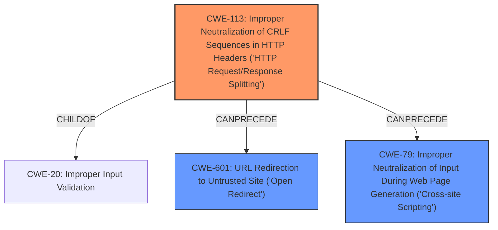

# Analysis Report for CVE-2024-52875

# Vulnerability Analysis Report: CVE-2024-52875

## Description

An issue was discovered in GFI Kerio Control 9.2.5 through 9.4.5. The dest GET parameter passed to the /nonauth/addCertException.cs and /nonauth/guestConfirm.cs and /nonauth/expiration.cs pages is not properly sanitized before being used to generate a Location HTTP header in a 302 HTTP response. This can be exploited to perform Open Redirect or HTTP Response Splitting attacks, which in turn lead to Reflected Cross-Site Scripting (XSS). Remote command execution can be achieved by leveraging the upgrade feature in the admin interface.

## Vulnerability Description Key Phrases

- **Component:** /nonauth/addCertException.cs, /nonauth/guestConfirm.cs, /nonauth/expiration.cs pages
- **Rootcause:** improper dest parameter sanitization
- **Weakness:** Open Redirect, HTTP Response Splitting
- **Product:** GFI Kerio Control
- **Impact:** Cross-Site Scripting, Reflected Cross-Site Scripting, command execution
- **Version:** 9.2.5 through 9.4.5

## Analysis (with Relationship Data)

# Summary

| CWE ID | CWE Name | Confidence | CWE Abstraction Level | CWE Vulnerability Mapping Label | CWE-Vulnerability Mapping Notes |
|---|---|---|---|---|---|
| CWE-113 | Improper Neutralization of CRLF Sequences in HTTP Headers ('HTTP Request/Response Splitting') | 0.9 | Variant | Allowed | Primary CWE: The application does not correctly filter/remove linefeed (LF) characters in the "dest" GET parameter when generating the "Location" HTTP header in a 302 HTTP response. |
| CWE-601 | URL Redirection to Untrusted Site ('Open Redirect') | 0.8 | Base | Allowed | Secondary: The "dest" parameter is used to construct a URL, and **improper sanitization** leads to redirection to an untrusted site. |
| CWE-79 | Improper Neutralization of Input During Web Page Generation ('Cross-site Scripting') | 0.7 | Base | Allowed | Secondary: HTTP Response Splitting can be leveraged to perform Reflected XSS. |

## Evidence and Confidence

*   **Confidence Score:** 0.8
*   **Evidence Strength:** HIGH

## Relationship Analysis

The primary weakness is CWE-113, as the root cause involves the **improper neutralization** of CRLF sequences. This leads to HTTP Response Splitting. CWE-601 is a related consequence, as the attacker can redirect the user to an untrusted site. CWE-79 is also a consequence, as the response splitting can be leveraged for reflected XSS. CWE-113 is a Variant of CWE-20 (Improper Input Validation).



## Vulnerability Chain

The vulnerability chain starts with the **improper sanitization** of the `dest` parameter (CWE-113), leading to HTTP Response Splitting. This can then be exploited to achieve Open Redirect (CWE-601) and Reflected XSS (CWE-79). Finally, the XSS can be used to perform Remote Code Execution (RCE) by leveraging the upgrade feature in the admin interface.

## Summary of Analysis

The analysis is based on the vulnerability description and the CVE reference links content summary. The root cause is the **improper sanitization** of the `dest` parameter, specifically the failure to filter/remove linefeed (LF) characters. This leads to HTTP Response Splitting (CWE-113), which can be exploited for Open Redirect (CWE-601) and Reflected XSS (CWE-79). The relationships between these CWEs are well-defined, with CWE-113 being the primary weakness and CWE-601 and CWE-79 being consequences of the response splitting.

The selected CWEs are at the optimal level of specificity. CWE-113 is a Variant, which is a preferred level of abstraction for mapping to the root causes of vulnerabilities. CWE-601 and CWE-79 are both Base level CWEs, which accurately represent the specific types of attacks that can be performed.

*   **CWE-923: Improper Restriction of Communication Channel to Intended Endpoints:** Not selected because the core issue isn't about restricting the communication channel, but about **improper sanitization** leading to HTTP response splitting and redirects.
*   **CWE-74: Improper Neutralization of Special Elements in Output Used by a Downstream Component ('Injection'):** Not selected because it's a high-level Class, and CWE-113 is a more specific Variant that directly addresses the CRLF injection.
*   **CWE-116: Improper Encoding or Escaping of Output:** Not selected as the issue is specifically about CRLF injection, not general encoding/escaping problems.
*   **CWE-425: Direct Request ('Forced Browsing'):** Not relevant.
*   **CWE-212: Improper Removal of Sensitive Information Before Storage or Transfer:** Not relevant.
*   **CWE-41: Improper Resolution of Path Equivalence:** Not relevant.
*   **CWE-668: Exposure of Resource to Wrong Sphere:** Not selected because it's too general. The vulnerability is more specific to HTTP response splitting and its consequences.
*   **CWE-918: Server-Side Request Forgery (SSRF):** Not relevant.
*   **CWE-138: Improper Neutralization of Special Elements:** Not selected as this is a Class level CWE, and CWE-113 is a more specific Variant.
*   **CWE-89: Improper Neutralization of Special Elements used in an SQL Command ('SQL Injection'):** Not relevant.
*   **CWE-434: Unrestricted Upload of File with Dangerous Type:** Not relevant.
*   **CWE-78: Improper Neutralization of Special Elements used in an OS Command ('OS Command Injection'):** Not relevant in this context.


## CWE Relationship Analysis

Current CWEs represent these abstraction levels: .


### Vulnerability Chain Analysis

**Chain starting from CWE-89:**
- 89 (Improper Neutralization of Special Elements used in an SQL Command ('SQL Injection')) - ROOT


**Chain starting from CWE-116:**
- 116 (Improper Encoding or Escaping of Output) - ROOT


### CWE Relationship Diagram

```mermaid
graph TD
    classDef primary fill:#f96,stroke:#333,stroke-width:2px
    classDef secondary fill:#69f,stroke:#333
    classDef tertiary fill:#9e9,stroke:#333
```


*Report generated on 2025-07-13 21:29:26*
