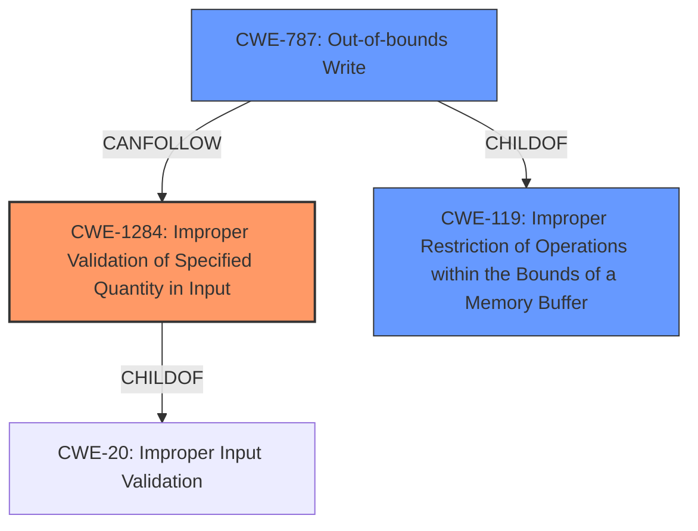

# Analysis Report for CVE-2024-52880

# Vulnerability Analysis Report: CVE-2024-52880

## Description

An issue was discovered in Insyde InsydeH2O kernel 5.2 before version 05.29.50, kernel 5.3 before version 05.38.50, kernel 5.4 before version 05.46.50, kernel 5.5 before version 05.54.50, kernel 5.6 before version 05.61.50, and kernel 5.7 before version 05.70.50. In VariableRuntimeDxe driver, **SecureBootHandler uses DataSize and VariableNameSize when determining if the data or name are in the buffer, but these are supplied by the caller and therefore cannot be trusted**.

## Vulnerability Description Key Phrases

- **Rootcause:** SecureBootHandler uses DataSize and VariableNameSize when determining if the data or name are in the buffer, but these are supplied by the caller and therefore cannot be trusted
- **Product:** Insyde InsydeH2O kernel
- **Version:** 5.2 before 05.29.50, 5.3 before 05.38.50, 5.4 before 05.46.50, 5.5 before 05.54.50, 5.6 before 05.61.50, and 5.7 before 05.70.50
- **Component:** VariableRuntimeDxe driver

## Analysis (with Relationship Data)

# Summary
| CWE ID | CWE Name | Confidence | CWE Abstraction Level | CWE Vulnerability Mapping Label | CWE-Vulnerability Mapping Notes |
|---|---|---|---|---|---|
| CWE-1284 | Improper Validation of Specified Quantity in Input | 0.8 | Base | Allowed | Primary CWE |
| CWE-787 | Out-of-bounds Write | 0.6 | Base | Allowed | Secondary Candidate |
| CWE-119 | Improper Restriction of Operations within the Bounds of a Memory Buffer | 0.4 | Class | Discouraged | Secondary Candidate |

## Evidence and Confidence

*   **Confidence Score:** 0.7
*   **Evidence Strength:** MEDIUM

## Relationship Analysis
The primary relationship that influenced my decision was the parent-child relationship between CWE-20 (Improper Input Validation) and CWE-1284 (Improper Validation of Specified Quantity in Input). CWE-1284 is a more specific type of input validation issue, dealing specifically with the validation of quantities like sizes or lengths, which aligns directly with the vulnerability description. CWE-787 (Out-of-bounds Write) is a potential consequence, but the root cause is the **lack of proper validation** of the `DataSize` and `VariableNameSize` parameters. CWE-119 is a general class for memory buffer errors and is less specific than CWE-787.



## Vulnerability Chain
The vulnerability chain starts with the **improper validation** of the `DataSize` and `VariableNameSize` parameters provided by the caller (CWE-1284). If these sizes are not properly validated, it can lead to an out-of-bounds write (CWE-787) when the `SecureBootHandler` attempts to use these sizes to determine if data or names are within the buffer.

## Summary of Analysis
The initial assessment strongly pointed to CWE-1284 as the primary weakness, given the explicit mention of untrusted `DataSize` and `VariableNameSize` parameters used in determining buffer boundaries. The analysis was based directly on the vulnerability description's key phrase: "**SecureBootHandler uses DataSize and VariableNameSize when determining if the data or name are in the buffer, but these are supplied by the caller and therefore cannot be trusted**." The CVE reference summary further emphasizes this by stating: "**Root cause of vulnerability: In VariableRuntimeDxe driver, SecureBootHandler uses DataSize and VariableNameSize when determining if the data or name are in the buffer, but these are supplied by the caller and therefore cannot be trusted.**"

While CWE-787 is a possible consequence, the root cause lies in the **lack of validation**. The graph relationships influenced the decision by highlighting the parent-child relationship between CWE-20 and CWE-1284, reinforcing the specificity of CWE-1284 for this vulnerability.

Relevant CWE Information:

# Enhanced Context (25 CWEs)
The following CWEs were identified as potentially relevant to this vulnerability:

## CWE Technical Explanations:

*   **CWE-1284: Improper Validation of Specified Quantity in Input**
    *   **Match:** The vulnerability involves using untrusted `DataSize` and `VariableNameSize` parameters without proper validation, directly relating to the improper validation of specified quantities.
    *   **Security Implications:** Allows attackers to potentially control the size of data written to or read from a buffer, leading to buffer overflows or other memory corruption issues.
    *   **Relationship:** ChildOf CWE-20 (Improper Input Validation).
    *   **Primary Weakness:** This is the primary weakness as it directly reflects the root cause described in the vulnerability description.
    *   **Mapping Guidance:** ALLOWED - Correct level of abstraction and accurate representation of the **root cause**.
*   **CWE-787: Out-of-bounds Write**
    *   **Match:** If the `DataSize` or `VariableNameSize` is not validated, it could result in writing data beyond the intended buffer boundaries.
    *   **Security Implications:** Memory corruption, potential for arbitrary code execution.
    *   **Relationship:** CanFollow CWE-1284 (as a consequence of improper input validation).
    *   **Secondary Weakness:** This is a potential consequence of the primary weakness.
    *   **Mapping Guidance:** ALLOWED - Correct level of abstraction, but represents a potential impact rather than the root cause.
*   **CWE-119: Improper Restriction of Operations within the Bounds of a Memory Buffer**
    *   **Match:** This is a more general class encompassing buffer overflows, but less specific than CWE-787 or CWE-1284.
    *   **Security Implications:** Similar to CWE-787.
    *   **Relationship:** ParentOf CWE-787
    *   **Secondary Weakness:** This is a more generalized description.
    *   **Mapping Guidance:** DISCOURAGED - Too general; more specific CWEs are available.

## CWEs Considered but Not Used:

*   **CWE-20: Improper Input Validation:** Considered but not used because CWE-1284 is a more specific child that better describes the **validation issue** related to sizes and quantities.
*   **CWE-1285: Improper Validation of Specified Index, Position, or Offset in Input:** While related, the vulnerability focuses on the size itself being untrusted, not necessarily the index, position, or offset calculated from that size.
*   **CWE-822: Untrusted Pointer Dereference:** Not directly applicable as the vulnerability doesn't explicitly mention the use of untrusted pointers.
*   **CWE-349: Acceptance of Extraneous Untrusted Data With Trusted Data:** The description of the vulnerability does not speak about extraneous data.
*   **CWE-122: Heap-based Buffer Overflow & CWE-121: Stack-based Buffer Overflow:** These are specific types of buffer overflows. The evidence does not give enough details to determine if the buffer is heap or stack based. It is more accurate to use the rootcause of the buffer overflow which is CWE-1284.


## CWE Relationship Analysis

Current CWEs represent these abstraction levels: .


### Vulnerability Chain Analysis

**Chain starting from CWE-1284:**
- 1284 (Improper Validation of Specified Quantity in Input) - ROOT


**Chain starting from CWE-121:**
- 121 (Stack-based Buffer Overflow) - ROOT


### CWE Relationship Diagram

```mermaid
graph TD
    classDef primary fill:#f96,stroke:#333,stroke-width:2px
    classDef secondary fill:#69f,stroke:#333
    classDef tertiary fill:#9e9,stroke:#333
```


*Report generated on 2025-07-13 21:29:45*
