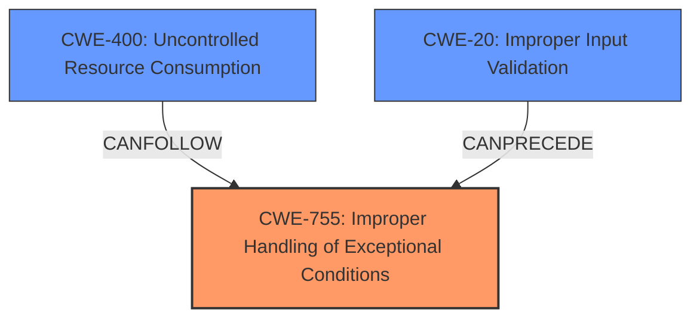

# Analysis for CVE-2024-52903

# Summary
| CWE ID | CWE Name | Confidence | CWE Abstraction Level | CWE Vulnerability Mapping Label | CWE-Vulnerability Mapping Notes |
|---|---|---|---|---|---|
| **CWE-755** | Improper Handling of Exceptional Conditions | 0.7 | Class | Primary | Discouraged: Choosing as primary due to the server crash condition, which is an exceptional condition not properly handled, and the lack of more specific root cause information. |
| CWE-400 | Uncontrolled Resource Consumption | 0.5 | Class | Secondary | Discouraged: Could be a result of the improper handling of exceptional conditions, leading to resource exhaustion. |
| CWE-20 | Improper Input Validation | 0.4 | Class | Secondary | Discouraged: A specially crafted query suggests potential input validation issues, but there isn't enough evidence to confirm this is the root cause. |

## Evidence and Confidence

*   **Confidence Score:** 0.6
*   **Evidence Strength:** MEDIUM

## Relationship Analysis
The primary weakness is classified as CWE-755 (Improper Handling of Exceptional Conditions), a Class-level CWE. CWE-400 (Uncontrolled Resource Consumption) and CWE-20 (Improper Input Validation) are considered secondary candidates. CWE-755 is a broad category, but the "server crash" condition indicates an exceptional circumstance not properly managed. While the "specially crafted query" points to input validation issues (CWE-20), the lack of specifics makes it a less confident mapping. CWE-400 might result from the improper handling, leading to resource exhaustion.

## Vulnerability Chain
The vulnerability chain starts with a **specially crafted query** (potential **Improper Input Validation**), which leads to an **Improper Handling of Exceptional Conditions** (server crash), potentially resulting in **Uncontrolled Resource Consumption** (Denial of Service). The chain isn't fully defined due to the intentional lack of detailed root cause information.

## Summary of Analysis
The initial assessment focused on identifying the root cause of the denial of service vulnerability in IBM Db2. The "specially crafted query" indicated a potential input validation issue, while the "server crash" pointed to improper handling of exceptional conditions. The lack of detailed vulnerability information limited the ability to pinpoint the exact root cause, leading to a lower confidence score.

The final decision was influenced by the evidence available, which highlighted the server crash as a direct result of the vulnerability. While **improper input validation** may be a contributing factor, the primary weakness lies in how the system handles the resulting exceptional condition. CWE-755 (Improper Handling of Exceptional Conditions) was selected as the primary CWE due to its direct relevance to the observed behavior.

The selection is at the Class level due to the limited information about the specific exceptional condition that is not being properly handled. More information could potentially allow for a selection of a more specific Base or Variant level CWE.

Relevant CWE Information:

# Enhanced Context (25 CWEs)
The following CWEs were identified as potentially relevant to this vulnerability:

## CWE-755: Improper Handling of Exceptional Conditions
**Abstraction Level**: Class
**Similarity Score**: 0.70
**Source**: dense

**Description**:
The product does not handle or incorrectly handles an exceptional condition.

**Mapping Guidance**:
- Usage: Discouraged
- Rationale: This CWE entry is a level-1 Class (i.e., a child of a Pillar). It might have lower-level children that would be more appropriate

**Explanation:** The server crash suggests that the system encounters an unexpected condition and fails to handle it gracefully. This aligns with the description of CWE-755.

## CWE-617: Reachable Assertion
**Abstraction Level**: Base
**Similarity Score**: 0.69
**Source**: dense

**Description**:
The product contains an assert() or similar statement that can be triggered by an attacker, which leads to an application exit or other behavior that is more severe than necessary.

**Mapping Guidance**:
- Usage: Allowed
- Rationale: This CWE entry is at the Base level of abstraction, which is a preferred level of abstraction for mapping to the root causes of vulnerabilities.

**Explanation:** Not selected. There's no explicit mention of assertions being triggered, so this isn't the best fit.

## CWE-918: Server-Side Request Forgery (SSRF)
**Abstraction Level**: Base
**Similarity Score**: 0.69
**Source**: dense

**Description**:
The web server receives a URL or similar request from an upstream component and retrieves the contents of this URL, but it does not sufficiently ensure that the request is being sent to the expected destination.

**Mapping Guidance**:
- Usage: Allowed
- Rationale: This CWE entry is at the Base level of abstraction, which is a preferred level of abstraction for mapping to the root causes of vulnerabilities.

**Explanation:** Not selected. This vulnerability involves a crafted query, not a server-side request.

## CWE-200: Exposure of Sensitive Information to an Unauthorized Actor
**Abstraction Level**: Class
**Similarity Score**: 0.69
**Source**: dense

**Description**:
The product exposes sensitive information to an actor that is not explicitly authorized to have access to that information.

**Mapping Guidance**:
- Usage: Discouraged
- Rationale: CWE-200 is commonly misused to represent the loss of confidentiality in a vulnerability, but confidentiality loss is a technical impact - not a root cause error. As of CWE 4.9, over 400 CWE entries can lead to a loss of confidentiality. Other options are often available. [REF-1287].

**Explanation:** Not selected. The vulnerability is a denial of service, not information exposure.

## CWE-400: Uncontrolled Resource Consumption
**Abstraction Level**: Class
**Similarity Score**: 0.69
**Source**: dense

**Description**:
The product does not properly control the allocation and maintenance of a limited resource, thereby enabling an actor to influence the amount of resources consumed, eventually leading to the exhaustion of available resources.

**Mapping Guidance**:
- Usage: Discouraged
- Rationale: CWE-400 is intended for incorrect behaviors in which the product is expected to track and restrict how many resources it consumes, but CWE-400 is often misused because it is conflated with the "technical impact" of vulnerabilities in which resource consumption occurs. It is sometimes used for low-information vulnerability reports. It is a level-1 Class (i.e., a child of a Pillar).

**Explanation:** Denial of service implies resource exhaustion. It is possible that the improper handling of exceptional conditions leads to uncontrolled resource consumption. Selected as a secondary CWE.

## CWE-1391: Use of Weak Credentials
**Abstraction Level**: Class
**Similarity Score**: 0.68
**Source**: dense

**Description**:
The product uses weak credentials (such as a default key or hard-coded password) that can be calculated, derived, reused, or guessed by an attacker.

**Mapping Guidance**:
- Usage: Allowed-with-Review
- Rationale: This CWE entry is a Class and might have Base-level children that would be more appropriate

**Explanation:** Not selected. This vulnerability does not involve weak credentials.

## CWE-119: Improper Restriction of Operations within the Bounds of a Memory Buffer
**Abstraction Level**: Class
**Similarity Score**: 0.68
**Source**: dense

**Description**:
The product performs operations on a memory buffer, but it reads from or writes to a memory location outside the buffer's intended boundary. This may result in read or write operations on unexpected memory locations that could be linked to other variables, data structures, or internal program data.

**Mapping Guidance**:
- Usage: Discouraged
- Rationale: CWE-119 is commonly misused in low-information vulnerability reports when lower-level CWEs could be used instead, or when more details about the vulnerability are available.

**Explanation:** Not selected. While memory corruption could be a factor leading to the crash, the description doesn't explicitly state buffer overflows.

## CWE-209: Generation of Error Message Containing Sensitive Information
**Abstraction Level**: Base
**Similarity Score**: 0.68
**Source**: dense

**Description**:
The product generates an error message that includes sensitive information about its environment, users, or associated data.

**Mapping Guidance**:
- Usage: Allowed
- Rationale: This CWE entry is at the Base level of abstraction, which is a preferred level of abstraction for mapping to the root causes of vulnerabilities.

**Explanation:** Not selected. The vulnerability is a denial of service, not information exposure via