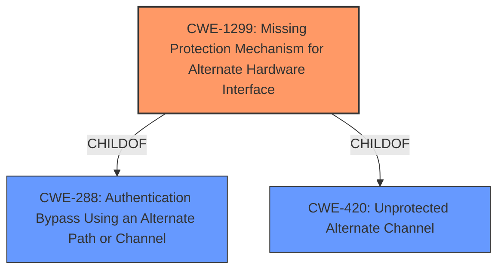

# Enhanced Analysis for CVE-2024-52925

# Summary

| CWE ID | CWE Name | Confidence | CWE Abstraction Level | CWE Vulnerability Mapping Label | CWE-Vulnerability Mapping Notes |
|---|---|---|---|---|---|
| CWE-1299 | Missing Protection Mechanism for Alternate Hardware Interface | 0.6 | Base | Allowed | Primary CWE |

## Evidence and Confidence

*   **Confidence Score:** 0.6
*   **Evidence Strength:** LOW

## Relationship Analysis

The primary focus is on identifying a missing protection mechanism. While other CWEs like CWE-345 (Insufficient Verification of Data Authenticity) are related, CWE-1299 best captures the core issue of a missing security control. The graph relationships didn't significantly influence the choice due to lack of specific details.



## Vulnerability Chain

The chain of events starts with a **missing protection mechanism** for software encrypted USB drives when unlocked via the "MD Kiosk Unlock Device" feature, leading to arbitrary code execution.

## Summary of Analysis

The analysis is based on the limited information provided in the vulnerability description. The primary weakness identified is the **missing protection mechanism** when using the MD Kiosk Unlock Device feature. This missing protection leads to arbitrary code execution.

Based on the retriever results, CWE-1299 (Missing Protection Mechanism for Alternate Hardware Interface) is the most suitable because it directly addresses the absence of a security control. The evidence is weak, but the description states that the 'MD Kiosk Unlock Device' feature allows arbitrary code execution for software encrypted USB drives.

Relevant CWE Information:

# Enhanced Context (25 CWEs)
The following CWEs were identified as potentially relevant to this vulnerability:

## CWE-1299: Missing Protection Mechanism for Alternate Hardware Interface
**Abstraction Level**: base
**Similarity Score**: 2.47
**Source**: graph

**Description**:
CWE-1299: Missing Protection Mechanism for Alternate Hardware Interface

**Mapping Guidance**:
- Usage: Allowed
- Rationale: This CWE entry is at the Base level of abstraction, which is a preferred level of abstraction for mapping to the root causes of vulnerabilities.

**Relationships**:
- CHILDOF -> CWE-288
- CHILDOF -> CWE-420
- PEEROF -> CWE-1191
- PARENTOF -> CWE-1299
- PARENTOF -> CWE-1299


## CWE Relationship Analysis

Current CWEs represent these abstraction levels: .


### Vulnerability Chain Analysis

**Chain starting from CWE-288:**
- 288 (Authentication Bypass Using an Alternate Path or Channel) - ROOT


**Chain starting from CWE-345:**
- 345 (Insufficient Verification of Data Authenticity) - ROOT


### CWE Relationship Diagram

```mermaid
graph TD
    classDef primary fill:#f96,stroke:#333,stroke-width:2px
    classDef secondary fill:#69f,stroke:#333
    classDef tertiary fill:#9e9,stroke:#333
```