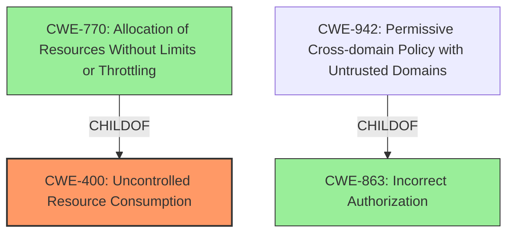

# Enhanced Analysis for CVE-2024-52974

# Summary
| CWE ID  | CWE Name                                                     | Confidence | CWE Abstraction Level | CWE Vulnerability Mapping Label | CWE-Vulnerability Mapping Notes |
| :-------- | :----------------------------------------------------------- | :--------- | :-------------------- | :------------------------------ | :------------------------------ |
| CWE-400 | Uncontrolled Resource Consumption                                                                     | 0.8        | Class                  | Primary                          | Allowed  |
| CWE-770 | Allocation of Resources Without Limits or Throttling | 0.6        | Base                  | Secondary                          | Allowed                  |
| CWE-863 | Incorrect Authorization                                                  | 0.4        | Class                  | Secondary                          | Allowed-with-Review                   |

## Evidence and Confidence

*   **Confidence Score:** 0.7
*   **Evidence Strength:** MEDIUM

## Relationship Analysis
The primary relationship influencing the CWE selection is the parent-child relationship between CWE-400 and CWE-770. CWE-770 is a base level CWE and a child of CWE-400. The vulnerability description indicates a Kibana server crash due to a specially crafted request that leads to **uncontrolled resource consumption**. While CWE-400 is a class, the allocation of resource without limits or throttling, which is CWE-770, is a more specific reason for the uncontrolled resource consumption.



## Vulnerability Chain
The vulnerability chain starts with a specially crafted request to the Observability API, which leads to **uncontrolled resource consumption** on the Kibana server, ultimately resulting in a server crash.
  - Crafted Request -> **Uncontrolled Resource Consumption (CWE-400)** -> Server Crash

## Summary of Analysis
The initial analysis focused on identifying the root cause of the Kibana server crash. The vulnerability description clearly indicates that a specially crafted request leads to **uncontrolled resource consumption**, which is why CWE-400 was chosen as the primary CWE.

The retriever results suggested several other CWEs, including CWE-20 (Improper Input Validation), CWE-269 (Improper Privilege Management), and CWE-863 (Incorrect Authorization). However, these CWEs do not directly address the root cause of the crash, which is the **uncontrolled resource consumption** itself.

CWE-770 provides more details on the resource allocation without limits or throttling and, thus, is a better explanation of the vulnerability than CWE-400 alone. However, the description does not provide enough details to determine how resource allocation is happening and if a lack of throttling is the cause.

CWE-863 was considered because the malicious user needs "read permissions" assigned to them. It's possible that the authorization logic is flawed, allowing the malicious user to send the crafted request. But since the description primarily points to **uncontrolled resource consumption** as the cause for the crash, and it is the most immediate cause, it is the best fit for the primary CWE.

The decision is primarily based on the provided evidence, specifically the vulnerability description and the CVE reference links content summary, which highlight the **uncontrolled resource consumption** as the direct cause of the server crash. The relationship analysis further supports this decision by identifying CWE-770 as a contributing factor in resource allocation issues, though the evidence is not strong enough to promote this to the primary CWE.

Relevant CWE Information:

# Enhanced Context (25 CWEs)
The following CWEs were identified as potentially relevant to this vulnerability:

## CWE-267: Privilege Defined With Unsafe Actions
**Abstraction Level**: Base
**Similarity Score**: 0.78
**Source**: dense

**Description**:
A particular privilege, role, capability, or right can be used to perform unsafe actions that were not intended, even when it is assigned to the correct entity.

**Mapping Guidance**:
- Usage: Allowed
- Rationale: This CWE entry is at the Base level of abstraction, which is a preferred level of abstraction for mapping to the root causes of vulnerabilities.

CWE-267 was not selected because the primary issue is resource consumption rather than unsafe actions due to privilege definition.

## CWE-668: Exposure of Resource to Wrong Sphere
**Abstraction Level**: Class
**Similarity Score**: 0.77
**Source**: dense

**Description**:
The product exposes a resource to the wrong control sphere, providing unintended actors with inappropriate access to the resource.

**Mapping Guidance**:
- Usage: Discouraged
- Rationale: CWE-668 is high-level and is often misused as a catch-all when lower-level CWE IDs might be applicable. It is sometimes used for low-information vulnerability reports [REF-1287]. It is a level-1 Class (i.e., a child of a Pillar). It is not useful for trend analysis.

CWE-668 was not selected due to its high-level nature and the availability of more specific CWEs like CWE-400 and CWE-770.

## CWE-266: Incorrect Privilege Assignment
**Abstraction Level**: Base
**Similarity Score**: 0.77
**Source**: dense

**Description**:
A product incorrectly assigns a privilege to a particular actor, creating an unintended sphere of control for that actor.

**Mapping Guidance**:
- Usage: Allowed
- Rationale: This CWE entry is at the Base level of abstraction, which is a preferred level of abstraction for mapping to the root causes of vulnerabilities.

CWE-266 was not selected because the vulnerability's root cause isn't related to privilege assignment, but rather to resource consumption.

## CWE-274: Improper Handling of Insufficient Privileges
**Abstraction Level**: Base
**Similarity Score**: 0.77
**Source**: dense

**Description**:
The product does not handle or incorrectly handles when it has insufficient privileges to perform an operation, leading to resultant weaknesses.

**Mapping Guidance**:
- Usage: Discouraged
- Rationale: This CWE entry could be deprecated in a future version of CWE.

CWE-274 was not selected because it focuses on handling insufficient privileges, whereas the vulnerability description highlights **uncontrolled resource consumption**.

## CWE-280: Improper Handling of Insufficient Permissions or Privileges
**Abstraction Level**: Base
**Similarity Score**: 0.77
**Source**: dense

**Description**:
The product does not handle or incorrectly handles when it has insufficient privileges to access resources or functionality as specified by their permissions. This may cause it to follow unexpected code paths that may leave the product in an invalid state.

**Mapping Guidance**:
- Usage: Allowed
- Rationale: This CWE entry is at the Base level of abstraction, which is a preferred level of abstraction for mapping to the root causes of vulnerabilities.

CWE-280 was not selected because it focuses on handling insufficient permissions or privileges, while the vulnerability revolves around resource consumption.

## CWE-497: Exposure of Sensitive System Information to an Unauthorized Control Sphere
**Abstraction Level**: Base
**Similarity Score**: 0.76
**Source**: dense

**Description**:
The product does not properly prevent sensitive system-level information from being accessed by unauthorized actors who do not have the same level of access to the underlying system as the product does.

**Mapping Guidance**:
- Usage: Allowed
- Rationale: This CWE entry is at the Base level of abstraction, which is a preferred level of abstraction for mapping to the root causes of vulnerabilities.

CWE-497 was not selected because the vulnerability does not involve the exposure of sensitive system information.

## CWE-639: Authorization Bypass Through User-Controlled Key
**Abstraction Level**: Base
**Similarity Score**: 0.75
**Source**: dense

**Description**:
The system's authorization functionality does not prevent one user from gaining access to another user's data or record by modifying the key value identifying the data.

**Mapping Guidance**:
- Usage: Allowed
- Rationale: This CWE entry is at the Base level of abstraction, which is a preferred level of abstraction for mapping to the root causes of vulnerabilities.

CWE-639 was not selected because the vulnerability doesn't involve authorization bypass through user-controlled keys.

## CWE-807: Reliance on Untrusted Inputs in a Security Decision
**Abstraction Level**: Base
**Similarity Score**: 0.75
**Source**: dense

**Description**:
The product uses a protection mechanism that relies on the existence or values of an input, but the input can be modified by an untrusted actor in a way that bypasses the


## CWE Relationship Analysis

Current CWEs represent these abstraction levels: .


### Vulnerability Chain Analysis

**Chain starting from CWE-274:**
- 274 (Improper Handling of Insufficient Privileges) - ROOT


**Chain starting from CWE-863:**
- 863 (Incorrect Authorization) - ROOT


### CWE Relationship Diagram

```mermaid
graph TD
    classDef primary fill:#f96,stroke:#333,stroke-width:2px
    classDef secondary fill:#69f,stroke:#333
    classDef tertiary fill:#9e9,stroke:#333
```