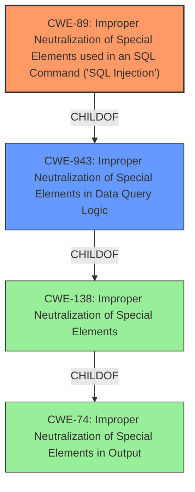

# Raw Analyzer Response for CVE-2024-53007

# Summary
| CWE ID | CWE Name | Confidence | CWE Abstraction Level | CWE Vulnerability Mapping Label | CWE-Vulnerability Mapping Notes |
|---|---|---|---|---|---|
| CWE-89 | Improper Neutralization of Special Elements used in an SQL Command ('SQL Injection') | 1.0 | Base | Allowed | Primary CWE.  The application allows an authenticated user to execute arbitrary SQL queries. |

## Evidence and Confidence

*   **Confidence Score:** 1.0
*   **Evidence Strength:** HIGH

## Relationship Analysis
The primary relationship that influenced the decision was the direct match of the vulnerability description to the definition of CWE-89. While other CWEs like CWE-943 are related to data query logic, CWE-89 is more specific to SQL injection, which is the stated impact.

## Vulnerability Chain
The vulnerability chain starts with the **improper neutralization** of SQL special elements which then leads to the ability to perform **SQL Injection**. The API allows authenticated users to execute SQL queries, but the application **fails to neutralize** special elements, leading to **SQL injection**.

## Summary of Analysis
The primary CWE selected is based on the clear evidence provided in the vulnerability description and CVE reference summary. The description states that the server "allows unintended SQL query execution by an authenticated user" and the summary explicitly mentions "SQL API abuse leading to potential bypass of access control or data tampering." This directly corresponds to CWE-89, which involves **improper neutralization** of special elements in SQL commands. The confidence is high due to the explicit mention of SQL injection.

Other CWEs were considered but not selected:

*   CWE-943: Improper Neutralization of Special Elements in Data Query Logic - While relevant, CWE-89 is a more specific child of this class and accurately reflects the SQL injection vulnerability.
*   CWE-20: Improper Input Validation - This is too general. The problem is not just any input validation issue; it's specifically about SQL injection.
*   CWE-306: Missing Authentication for Critical Function - Authentication is present, but it does not prevent SQL injection.
*   CWE-78: Improper Neutralization of Special Elements used in an OS Command ('OS Command Injection') - This is not applicable because the injection is in SQL, not OS commands.
*   CWE-184: Incomplete List of Disallowed Inputs - May be a factor, but it is secondary to the lack of neutralization.

The evidence is clear and the selected CWE is at the optimal level of specificity.