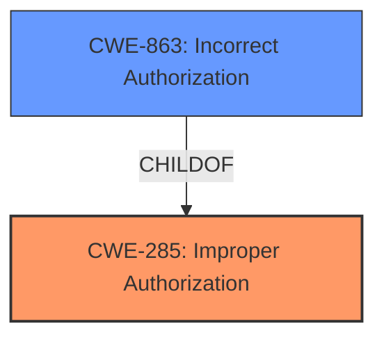

# Analysis for CVE-2024-53011

# Summary
| CWE ID  | CWE Name                                                                     | Confidence | CWE Abstraction Level | CWE Vulnerability Mapping Label | CWE-Vulnerability Mapping Notes |
| :-------- | :--------------------------------------------------------------------------- | :--------- | :-------------------- | :------------------------------ | :------------------------------ |
| CWE-285 | Improper Authorization                                                              | 0.75       | Class                 | Primary                         | Discouraged                    |
| CWE-863 | Incorrect Authorization                                                               | 0.6       | Class                | Secondary                         | Allowed-with-Review                    |

## Evidence and Confidence

*   **Confidence Score:** 0.7
*   **Evidence Strength:** MEDIUM

## Relationship Analysis
The primary relationship is between CWE-285 and its child CWE-863. CWE-863 is a more specific form of authorization failure where the check is performed incorrectly, as opposed to not being performed at all. The guidance suggests that CWE-285 is discouraged due to its high level of abstraction, recommending more specific children where possible.

## Vulnerability Chain
The chain begins with **improper permission and access controls** which leads to information disclosure.

## Summary of Analysis
The vulnerability description indicates **improper permission and access controls**, leading to information disclosure. The retriever results suggest several CWEs related to authorization and privilege management.

Initially, I considered CWE-284 (Improper Access Control) due to its broad applicability to access control issues. However, the description specifies that the problem lies in **improper permission and access controls**, which suggests a flaw in the authorization process rather than a complete lack of access control.

Given the guidance and the vulnerability's description, CWE-285 (Improper Authorization) is chosen as the primary CWE. CWE-863 (Incorrect Authorization) is considered a secondary CWE to indicate that the authorization process exists but is flawed.

The evidence relies on the description "**improper permission and access controls**". The selection of CWE-285 and CWE-863 are at the optimal level of specificity, as they capture the essence of the authorization failure without being overly generic.

Relevant CWE Information:

# Enhanced Context (25 CWEs)
The following CWEs were identified as potentially relevant to this vulnerability:

## CWE-285: Improper Authorization
**Abstraction Level**: Class
**Similarity Score**: 1218.00
**Source**: sparse

**Description**:
The product does not perform or incorrectly performs an authorization check when an actor attempts to access a resource or perform an action.

**Mapping Guidance**:
- Usage: Discouraged
- Rationale: CWE-285 is high-level and lower-level CWEs can frequently be used instead. It is a level-1 Class (i.e., a child of a Pillar).

## CWE-863: Incorrect Authorization
**Abstraction Level**: Class
**Similarity Score**: 1245.78
**Source**: sparse

**Description**:
The product performs an authorization check when an actor attempts to access a resource or perform an action, but it does not correctly perform the check.

**Mapping Guidance**:
- Usage: Allowed-with-Review
- Rationale: This CWE entry is a Class and might have Base-level children that would be more appropriate