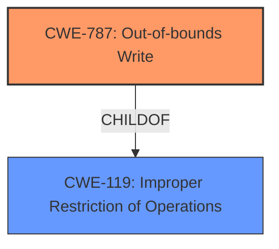

# Analysis Report for CVE-2024-53033

# Vulnerability Analysis Report: CVE-2024-53033

## Description

Memory corruption while doing Escape call when user provides valid kernel address in the place of valid user buffer address.

## Vulnerability Description Key Phrases

- **Weakness:** memory corruption
- **Attacker:** user
- **Component:** Escape call

## Analysis (with Relationship Data)

# Summary
| CWE ID | CWE Name | Confidence | CWE Abstraction Level | CWE Vulnerability Mapping Label | CWE-Vulnerability Mapping Notes |
|---|---|---|---|---|---|
| CWE-787 | Out-of-bounds Write | 0.9 | Base | Allowed | Primary CWE |

## Evidence and Confidence

*   **Confidence Score:** 0.9
*   **Evidence Strength:** MEDIUM

## Relationship Analysis
The primary identified weakness is CWE-787, Out-of-bounds Write, which is a base level CWE. Several other CWEs were considered based on the retriever results, including CWE-823 (Use of Out-of-range Pointer Offset), CWE-122 (Heap-based Buffer Overflow), and CWE-416 (Use After Free). The relationship between CWE-787 and CWE-119 (Improper Restriction of Operations within the Bounds of a Memory Buffer) is that CWE-787 is a ChildOf CWE-119. The retriever results offered several potential matches, but most of them were related to memory corruption, with CWE-787 having the highest score and being the most direct match to the description.



## Vulnerability Chain
The vulnerability chain starts with the user providing a valid kernel address instead of a valid user buffer address during an Escape call. This leads to **memory corruption** because the system attempts to write data to an invalid memory location, which results in an out-of-bounds write. The root cause is the **improper** handling of memory addresses provided by the user, and the impact is memory corruption due to the out-of-bounds write.

## Summary of Analysis
The primary focus of this analysis was to identify the most appropriate CWE for the provided vulnerability description, which describes a memory corruption issue during an Escape call caused by a user providing a kernel address instead of a valid user buffer address. The analysis heavily relies on the provided vulnerability description and the retriever results to pinpoint the root cause of the vulnerability.

The retriever results indicated that CWE-787 (Out-of-bounds Write) is the most relevant CWE. The vulnerability description explicitly mentions **memory corruption** which aligns with the typical impact of an out-of-bounds write. The description indicates a user providing a kernel address instead of a user buffer address, leading to the system attempting to write to an invalid memory location. This directly supports the selection of CWE-787 as the primary CWE.

Other CWEs were considered but deemed less suitable:
*   CWE-823 (Use of Out-of-range Pointer Offset) was considered but deemed less specific. While an out-of-range pointer offset could lead to an out-of-bounds write, the description does not specifically indicate an issue with pointer arithmetic.
*   CWE-122 (Heap-based Buffer Overflow) was considered, but the description does not specify that the memory corruption occurs on the heap.
*   CWE-416 (Use After Free) was considered, but there is no mention of memory being freed before being accessed.

The selection of CWE-787 is based on the direct evidence of **memory corruption** resulting from writing to an invalid memory location, driven by the user providing a kernel address in place of a user buffer address. The confidence in this selection is high (0.9) because the description aligns well with the characteristics of an out-of-bounds write.

Relevant CWE Information:

# Enhanced Context (25 CWEs)
The following CWEs were identified as potentially relevant to this vulnerability:

## CWE-823: Use of Out-of-range Pointer Offset
**Abstraction Level**: Base
**Similarity Score**: 0.73
**Source**: dense

**Description**:
The product performs pointer arithmetic on a valid pointer, but it uses an offset that can point outside of the intended range of valid memory locations for the resulting pointer.

**Mapping Guidance**:
- Usage: Allowed
- Rationale: This CWE entry is at the Base level of abstraction, which is a preferred level of abstraction for mapping to the root causes of vulnerabilities.


## CWE-131: Incorrect Calculation of Buffer Size
**Abstraction Level**: Base
**Similarity Score**: 0.72
**Source**: dense

**Description**:
The product does not correctly calculate the size to be used when allocating a buffer, which could lead to a buffer overflow.

**Mapping Guidance**:
- Usage: Allowed
- Rationale: This CWE entry is at the Base level of abstraction, which is a preferred level of abstraction for mapping to the root causes of vulnerabilities.


## CWE-822: Untrusted Pointer Dereference
**Abstraction Level**: Base
**Similarity Score**: 0.71
**Source**: dense

**Description**:
The product obtains a value from an untrusted source, converts this value to a pointer, and dereferences the resulting pointer.

**Mapping Guidance**:
- Usage: Allowed
- Rationale: This CWE entry is at the Base level of abstraction, which is a preferred level of abstraction for mapping to the root causes of vulnerabilities.


## CWE-824: Access of Uninitialized Pointer
**Abstraction Level**: Base
**Similarity Score**: 0.70
**Source**: dense

**Description**:
The product accesses or uses a pointer that has not been initialized.

**Mapping Guidance**:
- Usage: Allowed
- Rationale: This CWE entry is at the Base level of abstraction, which is a preferred level of abstraction for mapping to the root causes of vulnerabilities.


## CWE-667: Improper Locking
**Abstraction Level**: Class
**Similarity Score**: 0.70
**Source**: dense

**Description**:
The product does not properly acquire or release a lock on a resource, leading to unexpected resource state changes and behaviors.

**Mapping Guidance**:
- Usage: Allowed-with-Review
- Rationale: This CWE entry is a Class and might have Base-level children that would be more appropriate


## CWE-805: Buffer Access with Incorrect Length Value
**Abstraction Level**: Base
**Similarity Score**: 0.70
**Source**: dense

**Description**:
The product uses a sequential operation to read or write a buffer, but it uses an incorrect length value that causes it to access memory that is outside of the bounds of the buffer.

**Mapping Guidance**:
- Usage: Allowed
- Rationale: This CWE entry is at the Base level of abstraction, which is a preferred level of abstraction for mapping to the root causes of vulnerabilities.


## CWE-191: Integer Underflow (Wrap or Wraparound)
**Abstraction Level**: Base
**Similarity Score**: 0.69
**Source**: dense

**Description**:
The product subtracts one value from another, such that the result is less than the minimum allowable integer value, which produces a value that is not equal to the correct result.

**Mapping Guidance**:
- Usage: Allowed
- Rationale: This CWE entry is at the Base level of abstraction, which is a preferred level of abstraction for mapping to the root causes of vulnerabilities.


## CWE-1260: Improper Handling of Overlap Between Protected Memory Ranges
**Abstraction Level**: Base
**Similarity Score**: 0.69
**Source**: dense

**Description**:
The product allows address regions to overlap, which can result in the bypassing of intended memory protection.

**Mapping Guidance**:
- Usage: Allowed
- Rationale: This CWE entry is at the Base level of abstraction, which is a preferred level of abstraction for mapping to the root causes of vulnerabilities.


## CWE-193: Off-by-one Error
**Abstraction Level**: Base
**Similarity Score**: 0.69
**Source**: dense

**Description**:
A product calculates or uses an incorrect maximum or minimum value that is 1 more, or 1 less, than the correct value.

**Mapping Guidance**:
- Usage: Allowed
- Rationale: This CWE entry is at the Base level of abstraction, which is a preferred level of abstraction for mapping to the root causes of vulnerabilities.


## CWE-124: Buffer Underwrite ('Buffer Underflow')
**Abstraction Level**: Base
**Similarity Score**: 0.69
**Source**: dense

**Description**:
The product writes to a buffer using an index or pointer that references a memory location prior to the beginning of the buffer.

**Mapping Guidance**:
- Usage: Allowed
- Rationale: This CWE entry is at the Base level of abstraction, which is a preferred level of abstraction for mapping to the root causes of vulnerabilities.


## CWE-415: Double Free
**Abstraction Level**: Variant
**Similarity Score**: 353.50
**Source**: sparse

**Description**:
The product calls free() twice on the same memory address, potentially leading to modification of unexpected memory locations.

**Mapping Guidance**:
- Usage: Allowed
- Rationale: This CWE entry is at the Variant level of abstraction, which is a


## CWE Relationship Analysis

Current CWEs represent these abstraction levels: .


### Vulnerability Chain Analysis

**Chain starting from CWE-416:**
- 416 (Use After Free) - ROOT


**Chain starting from CWE-823:**
- 823 (Use of Out-of-range Pointer Offset) - ROOT


### CWE Relationship Diagram

```mermaid
graph TD
    classDef primary fill:#f96,stroke:#333,stroke-width:2px
    classDef secondary fill:#69f,stroke:#333
    classDef tertiary fill:#9e9,stroke:#333
```


*Report generated on 2025-07-13 21:37:59*
