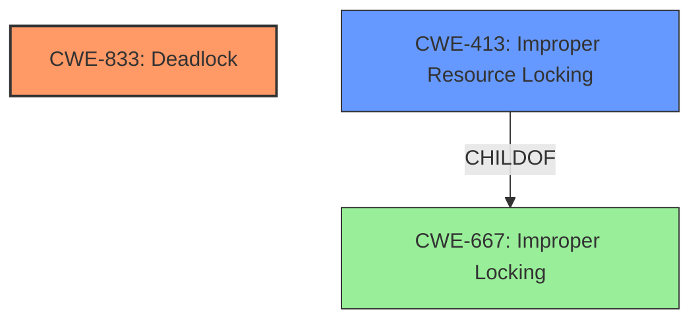

# Analysis for CVE-2024-53053

# Summary
| CWE ID | CWE Name | Confidence | CWE Abstraction Level | CWE Vulnerability Mapping Label | CWE-Vulnerability Mapping Notes |
|---|---|---|---|---|---|
| CWE-833 | Deadlock | 1.0 | Base | Primary CWE | Allowed |
| CWE-413 | Improper Resource Locking | 0.7 | Base | Secondary Candidate CWE | Allowed |
| CWE-667 | Improper Locking | 0.6 | Class | Secondary Candidate CWE | Allowed-with-Review |

## Evidence and Confidence

*   **Confidence Score:** 0.9
*   **Evidence Strength:** HIGH

## Relationship Analysis
The primary CWE is CWE-833 (Deadlock), which is a Base level CWE. CWE-413 (Improper Resource Locking) and CWE-667 (Improper Locking) are also considered. CWE-667 is a class and parents CWE-413. The vulnerability description indicates a deadlock due to improper resource handling in a concurrent context.

## Vulnerability Chain
The vulnerability chain starts with the **deadlock** condition caused by `ufshcd_rtc_work` calling `ufshcd_rpm_put_sync()` when the pms usage_count is 0, leading to the runtime suspend callback waiting for `ufshcd_rtc_work` to complete, resulting in a standstill. The root cause is the synchronous resource management (`ufshcd_rpm_put_sync()`) conflicting with the asynchronous nature of the runtime suspend callback and `ufshcd_rtc_work`.

## Summary of Analysis
The analysis is based on the provided evidence from the vulnerability description and CVE reference summary.

The vulnerability description clearly states: "Fix another **deadlock** during RTC update. If ufshcd_rtc_work calls ufshcd_rpm_put_sync() and the pms usage_count is 0, we will enter the runtime suspend callback. However, the runtime suspend callback will wait to flush ufshcd_rtc_work, causing a **deadlock**."

The "CVE Reference Links Content Summary" further supports this: "A **deadlock** occurs in the UFS (Universal Flash Storage) subsystem when updating the Real-Time Clock (RTC)." and "The runtime suspend callback waits for `ufshcd_rtc_work` to complete (flush), but `ufshcd_rtc_work` itself is blocked on `ufshcd_rpm_put_sync()`, creating a **deadlock** condition."

CWE-833 (Deadlock) is the most specific and accurate representation of the vulnerability. The retriever results also list CWE-833 as a potential match.

CWE-413 (Improper Resource Locking) is considered because the deadlock involves waiting for a resource. However, the core issue is the deadlock itself rather than simply improper locking. CWE-667 (Improper Locking) is a higher-level class that encompasses CWE-413, making CWE-413 the preferred choice if improper locking were the primary issue.

The selection of CWE-833 is at the optimal level of specificity, as it directly addresses the **deadlock** condition described in the vulnerability.

Relevant CWE Information:

# Enhanced Context (25 CWEs)
The following CWEs were identified as potentially relevant to this vulnerability:

## CWE-667: Improper Locking
**Abstraction Level**: Class
**Similarity Score**: 0.77
**Source**: dense

**Description**:
The product does not properly acquire or release a lock on a resource, leading to unexpected resource state changes and behaviors.

**Mapping Guidance**:
- Usage: Allowed-with-Review
- Rationale: This CWE entry is a Class and might have Base-level children that would be more appropriate

## CWE-833: Deadlock
**Abstraction Level**: Base
**Similarity Score**: 0.77
**Source**: dense

**Description**:
The product contains multiple threads or executable segments that are waiting for each other to release a necessary lock, resulting in deadlock.

**Mapping Guidance**:
- Usage: Allowed
- Rationale: This CWE entry is at the Base level of abstraction, which is a preferred level of abstraction for mapping to the root causes of vulnerabilities.

## CWE-362: Concurrent Execution using Shared Resource with Improper Synchronization ('Race Condition')
**Abstraction Level**: Class
**Similarity Score**: 0.72
**Source**: dense

**Description**:
The product contains a concurrent code sequence that requires temporary, exclusive access to a shared resource, but a timing window exists in which the shared resource can be modified by another code sequence operating concurrently.

**Mapping Guidance**:
- Usage: Allowed-with-Review
- Rationale: This CWE entry is a Class and might have Base-level children that would be more appropriate

## CWE-824: Access of Uninitialized Pointer
**Abstraction Level**: Base
**Similarity Score**: 0.71
**Source**: dense

**Description**:
The product accesses or uses a pointer that has not been initialized.

**Mapping Guidance**:
- Usage: Allowed
- Rationale: This CWE entry is at the Base level of abstraction, which is a preferred level of abstraction for mapping to the root causes of vulnerabilities.

## CWE-755: Improper Handling of Exceptional Conditions
**Abstraction Level**: Class
**Similarity Score**: 0.71
**Source**: dense

**Description**:
The product does not handle or incorrectly handles an exceptional condition.

**Mapping Guidance**:
- Usage: Discouraged
- Rationale: This CWE entry is a level-1 Class (i.e., a child of a Pillar). It might have lower-level children that would be more appropriate

## CWE-413: Improper Resource Locking
**Abstraction Level**: Base
**Similarity Score**: 0.71
**Source**: dense

**Description**:
The product does not lock or does not correctly lock a resource when the product must have exclusive access to the resource.

**Mapping Guidance**:
- Usage: Allowed
- Rationale: This CWE entry is at the Base level of abstraction, which is a preferred level of abstraction for mapping to the root causes of vulnerabilities.

## CWE-367: Time-of-check Time-of-use (TOCTOU) Race Condition
**Abstraction Level**: Base
**Similarity Score**: 0.71
**Source**: dense

**Description**:
The product checks the state of a resource before using that resource, but the resource's state can change between the check and the use in a way that invalidates the results of the check. This can cause the product to perform invalid actions when the resource is in an unexpected state.

**Mapping Guidance**:
- Usage: Allowed
- Rationale: This CWE entry is at the Base level of abstraction, which is a preferred level of abstraction for mapping to the root causes of vulnerabilities.

## CWE-1285: Improper Validation of Specified Index, Position, or Offset in Input
**Abstraction Level**: Base
**Similarity Score**: 0.71
**Source**: dense

**Description**:
The product receives input that is expected to specify an index, position, or offset into an indexable resource such as a buffer or file, but it does not validate or incorrectly validates that the specified index/position/offset has the required properties.

**Mapping Guidance**:
- Usage: Allowed
- Rationale: This CWE entry is at the Base level of abstraction, which is a preferred level of abstraction for mapping to the root causes of vulnerabilities.

## CWE-404: Improper Resource Shutdown or Release
**Abstraction Level**: Class
**Similarity Score**: 0.70
**Source**: dense

**Description**:
The product does not release or incorrectly releases a resource before it is made available for re-use.

**Mapping Guidance**:
- Usage: Allowed-with-Review
- Rationale: This CWE entry is a Class and might have Base-level children that would be more appropriate

## CWE-665: Improper Initialization
**Abstraction Level**: Class
**Similarity Score**: 0.70
**Source**: dense

**Description**:
The product does not initialize or incorrectly initializes a resource, which might leave the resource in an unexpected state when it is accessed or used.

**Mapping Guidance**:
- Usage: Discouraged
- Rationale: This CWE entry is a level-1 Class (i.e., a child of a Pillar). It might have lower-level children that would be more appropriate

## CWE-667: Improper Locking
**Abstraction Level**: Class
**Similarity Score**: 808.39
**Source**: sparse

**Description**:
The product does not properly acquire or release a lock on a