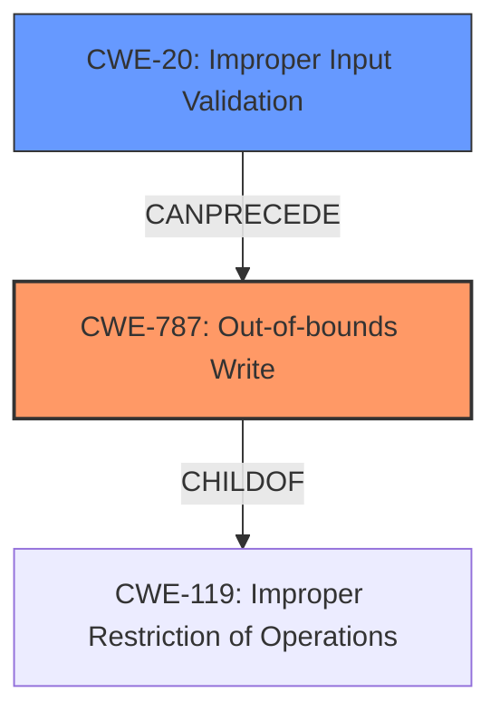

# Raw Analyzer Response for CVE-2024-5306

# Summary
| CWE ID | CWE Name | Confidence | CWE Abstraction Level | CWE Vulnerability Mapping Label | CWE-Vulnerability Mapping Notes |
|---|---|---|---|---|---|
| CWE-787 | Out-of-bounds Write | 1.0 | Base | Allowed | Primary CWE. The **lack of proper validation of user-supplied data** leads to a **memory corruption** condition, which allows an attacker to write data outside the intended buffer. |
| CWE-20 | Improper Input Validation | 0.7 | Class | Discouraged | Secondary CWE. The vulnerability stems from a **lack of proper validation of user-supplied data**. While this is a contributing factor, the resulting out-of-bounds write is a more specific weakness. |

## Evidence and Confidence

*   **Confidence Score:** 0.9
*   **Evidence Strength:** HIGH

## Relationship Analysis
The primary relationship that influences this decision is the parent-child relationship between CWE-119 (Improper Restriction of Operations within the Bounds of a Memory Buffer) and CWE-787 (Out-of-bounds Write). CWE-787 is a more specific type of CWE-119. CWE-20 can precede CWE-787 as improper input validation can lead to out-of-bounds writes. Choosing CWE-787 provides a more precise classification of the vulnerability.

## Vulnerability Chain
The vulnerability chain starts with **improper input validation** (CWE-20), which leads to a **memory corruption** condition, specifically an out-of-bounds write (CWE-787). The final impact is arbitrary code execution.
  - Improper Input Validation (CWE-20) -> Out-of-bounds Write (CWE-787) -> Arbitrary Code Execution (Impact)

## Summary of Analysis
The initial analysis identified CWE-787 as the primary candidate due to the **memory corruption** condition resulting from the **lack of proper validation of user-supplied data**. This assessment is strongly supported by the vulnerability description, which explicitly mentions the **lack of proper validation of user-supplied data** as the root cause and **memory corruption** as the weakness. The "CVE Reference Links Content Summary" reinforces this by stating that the "vulnerability stems from a lack of proper validation of user-supplied data during the parsing of PDF files within Kofax Power PDF. This inadequate validation leads to a memory corruption condition."

The retriever results also list CWE-787 as the top candidate, further strengthening the decision. CWE-20 was considered as a secondary factor. The graph relationships show that CWE-787 is a child of CWE-119, providing a more specific classification than CWE-119. The chosen CWEs are at the optimal level of specificity, with CWE-787 being a Base-level CWE.

Relevant CWE Information:
*   CWE-787: Out-of-bounds Write. The product writes data past the end, or before the beginning, of the intended buffer.
*   CWE-20: Improper Input Validation. The product receives input or data, but it does not validate or incorrectly validates that the input has the properties that are required to process the data safely and correctly.

CWEs Considered but Not Used:

*   CWE-119: Improper Restriction of Operations within the Bounds of a Memory Buffer was considered but not used because CWE-787 is a more specific child that more accurately describes the vulnerability. Usage is Discouraged for CWE-119.
*   CWE-125: Out-of-bounds Read was considered but not used because the vulnerability description specifically mentions **memory corruption**, which implies writing to memory, rather than reading.
*   CWE-120: Buffer Copy without Checking Size of Input ('Classic Buffer Overflow') was considered but not used because the description does not mention a buffer copy operation.
*   CWE-122: Heap-based Buffer Overflow was considered but not used because the description doesn't explicitly mention the heap. While memory corruption can often involve the heap, without explicit confirmation, it's better to stick to the more general CWE-787.
*   CWE-190: Integer Overflow or Wraparound was considered but not used because there is no mention of an integer overflow or wraparound in the description.