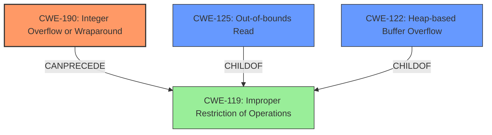

# Raw Analyzer Response for CVE-2024-53061

# Summary
| CWE ID | CWE Name | Confidence | CWE Abstraction Level | CWE Vulnerability Mapping Label | CWE-Vulnerability Mapping Notes |
|---|---|---|---|---|---|
| CWE-190 | Integer Overflow or Wraparound | 0.9 | Base | Primary CWE | Allowed |
| CWE-125 | Out-of-bounds Read | 0.8 | Base | Secondary Candidate | Allowed |
| CWE-122 | Heap-based Buffer Overflow | 0.7 | Variant | Secondary Candidate | Allowed |

## Evidence and Confidence

*   **Confidence Score:** 0.8
*   **Evidence Strength:** HIGH

## Relationship Analysis
The primary weakness is identified as CWE-190, which can **precede** CWE-119 (Improper Restriction of Operations within the Bounds of a Memory Buffer). CWE-125 (Out-of-bounds Read) and CWE-122 (Heap-based Buffer Overflow) are considered secondary candidates. CWE-125 is a type of memory corruption that can result from integer overflow. CWE-122 is a specific type of buffer overflow where the buffer is allocated on the heap. The relationships help to understand the progression from the initial integer issue to the eventual memory corruption. The abstraction levels (Base and Variant) are appropriate as they directly reflect the specific nature of the vulnerability.

## Vulnerability Chain
The vulnerability chain starts with an **improper calculation** due to the missing validation of `word` variable, which leads to a negative value being assigned to `jpeg_buffer.size`. This then causes an **out-of-bounds read** when the driver attempts to read more data than available, potentially resulting in a **heap-based buffer overflow**.
  - **Root Cause:** **Improper calculation** due to missing validation on `word` leading to negative `jpeg_buffer.size` (CWE-190)
  - **Weakness:** Attempt to read beyond buffer (CWE-125)
  - **Impact:** Heap-based Buffer Overflow (CWE-122)

## Summary of Analysis
The initial analysis focused on the **buffer overflow** aspect of the vulnerability. However, a closer look at the vulnerability description and the provided information suggests that the root cause is an **integer overflow** that leads to the buffer overflow. Specifically, the **lack of validation** on the `word` variable allows it to have a value less than 2, which leads to `jpeg_buffer.size` having a negative value after subtracting 2 from it. This negative value causes the program to then read out of bounds.

The graph relationships show how CWE-190 can **precede** CWE-119 (Improper Restriction of Operations within the Bounds of a Memory Buffer), which is a more general class of errors. CWE-125 (Out-of-bounds Read) and CWE-122 (Heap-based Buffer Overflow) are both children of CWE-119.

The final selection of CWEs is based on the evidence that the root cause is an **integer overflow** and the subsequent impact is an **out-of-bounds read**, possibly leading to a **heap-based buffer overflow**. These CWEs are at the optimal level of specificity as they accurately capture the nature of the vulnerability and its progression.

Relevant CWE Information:

# Enhanced Context (25 CWEs)
The following CWEs were identified as potentially relevant to this vulnerability:

## CWE-129: Improper Validation of Array Index
**Abstraction Level**: Variant
**Similarity Score**: 0.75
**Source**: dense

**Description**:
The product uses untrusted input when calculating or using an array index, but the product does not validate or incorrectly validates the index to ensure the index references a valid position within the array.

**Mapping Guidance**:
- Usage: Allowed
- Rationale: This CWE entry is at the Variant level of abstraction, which is a preferred level of abstraction for mapping to the root causes of vulnerabilities.

*Not selected:* While there is a validation issue, it's not specifically related to array indices.

## CWE-131: Incorrect Calculation of Buffer Size
**Abstraction Level**: Base
**Similarity Score**: 0.75
**Source**: dense

**Description**:
The product does not correctly calculate the size to be used when allocating a buffer, which could lead to a buffer overflow.

**Mapping Guidance**:
- Usage: Allowed
- Rationale: This CWE entry is at the Base level of abstraction, which is a preferred level of abstraction for mapping to the root causes of vulnerabilities.

*Not selected:* While the buffer size is incorrectly determined, it is directly caused by integer overflow.

## CWE-125: Out-of-bounds Read
**Abstraction Level**: Base
**Similarity Score**: 0.75
**Source**: dense

**Description**:
The product reads data past the end, or before the beginning, of the intended buffer.

**Mapping Guidance**:
- Usage: Allowed
- Rationale: This CWE entry is at the Base level of abstraction, which is a preferred level of abstraction for mapping to the root causes of vulnerabilities.

*Selected:* The vulnerability leads to reading data past the end of the intended buffer.

## CWE-789: Memory Allocation with Excessive Size Value
**Abstraction Level**: Variant
**Similarity Score**: 0.74
**Source**: dense

**Description**:
The product allocates memory based on an untrusted, large size value, but it does not ensure that the size is within expected limits, allowing arbitrary amounts of memory to be allocated.

**Mapping Guidance**:
- Usage: Allowed
- Rationale: This CWE entry is at the Variant level of abstraction, which is a preferred level of abstraction for mapping to the root causes of vulnerabilities.

*Not selected:* Not applicable as the issue isn't about excessive size.

## CWE-126: Buffer Over-read
**Abstraction Level**: Variant
**Similarity Score**: 0.73
**Source**: dense

**Description**:
The product reads from a buffer using buffer access mechanisms such as indexes or pointers that reference memory locations after the targeted buffer.

**Mapping Guidance**:
- Usage: Allowed
- Rationale: This CWE entry is at the Variant level of abstraction, which is a preferred level of abstraction for mapping to the root causes of vulnerabilities.

*Not selected:* Similar to CWE-125, but not the primary root cause.

## CWE-1285: Improper Validation of Specified Index, Position, or Offset in Input
**Abstraction Level**: Base
**Similarity Score**: 0.73
**Source**: dense

**Description**:
The product receives input that is expected to specify an index, position, or offset into an indexable resource such as a buffer or file, but it does not validate or incorrectly validates that the specified index/position/offset has the required properties.

**Mapping Guidance**:
- Usage: Allowed
- Rationale: This CWE entry is at the Base level of abstraction, which is a preferred level of abstraction for mapping to the root causes of vulnerabilities.

*Not selected:* Not applicable as the issue isn't about index, position, or offset.

## CWE-193: Off-by-one Error
**Abstraction Level**: Base
**Similarity Score**: 0.73
**Source**: dense

**Description**:
A product calculates or uses an incorrect maximum or minimum value that is 1 more, or 1 less, than the correct value.

**Mapping Guidance**:
- Usage: Allowed
- Rationale: This CWE entry is at the Base level of abstraction, which is a preferred level of abstraction for mapping to the root causes of vulnerabilities.

*Not selected:* Not an off-by-one error.

## CWE-190: Integer Overflow or Wraparound
**Abstraction Level**: Base
**Similarity Score**: 0.73
**Source**: dense

**Description**:
The product performs a calculation that can
         produce an integer overflow or wraparound when the logic
         assumes that the resulting value will always be larger than
         the original value. This occurs when an integer value is
         incremented to a value that is too large to store in the
         associated representation. When this occurs, the value may
         become a very small or negative number.

**Mapping Guidance**:
- Usage: Allowed
- Rationale: This CWE entry is at the Base level of abstraction, which is a preferred level