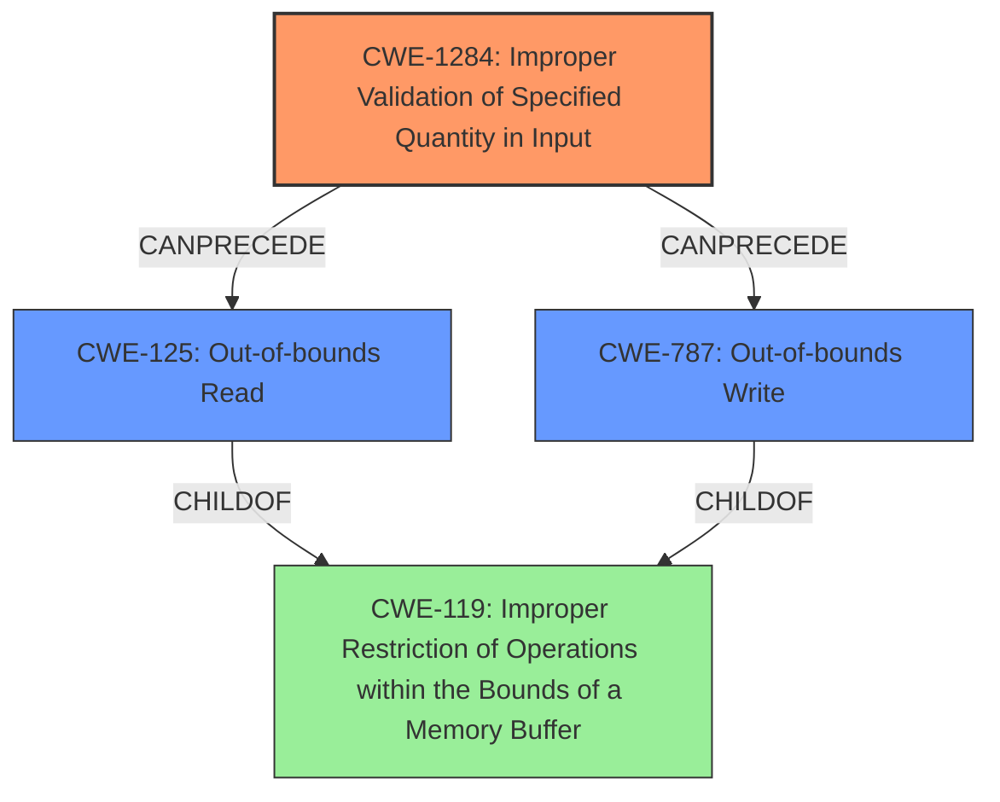

# Enhanced Analysis for CVE-2024-53082

# Summary
| CWE ID | CWE Name | Confidence | CWE Abstraction Level | CWE Vulnerability Mapping Label | CWE-Vulnerability Mapping Notes |
|---|---|---|---|---|---|
| CWE-1284 | Improper Validation of Specified Quantity in Input | 0.9 | Base | Allowed | Primary CWE. The driver **does not validate** if the provided `rss_max_key_size` exceeds the defined maximum `VIRTIO_NET_RSS_MAX_KEY_SIZE`. |
| CWE-125 | Out-of-bounds Read | 0.8 | Base | Allowed | Secondary CWE. Without proper validation, a malicious or misconfigured virtio device can provide an `rss_max_key_size` that is too large which leads to **out-of-bounds read**. |
| CWE-787 | Out-of-bounds Write | 0.8 | Base | Allowed | Secondary CWE. Without proper validation, a malicious or misconfigured virtio device can provide an `rss_max_key_size` that is too large which leads to **out-of-bounds write**. |

## Evidence and Confidence

*   **Confidence Score:** 0.9
*   **Evidence Strength:** HIGH

## Relationship Analysis
The primary weakness is CWE-1284 Improper Validation of Specified Quantity in Input, which **leads to** CWE-125 Out-of-bounds Read and/or CWE-787 Out-of-bounds Write.
CWE-125 and CWE-787 are siblings, both children of CWE-119.
I chose CWE-1284 as the root cause because the vulnerability stems from **missing check** on the `rss_max_key_size` read from the virtio device's configuration.



## Vulnerability Chain
The vulnerability chain starts with **Improper Validation of Specified Quantity in Input** (CWE-1284), as the driver does not validate the `rss_max_key_size`. This **leads to** either an **Out-of-bounds Read** (CWE-125) or an **Out-of-bounds Write** (CWE-787) when the driver attempts to use the unvalidated size in subsequent operations related to setting or reading the RSS hash key.

## Summary of Analysis
The initial assessment considered CWE-125 as the primary cause, given the description contains phrases like "**out of bound errors**". However, the root cause is actually the **missing validation** of the `rss_max_key_size`. Therefore, the primary CWE is CWE-1284, which **leads to** CWE-125 or CWE-787.

The evidence from the vulnerability description includes:
- Vulnerability Description Key Phrases: **weakness: out of bound errors**
- CVE Reference Links Content Summary: **Root Cause:** The vulnerability stems from a **missing check** on the `rss_max_key_size` read from the virtio device's configuration. Specifically, the driver **does not validate** if the provided `rss_max_key_size` exceeds the defined maximum `VIRTIO_NET_RSS_MAX_KEY_SIZE`.
- CVE Reference Links Content Summary: **Weaknesses/Vulnerabilities:** Without proper validation, a malicious or misconfigured virtio device can provide an `rss_max_key_size` that is too large. This could lead to **out-of-bounds reads or writes** when the driver attempts to use this value in subsequent operations related to setting or reading the RSS hash key.

The retriever results also suggested CWE-1284 as a potential candidate.
CWE-125 and CWE-787 are included because they are consequences of the **missing validation**.
All the selected CWEs are at the Base level of abstraction, which is the preferred level.

Relevant CWE Information:

# Enhanced Context (25 CWEs)
The following CWEs were identified as potentially relevant to this vulnerability:

## CWE-191: Integer Underflow (Wrap or Wraparound)
**Abstraction Level**: Base
**Similarity Score**: 0.73
**Source**: dense

**Description**:
The product subtracts one value from another, such that the result is less than the minimum allowable integer value, which produces a value that is not equal to the correct result.

**Mapping Guidance**:
- Usage: Allowed
- Rationale: This CWE entry is at the Base level of abstraction, which is a preferred level of abstraction for mapping to the root causes of vulnerabilities.

*Not Selected*: This CWE is not suitable because there is no indication of an integer underflow in the vulnerability description.

## CWE-131: Incorrect Calculation of Buffer Size
**Abstraction Level**: Base
**Similarity Score**: 0.72
**Source**: dense

**Description**:
The product does not correctly calculate the size to be used when allocating a buffer, which could lead to a buffer overflow.

**Mapping Guidance**:
- Usage: Allowed
- Rationale: This CWE entry is at the Base level of abstraction, which is a preferred level of abstraction for mapping to the root causes of vulnerabilities.

*Not Selected*: This CWE is not suitable because the issue is not an incorrect calculation of buffer size but a missing validation of the provided size.

## CWE-1285: Improper Validation of Specified Index, Position, or Offset in Input
**Abstraction Level**: Base
**Similarity Score**: 0.72
**Source**: dense

**Description**:
The product receives input that is expected to specify an index, position, or offset into an indexable resource such as a buffer or file, but it does not validate or incorrectly validates that the specified index/position/offset has the required properties.

**Mapping Guidance**:
- Usage: Allowed
- Rationale: This CWE entry is at the Base level of abstraction, which is a preferred level of abstraction for mapping to the root causes of vulnerabilities.

*Not Selected*: While related to validation, CWE-1284 is a better fit because it specifically addresses the validation of a quantity, rather than an index or offset.

## CWE-824: Access of Uninitialized Pointer
**Abstraction Level**: Base
**Similarity Score**: 0.71
**Source**: dense

**Description**:
The product accesses or uses a pointer that has not been initialized.

**Mapping Guidance**:
- Usage: Allowed
- Rationale: This CWE entry is at the Base level of abstraction, which is a preferred level of abstraction for mapping to the root causes of vulnerabilities.

*Not Selected*: This CWE is not suitable because there is no mention of uninitialized pointers.

## CWE-755: Improper Handling of Exceptional Conditions
**Abstraction Level**: Class
**Similarity Score**: 0.71
**Source**: dense

**Description**:
The product does not handle or incorrectly handles an exceptional condition.

**Mapping Guidance**:
- Usage: Discouraged
- Rationale: This CWE entry is a level-1 Class (i.e., a child of a Pillar). It might have lower-level children that would be more appropriate

*Not Selected*: This is a class-level CWE and too general for the specific vulnerability described.

## CWE-252: Unchecked Return Value
**Abstraction Level**: Base
**Similarity Score**: 0.71
**Source**: dense

**Description**:
The product does not check the return value from a method or function, which can prevent it from detecting unexpected states and conditions.

**Mapping Guidance**:
- Usage: Allowed
- Rationale: This CWE entry is at the Base level of abstraction, which is a preferred level of abstraction for mapping to the root causes of vulnerabilities.

*Not Selected*: This CWE is not suitable because the issue is not related to unchecked return values.

## CWE-193: Off-by-one Error
**Abstraction Level**: Base
**Similarity Score**: 0.71
**Source**: dense

**Description**:
A product calculates or uses an incorrect maximum or minimum value that is 1 more, or 1 less, than the correct value.

**Mapping Guidance**:
- Usage: Allowed
- Rationale: This CWE entry is at the Base level of abstraction, which is a preferred level of abstraction for mapping


## CWE Relationship Analysis

Current CWEs represent these abstraction levels: .


### Vulnerability Chain Analysis

**Chain starting from CWE-1284:**
- 1284 (Improper Validation of Specified Quantity in Input) - ROOT


**Chain starting from CWE-125:**
- 125 (Out-of-bounds Read) - ROOT


### CWE Relationship Diagram

```mermaid
graph TD
    classDef primary fill:#f96,stroke:#333,stroke-width:2px
    classDef secondary fill:#69f,stroke:#333
    classDef tertiary fill:#9e9,stroke:#333
```