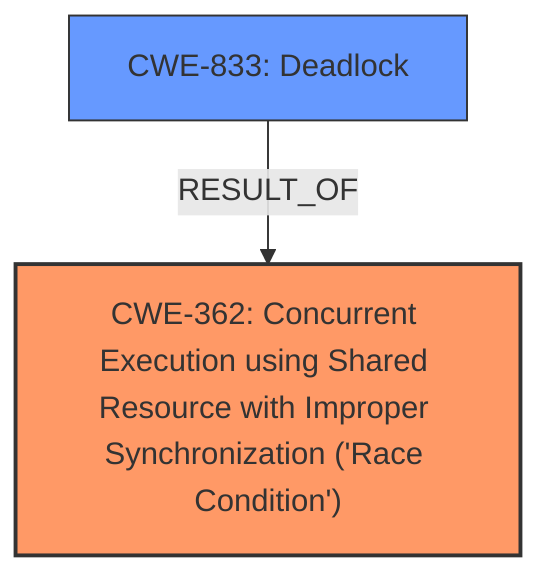

# Raw Analyzer Response for CVE-2024-53136

# Summary
| CWE ID | CWE Name | Confidence | CWE Abstraction Level | CWE Vulnerability Mapping Label | CWE-Vulnerability Mapping Notes |
|---|---|---|---|---|---|
| CWE-362 | Concurrent Execution using Shared Resource with Improper Synchronization ('Race Condition') | 0.9 | Class | Allowed-with-Review | Primary CWE. The vulnerability is due to a **data race** in `shmem_getattr()` function. |
| CWE-833 | Deadlock | 0.8 | Base | Allowed | Secondary CWE. The fix for the data race introduced a **deadlock** when accessing tmpfs over NFS. |

## Evidence and Confidence

*   **Confidence Score:** 0.85
*   **Evidence Strength:** HIGH

## Relationship Analysis
The primary weakness is a **race condition** (CWE-362). The attempted fix introduced a **deadlock** (CWE-833). CWE-362 is a Class, which has child CWEs that are more specific, but in this case, the description aligns well with the general nature of concurrent execution issues. CWE-833 accurately describes the resulting deadlock caused by the improper fix.

## Vulnerability Chain
The vulnerability chain starts with a **data race** (CWE-362) in `shmem_getattr()`. An attempt to fix this **data race** led to the introduction of a **deadlock** (CWE-833) when accessing tmpfs over NFS. The chain is: CWE-362 (root cause) -> CWE-833 (impact of incorrect fix).

## Summary of Analysis
The initial assessment focused on identifying the **root cause** and subsequent impact. The **data race** was the original issue, and the **deadlock** was a consequence of the improper fix. The evidence strongly supports the classification of CWE-362 as the primary weakness, with CWE-833 as a secondary weakness resulting from the flawed fix.

The evidence is based on the following:
- "**data-race in shmem_getattr()**" (Vulnerability Description Key Phrases)
- "The root cause is a problematic fix (commit `d949d1d14fa2`) that attempted to address a data race in the `shmem_getattr()` function" (CVE Reference Links Content Summary)
- "This fix introduced a shared lock, which led to deadlocks when accessing tmpfs (a temporary file storage) over NFS (Network File System)." (CVE Reference Links Content Summary)
- "The initial vulnerability was a **data race** in `shmem_getattr()`." (CVE Reference Links Content Summary)
- "The fix introduced a **deadlock** when accessing tmpfs over NFS." (CVE Reference Links Content Summary)

CWE-362 is chosen because the vulnerability description explicitly mentions a **data race**. CWE-833 is chosen because the fix introduced a **deadlock**. Both CWEs are at appropriate levels of specificity, with CWE-362 being a Class and CWE-833 being a Base.

Relevant CWE Information:

# Enhanced Context (25 CWEs)
The following CWEs were identified as potentially relevant to this vulnerability:

## CWE-667: Improper Locking
**Abstraction Level**: Class
**Similarity Score**: 0.77
**Source**: dense

**Description**:
The product does not properly acquire or release a lock on a resource, leading to unexpected resource state changes and behaviors.

**Mapping Guidance**:
- Usage: Allowed-with-Review
- Rationale: This CWE entry is a Class and might have Base-level children that would be more appropriate

**Not Used**: While locking is involved, the core issue is the concurrent access, making CWE-362 a better fit for the primary weakness. The **deadlock** introduced by the fix makes CWE-833 more appropriate than CWE-667.

## CWE-367: Time-of-check Time-of-use (TOCTOU) Race Condition
**Abstraction Level**: Base
**Similarity Score**: 0.77
**Source**: dense

**Description**:
The product checks the state of a resource before using that resource, but the resource's state can change between the check and the use in a way that invalidates the results of the check. This can cause the product to perform invalid actions when the resource is in an unexpected state.

**Mapping Guidance**:
- Usage: Allowed
- Rationale: This CWE entry is at the Base level of abstraction, which is a preferred level of abstraction for mapping to the root causes of vulnerabilities.

**Not Used**: TOCTOU is a specific type of race condition, but the description does not provide sufficient evidence that this specific type of race condition occurred.

## CWE-362: Concurrent Execution using Shared Resource with Improper Synchronization ('Race Condition')
**Abstraction Level**: Class
**Similarity Score**: 0.77
**Source**: dense

**Description**:
The product contains a concurrent code sequence that requires temporary, exclusive access to a shared resource, but a timing window exists in which the shared resource can be modified by another code sequence operating concurrently.

**Mapping Guidance**:
- Usage: Allowed-with-Review
- Rationale: This CWE entry is a Class and might have Base-level children that would be more appropriate

**Used**: The vulnerability is due to a **data race** in `shmem_getattr()` function.

## CWE-833: Deadlock
**Abstraction Level**: Base
**Similarity Score**: 0.75
**Source**: dense

**Description**:
The product contains multiple threads or executable segments that are waiting for each other to release a necessary lock, resulting in deadlock.

**Mapping Guidance**:
- Usage: Allowed
- Rationale: This CWE entry is at the Base level of abstraction, which is a preferred level of abstraction for mapping to the root causes of vulnerabilities.

**Used**: The fix for the **data race** introduced a **deadlock** when accessing tmpfs over NFS.

## CWE-366: Race Condition within a Thread
**Abstraction Level**: Base
**Similarity Score**: 0.75
**Source**: dense

**Description**:
If two threads of execution use a resource simultaneously, there exists the possibility that resources may be used while invalid, in turn making the state of execution undefined.

**Mapping Guidance**:
- Usage: Allowed
- Rationale: This CWE entry is at the Base level of abstraction, which is a preferred level of abstraction for mapping to the root causes of vulnerabilities.

**Not Used**: While this might be happening, the description does not provide sufficient evidence that this specific type of race condition occurred.

## CWE-404: Improper Resource Shutdown or Release
**Abstraction Level**: Class
**Similarity Score**: 0.73
**Source**: dense

**Description**:
The product does not release or incorrectly releases a resource before it is made available for re-use.

**Mapping Guidance**:
- Usage: Allowed-with-Review
- Rationale: This CWE entry is a Class and might have Base-level children that would be more appropriate

**Not Used**: This is not related to the described vulnerability.

## CWE-476: NULL Pointer Dereference
**Abstraction Level**: Base
**Similarity Score**: 0.71
**Source**: dense

**Description**:
The product dereferences a pointer that it expects to be valid but is NULL.

**Mapping Guidance**:
- Usage: Allowed
- Rationale: This CWE entry is at the Base level of abstraction, which is a preferred level of abstraction for mapping to the root causes of vulnerabilities.

**Not Used**: This is not related to the described vulnerability.

## CWE-755: Improper Handling of Exceptional Conditions
**Abstraction Level**: Class
**Similarity Score**: 0.71
**Source**: dense

**Description**:
The product does not handle or incorrectly handles an exceptional condition.

**Mapping Guidance**:
- Usage: Discouraged
- Rationale: This CWE entry is a level-1 Class (i.e., a child of a Pillar). It might have lower-level children that would be more appropriate

**Not Used**: This is not related to the described vulnerability.

## CWE-703: Improper Check or Handling of Exceptional Conditions
**Abstraction Level**: Pillar
**Similarity Score**: 0.71
**Source**: dense

**Description**:
The product does not properly anticipate or handle exceptional conditions that rarely occur during normal operation of the product.

**Mapping Guidance**:
- Usage: Discouraged
- Rationale: This CWE entry is extremely high-level, a Pillar.

**Not Used**: This is not related to the described vulnerability.

## CWE-824: Access of Uninitialized Pointer
**Abstraction Level**: Base
**Similarity Score**: 0.71
**Source**: dense

**Description**:
The product accesses