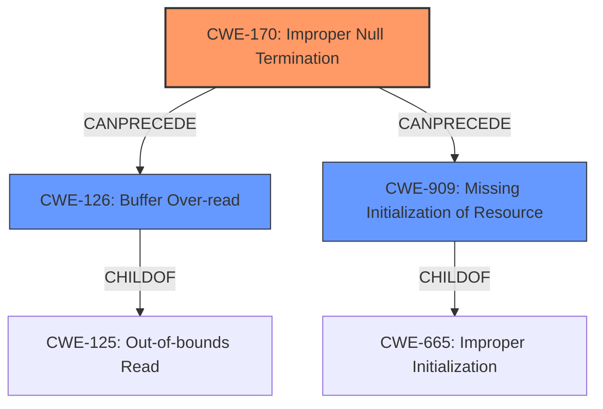

# Analysis Report for CVE-2024-53142

# Vulnerability Analysis Report: CVE-2024-53142

## Description

In the Linux kernel, the following vulnerability has been resolved initramfs avoid **filename buffer overrun** The initramfs filename field is defined in Documentation/driver-api/early-userspace/buffer-format.rst as 37 cpio_file = ALGN(4) + cpio_header + filename + \\0 + ALGN(4) + data ... 55 ============= ================== ========================= 56 Field name Field size Meaning 57 ============= ================== ========================= ... 70 c_namesize 8 bytes Length of filename, including final \\0 When extracting an initramfs cpio archive, the kernels do_name() path handler assumes a zero-terminated path at @collected, passing it directly to filp_open() / init_mkdir() / init_mknod(). If a specially crafted cpio entry carries a non-zero-terminated filename and is followed by **uninitialized memory**, then a file may be created with trailing characters that represent the **uninitialized memory**. The ability to create an initramfs entry would imply already having full control of the system, so the buffer overrun shouldnt be considered a security vulnerability. Append the output of the following bash script to an existing initramfs and observe any created /initramfs_test_fname_overrunAA* path. E.g. ./reproducer.sh | gzip >> /myinitramfs Its easiest to observe non-zero **uninitialized memory** when the output is gzipped, as itll **overflow** the heap allocated @out_buf in __gunzip(), rather than the initrd_start+initrd_size block. ---- reproducer.sh ---- nilchar=A # change to \\0 to properly zero terminate / pad magic=070701 ino=1 mode=$(( 0100777 )) uid=0 gid=0 nlink=1 mtime=1 filesize=0 devmajor=0 devminor=1 rdevmajor=0 rdevminor=0 csum=0 fname=initramfs_test_fname_overrun namelen=$(( ${#fname} + 1 )) # plus one to account for terminator printf %s%08x%08x%08x%08x%08x%08x%08x%08x%08x%08x%08x%08x%08x%s \\ $magic $ino $mode $uid $gid $nlink $mtime $filesize \\ $devmajor $devminor $rdevmajor $rdevminor $namelen $csum $fname termpadlen=$(( 1 + ((4 - ((110 + $namelen) & 3)) % 4) )) printf %.s${nilchar} $(seq 1 $termpadlen) ---- reproducer.sh ---- Symlink filename fields handled in do_symlink() wont overrun past the data segment, due to the explicit zero-termination of the symlink target. Fix **filename buffer overrun** by aborting the initramfs FSM if any cpio entry doesnt carry a zero-terminator at the expected (name_len - 1) offset.

## Vulnerability Description Key Phrases

- **Rootcause:** uninitialized memory
- **Weakness:** ['filename buffer overrun', 'overflow']
- **Impact:** create a file with trailing characters
- **Vector:** specially crafted cpio entry with non-zero-terminated filename
- **Product:** Linux kernel
- **Component:** initramfs

## Analysis (with Relationship Data)

# Summary
| CWE ID  | CWE Name                                          | Confidence | CWE Abstraction Level | CWE Vulnerability Mapping Label | CWE-Vulnerability Mapping Notes |
| :-------- | :------------------------------------------------ | :--------- | :-------------------- | :------------------------------ | :------------------------------ |
| CWE-170 | Improper Null Termination                         | 0.9        | Base                  | Primary                         | Allowed                         |
| CWE-126 | Buffer Over-read                                  | 0.7        | Variant               | Secondary                       | Allowed                         |
| CWE-909 | Missing Initialization of Resource                | 0.6        | Class                 | Secondary                       | Allowed-with-Review                         |

## Evidence and Confidence

*   **Confidence Score:** 0.8
*   **Evidence Strength:** HIGH

## Relationship Analysis
The primary weakness is CWE-170 Improper Null Termination, which can lead to other issues. If the string is not properly null-terminated, it can lead to out-of-bounds reads (CWE-126). The **uninitialized memory** could point to CWE-909 Missing Initialization of Resource if the memory being read past the buffer is **uninitialized**.



## Vulnerability Chain
The vulnerability chain starts with **improper null termination** (CWE-170) of the filename in the cpio archive. This leads to reading beyond the intended buffer (CWE-126), potentially exposing **uninitialized memory** (CWE-909) and resulting in the creation of a file with unexpected trailing characters. The **filename buffer overrun** is a direct consequence of the missing null terminator.

## Summary of Analysis
The analysis focuses on the root cause of the vulnerability, which is the **improper null termination** (CWE-170) of the filename within the initramfs cpio archive. The description explicitly mentions that the kernel's path handler assumes a zero-terminated path, and a specially crafted cpio entry with a non-zero-terminated filename can lead to the issue. This aligns perfectly with the definition of CWE-170.

The **buffer overrun** is a symptom, and **uninitialized memory** is an additional factor. An over-read (CWE-126) from the missing null terminator reads **uninitialized memory** (CWE-909).

The retriever results and keyphrase analysis both support this conclusion, with CWE-170 being a relevant candidate. While other CWEs like CWE-125 (Out-of-bounds Read) and CWE-909 (Missing Initialization of Resource) are also relevant, they are consequences of the primary weakness (CWE-170).

The selected CWEs are at the optimal level of specificity. CWE-170 is a Base CWE, representing the core issue. CWE-126 and CWE-909 are secondary contributing factors. The relationships between these CWEs are well-defined, with CWE-170 potentially leading to CWE-126, and the **uninitialized memory** triggering CWE-909.

Relevant CWE Information:

# Enhanced Context (25 CWEs)
The following CWEs were identified as potentially relevant to this vulnerability:

## CWE-824: Access of Uninitialized Pointer
**Abstraction Level**: Base
**Similarity Score**: 0.75
**Source**: dense

**Description**:
The product accesses or uses a pointer that has not been initialized.

**Mapping Guidance**:
- Usage: Allowed
- Rationale: This CWE entry is at the Base level of abstraction, which is a preferred level of abstraction for mapping to the root causes of vulnerabilities.

## CWE-665: Improper Initialization
**Abstraction Level**: Class
**Similarity Score**: 0.75
**Source**: dense

**Description**:
The product does not initialize or incorrectly initializes a resource, which might leave the resource in an unexpected state when it is accessed or used.

**Mapping Guidance**:
- Usage: Discouraged
- Rationale: This CWE entry is a level-1 Class (i.e., a child of a Pillar). It might have lower-level children that would be more appropriate

## CWE-667: Improper Locking
**Abstraction Level**: Class
**Similarity Score**: 0.74
**Source**: dense

**Description**:
The product does not properly acquire or release a lock on a resource, leading to unexpected resource state changes and behaviors.

**Mapping Guidance**:
- Usage: Allowed-with-Review
- Rationale: This CWE entry is a Class and might have Base-level children that would be more appropriate

## CWE-131: Incorrect Calculation of Buffer Size
**Abstraction Level**: Base
**Similarity Score**: 0.74
**Source**: dense

**Description**:
The product does not correctly calculate the size to be used when allocating a buffer, which could lead to a buffer overflow.

**Mapping Guidance**:
- Usage: Allowed
- Rationale: This CWE entry is at the Base level of abstraction, which is a preferred level of abstraction for mapping to the root causes of vulnerabilities.

## CWE-909: Missing Initialization of Resource
**Abstraction Level**: Class
**Similarity Score**: 0.74
**Source**: dense

**Description**:
The product does not initialize a critical resource.

**Mapping Guidance**:
- Usage: Allowed-with-Review
- Rationale: This CWE entry is a Class and might have Base-level children that would be more appropriate

## CWE-125: Out-of-bounds Read
**Abstraction Level**: Base
**Similarity Score**: 0.74
**Source**: dense

**Description**:
The product reads data past the end, or before the beginning, of the intended buffer.

**Mapping Guidance**:
- Usage: Allowed
- Rationale: This CWE entry is at the Base level of abstraction, which is a preferred level of abstraction for mapping to the root causes of vulnerabilities.

## CWE-754: Improper Check for Unusual or Exceptional Conditions
**Abstraction Level**: Class
**Similarity Score**: 0.74
**Source**: dense

**Description**:
The product does not check or incorrectly checks for unusual or exceptional conditions that are not expected to occur frequently during day to day operation of the product.

**Mapping Guidance**:
- Usage: Allowed-with-Review
- Rationale: This CWE entry is a Class and might have Base-level children that would be more appropriate

## CWE-41: Improper Resolution of Path Equivalence
**Abstraction Level**: Base
**Similarity Score**: 0.74
**Source**: dense

**Description**:
The product is vulnerable to file system contents disclosure through path equivalence. Path equivalence involves the use of special characters in file and directory names. The associated manipulations are intended to generate multiple names for the same object.

**Mapping Guidance**:
- Usage: Allowed
- Rationale: This CWE entry is at the Base level of abstraction, which is a preferred level of abstraction for mapping to the root causes of vulnerabilities.

## CWE-129: Improper Validation of Array Index
**Abstraction Level**: Variant
**Similarity Score**: 0.73
**Source**: dense

**Description**:
The product uses untrusted input when calculating or using an array index, but the product does not validate or incorrectly validates the index to ensure the index references a valid position within the array.

**Mapping Guidance**:
- Usage: Allowed
- Rationale: This CWE entry is at the Variant level of abstraction, which is a preferred level of abstraction for mapping to the root causes of vulnerabilities.

## CWE-703: Improper Check or Handling of Exceptional Conditions
**Abstraction Level**: Pillar
**Similarity Score**: 0.73
**Source**: dense

**Description**:
The product does not properly anticipate or handle exceptional conditions that rarely occur during normal operation of the product.

**Mapping Guidance**:
- Usage: Discouraged
- Rationale: This CWE entry is extremely high-level, a Pillar.

## CWE-1284: Improper Validation of Specified Quantity in Input
**Abstraction Level**: Base
**Similarity Score**: 3009.47
**Source**: sparse

**Description**:
The product receives input that is expected to specify a quantity (such as size or length), but it does not validate or incorrectly validates that the quantity has the required properties.

**Mapping Guidance**:
- Usage: Allowed


## CWE Relationship Analysis

Current CWEs represent these abstraction levels: .


### Vulnerability Chain Analysis

**Chain starting from CWE-1284:**
- 1284 (Improper Validation of Specified Quantity in Input) - ROOT


**Chain starting from CWE-41:**
- 41 (Improper Resolution of Path Equivalence) - ROOT


### CWE Relationship Diagram

```mermaid
graph TD
    classDef primary fill:#f96,stroke:#333,stroke-width:2px
    classDef secondary fill:#69f,stroke:#333
    classDef tertiary fill:#9e9,stroke:#333
```


*Report generated on 2025-07-13 21:44:06*
