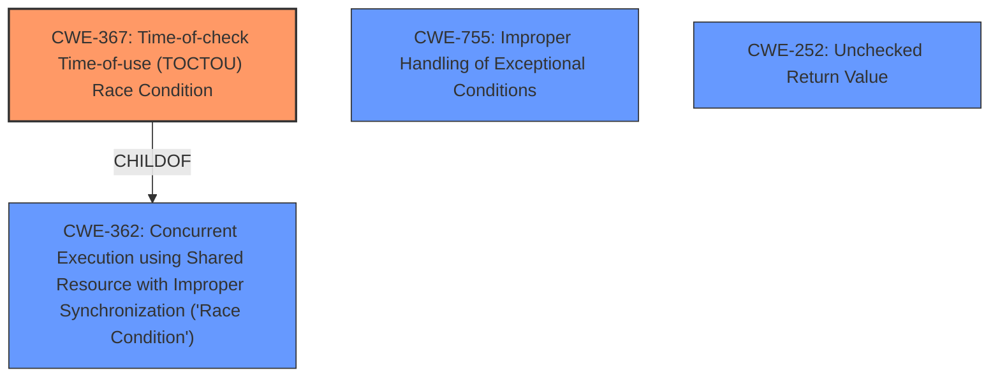

# Analysis Report for CVE-2024-53195

# Vulnerability Analysis Report: CVE-2024-53195

## Description

In the Linux kernel, the following vulnerability has been resolved KVM arm64 Get rid of userspace_irqchip_in_use Improper use of userspace_irqchip_in_use led to syzbot hitting the following WARN_ON() in kvm_timer_update_irq() WARNING CPU 0 PID 3281 at arch/arm64/kvm/arch_timer.c459 kvm_timer_update_irq+0x21c/0x394 Call trace kvm_timer_update_irq+0x21c/0x394 arch/arm64/kvm/arch_timer.c459 kvm_timer_vcpu_reset+0x158/0x684 arch/arm64/kvm/arch_timer.c968 kvm_reset_vcpu+0x3b4/0x560 arch/arm64/kvm/reset.c264 kvm_vcpu_set_target arch/arm64/kvm/arm.c1553 [inline] kvm_arch_vcpu_ioctl_vcpu_init arch/arm64/kvm/arm.c1573 [inline] kvm_arch_vcpu_ioctl+0x112c/0x1b3c arch/arm64/kvm/arm.c1695 kvm_vcpu_ioctl+0x4ec/0xf74 virt/kvm/kvm_main.c4658 vfs_ioctl fs/ioctl.c51 [inline] __do_sys_ioctl fs/ioctl.c907 [inline] __se_sys_ioctl fs/ioctl.c893 [inline] __arm64_sys_ioctl+0x108/0x184 fs/ioctl.c893 __invoke_syscall arch/arm64/kernel/syscall.c35 [inline] invoke_syscall+0x78/0x1b8 arch/arm64/kernel/syscall.c49 el0_svc_common+0xe8/0x1b0 arch/arm64/kernel/syscall.c132 do_el0_svc+0x40/0x50 arch/arm64/kernel/syscall.c151 el0_svc+0x54/0x14c arch/arm64/kernel/entry-common.c712 el0t_64_sync_handler+0x84/0xfc arch/arm64/kernel/entry-common.c730 el0t_64_sync+0x190/0x194 arch/arm64/kernel/entry.S598 The following sequence led to the scenario - Userspace creates a VM and a vCPU. - The vCPU is initialized with KVM_ARM_VCPU_PMU_V3 during KVM_ARM_VCPU_INIT. - Without any other setup, such as vGIC or vPMU, userspace issues KVM_RUN on the vCPU. Since the vPMU is requested, but not setup, kvm_arm_pmu_v3_enable() fails in kvm_arch_vcpu_run_pid_change(). As a result, KVM_RUN returns after enabling the timer, but before incrementing userspace_irqchip_in_use kvm_arch_vcpu_run_pid_change() ret = kvm_arm_pmu_v3_enable() if (!vcpu->arch.pmu.created) return -EINVAL if (ret) return ret [...] if (!irqchip_in_kernel(kvm)) static_branch_inc(&userspace_irqchip_in_use) - Userspace ignores the error and issues KVM_ARM_VCPU_INIT again. Since the timer is already enabled, control moves through the following flow, ultimately hitting the WARN_ON() kvm_timer_vcpu_reset() if (timer->enabled) kvm_timer_update_irq() if (!userspace_irqchip()) ret = kvm_vgic_inject_irq() ret = vgic_lazy_init() if (unlikely(!vgic_initialized(kvm))) if (kvm->arch.vgic.vgic_model != KVM_DEV_TYPE_ARM_VGIC_V2) return -EBUSY WARN_ON(ret) Theoretically, since userspace_irqchip_in_uses functionality can be simply replaced by !irqchip_in_kernel(), get rid of the static key to avoid the mismanagement, which also helps with the syzbot issue.

## Vulnerability Description Key Phrases

- **Component:** KVM
- **Rootcause:** Improper use of userspace_irqchip_in_use, userspace doesn't account for IRQ chip state
- **Vector:** KVM_ARM_VCPU_PMU_V3 activation and userspace KVM_RUN
- **Product:** Linux kernel
- **Impact:** WARN_ON

## Analysis (with Relationship Data)

# Summary

| CWE ID | CWE Name | Confidence | CWE Abstraction Level | CWE Vulnerability Mapping Label | CWE-Vulnerability Mapping Notes |
|---|---|---|---|---|---|
| CWE-367 | Time-of-check Time-of-use (TOCTOU) Race Condition | 0.9 | Base | Allowed | Primary CWE |
| CWE-362 | Concurrent Execution using Shared Resource with Improper Synchronization ('Race Condition') | 0.7 | Class | Allowed-with-Review | Secondary Candidate |
| CWE-755 | Improper Handling of Exceptional Conditions | 0.6 | Class | Discouraged | Secondary Candidate |
| CWE-252 | Unchecked Return Value | 0.5 | Base | Allowed | Secondary Candidate |

## Evidence and Confidence

*   **Confidence Score:** 0.8
*   **Evidence Strength:** HIGH

## Relationship Analysis

The primary weakness is identified as CWE-367, Time-of-check Time-of-use (TOCTOU) Race Condition, which is a child of CWE-362, Concurrent Execution using Shared Resource with Improper Synchronization ('Race Condition'). The vulnerability occurs because the state of the `userspace_irqchip_in_use` flag is checked and then used, but can change between the check and the use due to the concurrent nature of the KVM architecture. This leads to an incorrect state and subsequent WARN_ON failure.



## Vulnerability Chain

The vulnerability chain starts with the improper initialization of the vCPU with `KVM_ARM_VCPU_PMU_V3`, followed by the failure of `kvm_arm_pmu_v3_enable()` within `kvm_arch_vcpu_run_pid_change()`. This failure leads to a race condition where `userspace_irqchip_in_use` is not correctly managed. Subsequent calls to `KVM_ARM_VCPU_INIT` then trigger a WARN_ON due to the incorrect state, leading to a kernel panic.

1.  **Root Cause:** **Improper use of `userspace_irqchip_in_use`** leads to a race condition (CWE-367).
2.  **Consequence:** Incorrect state of `userspace_irqchip_in_use`.
3.  **Impact:** `WARN_ON` failure and kernel panic.

## Summary of Analysis

The primary CWE is CWE-367 because the core issue lies in the time-of-check time-of-use race condition involving the `userspace_irqchip_in_use` flag. The `userspace_irqchip_in_use` flag is incremented without proper error handling in the `kvm_arch_vcpu_run_pid_change()` function, leading to an inconsistent state. This is direct evidence from "As a result, KVM_RUN returns after enabling the timer, but before incrementing userspace_irqchip_in_use". The **improper** management of this flag allows a race condition to occur, where the state of the flag can change between the check and use, leading to the WARN\_ON.

CWE-362 is a parent Class of CWE-367 and is considered as a secondary candidate because it broadly describes the concurrent execution issue but doesn't specifically capture the TOCTOU nature of the race condition.

CWE-755, Improper Handling of Exceptional Conditions, is also considered because the error return from `kvm_arm_pmu_v3_enable()` is ignored, leading to further issues. However, the core weakness is the race condition, making CWE-367 more appropriate. The key phrase "Userspace ignores the error and issues KVM_ARM_VCPU_INIT again" supports this.

CWE-252, Unchecked Return Value, is another candidate because the return value from `kvm_arm_pmu_v3_enable()` is not checked, which contributes to the problem. However, the race condition is the more direct cause of the vulnerability.

The selected CWEs are at the optimal level of specificity because CWE-367 is a Base CWE that accurately captures the TOCTOU race condition, while CWE-362 and CWE-755 represent related but less specific aspects of the vulnerability.

Relevant CWE Information:

# Enhanced Context (25 CWEs)
The following CWEs were identified as potentially relevant to this vulnerability:

## CWE-362: Concurrent Execution using Shared Resource with Improper Synchronization ('Race Condition')
**Abstraction Level**: Class
**Similarity Score**: 0.74
**Source**: dense

**Description**:
The product contains a concurrent code sequence that requires temporary, exclusive access to a shared resource, but a timing window exists in which the shared resource can be modified by another code sequence operating concurrently.

**Mapping Guidance**:
- Usage: Allowed-with-Review
- Rationale: This CWE entry is a Class and might have Base-level children that would be more appropriate


## CWE-667: Improper Locking
**Abstraction Level**: Class
**Similarity Score**: 0.74
**Source**: dense

**Description**:
The product does not properly acquire or release a lock on a resource, leading to unexpected resource state changes and behaviors.

**Mapping Guidance**:
- Usage: Allowed-with-Review
- Rationale: This CWE entry is a Class and might have Base-level children that would be more appropriate


## CWE-367: Time-of-check Time-of-use (TOCTOU) Race Condition
**Abstraction Level**: Base
**Similarity Score**: 0.73
**Source**: dense

**Description**:
The product checks the state of a resource before using that resource, but the resource's state can change between the check and the use in a way that invalidates the results of the check. This can cause the product to perform invalid actions when the resource is in an unexpected state.

**Mapping Guidance**:
- Usage: Allowed
- Rationale: This CWE entry is at the Base level of abstraction, which is a preferred level of abstraction for mapping to the root causes of vulnerabilities.


## CWE-755: Improper Handling of Exceptional Conditions
**Abstraction Level**: Class
**Similarity Score**: 0.71
**Source**: dense

**Description**:
The product does not handle or incorrectly handles an exceptional condition.

**Mapping Guidance**:
- Usage: Discouraged
- Rationale: This CWE entry is a level-1 Class (i.e., a child of a Pillar). It might have lower-level children that would be more appropriate


## CWE-909: Missing Initialization of Resource
**Abstraction Level**: Class
**Similarity Score**: 0.71
**Source**: dense

**Description**:
The product does not initialize a critical resource.

**Mapping Guidance**:
- Usage: Allowed-with-Review
- Rationale: This CWE entry is a Class and might have Base-level children that would be more appropriate


## CWE-252: Unchecked Return Value
**Abstraction Level**: Base
**Similarity Score**: 0.70
**Source**: dense

**Description**:
The product does not check the return value from a method or function, which can prevent it from detecting unexpected states and conditions.

**Mapping Guidance**:
- Usage: Allowed
- Rationale: This CWE entry is at the Base level of abstraction, which is a preferred level of abstraction for mapping to the root causes of vulnerabilities.


## CWE-1285: Improper Validation of Specified Index, Position, or Offset in Input
**Abstraction Level**: Base
**Similarity Score**: 0.70
**Source**: dense

**Description**:
The product receives input that is expected to specify an index, position, or offset into an indexable resource such as a buffer or file, but it does not validate or incorrectly validates that the specified index/position/offset has the required properties.

**Mapping Guidance**:
- Usage: Allowed
- Rationale: This CWE entry is at the Base level of abstraction, which is a preferred level of abstraction for mapping to the root causes of vulnerabilities.


## CWE-119: Improper Restriction of Operations within the Bounds of a Memory Buffer
**Abstraction Level**: Class
**Similarity Score**: 0.69
**Source**: dense

**Description**:
The product performs operations on a memory buffer, but it reads from or writes to a memory location outside the buffer's intended boundary. This may result in


## CWE Relationship Analysis

Current CWEs represent these abstraction levels: .


### Vulnerability Chain Analysis

**Chain starting from CWE-667:**
- 667 (Improper Locking) - ROOT


**Chain starting from CWE-119:**
- 119 (Improper Restriction of Operations within the Bounds of a Memory Buffer) - ROOT


### CWE Relationship Diagram

```mermaid
graph TD
    classDef primary fill:#f96,stroke:#333,stroke-width:2px
    classDef secondary fill:#69f,stroke:#333
    classDef tertiary fill:#9e9,stroke:#333
```


*Report generated on 2025-07-13 21:45:55*
