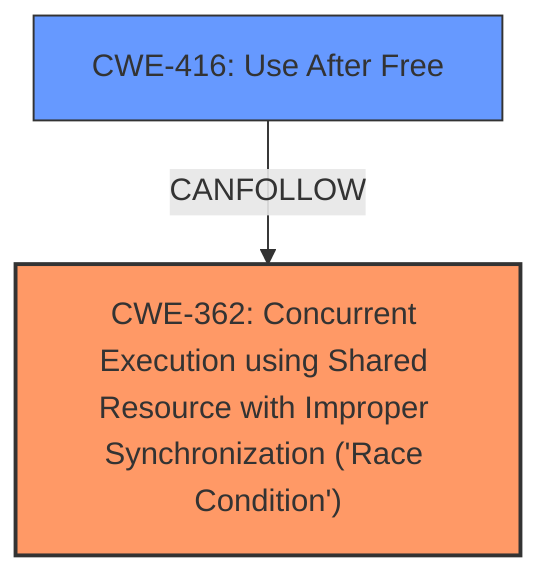

# Analysis for CVE-2024-53218

# Summary
| CWE ID | CWE Name | Confidence | CWE Abstraction Level | CWE Vulnerability Mapping Label | CWE-Vulnerability Mapping Notes |
|---|---|---|---|---|---|
| CWE-362 | Concurrent Execution using Shared Resource with Improper Synchronization ('Race Condition') | 0.9 | Class | Allowed-with-Review | Primary CWE. The root cause is a **race condition** in `f2fs_stop_gc_thread()`.  |
| CWE-416 | Use After Free | 0.8 | Base | Allowed | Secondary CWE. The **race condition** leads to a use-after-free vulnerability. |

## Evidence and Confidence

*   **Confidence Score:** 0.85
*   **Evidence Strength:** HIGH

## Relationship Analysis
The analysis focuses on identifying the root cause and subsequent impact of the vulnerability.
  - CWE-362 (Race Condition) is a Class-level CWE, while CWE-416 (Use After Free) is a Base-level CWE.
  - CWE-416 can be a consequence of CWE-362 under certain circumstances, where the race condition leads to memory being freed while still in use.
  - The primary focus is on the initial **race condition** (CWE-362) that triggers the subsequent use-after-free (CWE-416).

## Vulnerability Chain
The vulnerability chain starts with a **race condition** due to concurrent access to a shared resource, leading to a use-after-free condition, and finally resulting in a kernel crash.
  - **Root Cause:** CWE-362 (Concurrent Execution using Shared Resource with Improper Synchronization ('Race Condition')) - The `f2fs_stop_gc_thread()` function is called concurrently, leading to a race.
  - **Weakness:** CWE-416 (Use After Free) - A thread frees the memory while another is still using it.
  - **Impact:** Kernel crash due to a general protection fault.

## Summary of Analysis
The primary weakness is a **race condition** (CWE-362) in the `f2fs_stop_gc_thread()` function within the Linux kernel. This **race condition** leads to a use-after-free vulnerability (CWE-416), ultimately causing a kernel crash.

The evidence from the "CVE Reference Links Content Summary" confirms the **race condition**: "A race condition exists in the `f2fs_stop_gc_thread()` function" and the resulting UAF: "One thread might free the memory associated with `gc_th` (garbage collection thread) while another thread is still using it, leading to a use-after-free when `kthread_stop(gc_th->f2fs_gc_task)` is called with a dangling pointer."

The graph relationships highlight the connection between CWE-362 and CWE-416, where a race condition can lead to a use-after-free.

The selected CWEs are at the optimal level of specificity. CWE-362 accurately represents the root cause, and CWE-416 describes the direct consequence of the race condition.

Relevant CWE Information:

# Enhanced Context (25 CWEs)
The following CWEs were identified as potentially relevant to this vulnerability:

## CWE-362: Concurrent Execution using Shared Resource with Improper Synchronization ('Race Condition')
**Abstraction Level**: Class
**Similarity Score**: 0.76
**Source**: dense

**Description**:
The product contains a concurrent code sequence that requires temporary, exclusive access to a shared resource, but a timing window exists in which the shared resource can be modified by another code sequence operating concurrently.

**Mapping Guidance**:
- Usage: Allowed-with-Review
- Rationale: This CWE entry is a Class and might have Base-level children that would be more appropriate

## CWE-416: Use After Free
**Abstraction Level**: Base
**Similarity Score**: Not Listed, but implied by the text.
**Source**: CVE Reference Links Content Summary

**Description**:
The product contains a code sequence that frees a resource, but it does not clear the pointer to that resource. Later, the code dereferences the pointer, assuming that the resource is still valid.

**Mapping Guidance**:
- Usage: Allowed
- Rationale: This CWE entry is at the Base level of abstraction, which is a preferred level of abstraction for mapping to the root causes of vulnerabilities.

## Considered but not Used:

*   **CWE-366: Race Condition within a Thread:** While a race condition exists within a thread, CWE-362 is more general and accurately captures the **race condition** involving shared resources.
*   **CWE-367: Time-of-check Time-of-use (TOCTOU) Race Condition:** This is a specific type of race condition, but the provided information does not explicitly indicate a TOCTOU vulnerability.
*   **CWE-667: Improper Locking:** Although locking is related, the core issue is the **race condition** itself, rather than specifically improper locking.
*   **CWE-833: Deadlock:** There is no indication of a deadlock in the provided vulnerability description.
*   **CWE-404: Improper Resource Shutdown or Release:** While related to shutdown, the primary issue is the **race condition** during the shutdown process, not the shutdown itself.
*   **CWE-755: Improper Handling of Exceptional Conditions:** The vulnerability is more specific than a general improper handling of exceptional conditions.
*   **CWE-908: Use of Uninitialized Resource** and **CWE-909: Missing Initialization of Resource:** Not applicable based on the provided information.
*   **CWE-129: Improper Validation of Array Index:** Not applicable based on the provided information.
*   **CWE-364: Signal Handler Race Condition:** Not applicable based on the provided information.
*   **CWE-662: Improper Synchronization** While synchronization is related, CWE-362 is a better fit as the root cause.
*   **CWE-609: Double-Checked Locking:** Not applicable based on the provided information.
*   **CWE-567: Unsynchronized Access to Shared Data in a Multithreaded Context:** Not applicable based on the provided information.
*   **CWE-488: Exposure of Data Element to Wrong Session:** Not applicable based on the provided information.
*   **CWE-663: Use of a Non-reentrant Function in a Concurrent Context:** Not applicable based on the provided information.
*   **CWE-1265: Unintended Reentrant Invocation of Non-reentrant Code Via Nested Calls:** Not applicable based on the provided information.
*   **CWE-386: Symbolic Name not Mapping to Correct Object:** Not applicable based on the provided information.