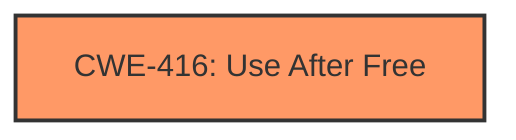

# Analysis Report for CVE-2024-53237

# Vulnerability Analysis Report: CVE-2024-53237

## Description

In the Linux kernel, the following vulnerability has been resolved Bluetooth fix **use-after-free** in device_for_each_child() Syzbot has reported the following KASAN splat BUG KASAN slab-**use-after-free** in device_for_each_child+0x18f/0x1a0 Read of size 8 at addr ffff88801f605308 by task kbnepd bnep0/4980 CPU 0 UID 0 PID 4980 Comm kbnepd bnep0 Not tainted 6.12.0-rc4-00161-gae90f6a6170d #1 Hardware name QEMU Standard PC (i440FX + PIIX, 1996), BIOS 1.16.3-2.fc40 04/01/2014 Call Trace dump_stack_lvl+0x100/0x190 ? device_for_each_child+0x18f/0x1a0 print_report+0x13a/0x4cb ? __virt_addr_valid+0x5e/0x590 ? __phys_addr+0xc6/0x150 ? device_for_each_child+0x18f/0x1a0 kasan_report+0xda/0x110 ? device_for_each_child+0x18f/0x1a0 ? __pfx_dev_memalloc_noio+0x10/0x10 device_for_each_child+0x18f/0x1a0 ? __pfx_device_for_each_child+0x10/0x10 pm_runtime_set_memalloc_noio+0xf2/0x180 netdev_unregister_kobject+0x1ed/0x270 unregister_netdevice_many_notify+0x123c/0x1d80 ? __mutex_trylock_common+0xde/0x250 ? __pfx_unregister_netdevice_many_notify+0x10/0x10 ? trace_contention_end+0xe6/0x140 ? __mutex_lock+0x4e7/0x8f0 ? __pfx_lock_acquire.part.0+0x10/0x10 ? rcu_is_watching+0x12/0xc0 ? unregister_netdev+0x12/0x30 unregister_netdevice_queue+0x30d/0x3f0 ? __pfx_unregister_netdevice_queue+0x10/0x10 ? __pfx_down_write+0x10/0x10 unregister_netdev+0x1c/0x30 bnep_session+0x1fb3/0x2ab0 ? __pfx_bnep_session+0x10/0x10 ? __pfx_lock_release+0x10/0x10 ? __pfx_woken_wake_function+0x10/0x10 ? __kthread_parkme+0x132/0x200 ? __pfx_bnep_session+0x10/0x10 ? kthread+0x13a/0x370 ? __pfx_bnep_session+0x10/0x10 kthread+0x2b7/0x370 ? __pfx_kthread+0x10/0x10 ret_from_fork+0x48/0x80 ? __pfx_kthread+0x10/0x10 ret_from_fork_asm+0x1a/0x30 Allocated by task 4974 kasan_save_stack+0x30/0x50 kasan_save_track+0x14/0x30 __kasan_kmalloc+0xaa/0xb0 __kmalloc_noprof+0x1d1/0x440 hci_alloc_dev_priv+0x1d/0x2820 __vhci_create_device+0xef/0x7d0 vhci_write+0x2c7/0x480 vfs_write+0x6a0/0xfc0 ksys_write+0x12f/0x260 do_syscall_64+0xc7/0x250 entry_SYSCALL_64_after_hwframe+0x77/0x7f Freed by task 4979 kasan_save_stack+0x30/0x50 kasan_save_track+0x14/0x30 kasan_save_free_info+0x3b/0x60 __kasan_slab_free+0x4f/0x70 kfree+0x141/0x490 hci_release_dev+0x4d9/0x600 bt_host_release+0x6a/0xb0 device_release+0xa4/0x240 kobject_put+0x1ec/0x5a0 put_device+0x1f/0x30 vhci_release+0x81/0xf0 __fput+0x3f6/0xb30 task_work_run+0x151/0x250 do_exit+0xa79/0x2c30 do_group_exit+0xd5/0x2a0 get_signal+0x1fcd/0x2210 arch_do_signal_or_restart+0x93/0x780 syscall_exit_to_user_mode+0x140/0x290 do_syscall_64+0xd4/0x250 entry_SYSCALL_64_after_hwframe+0x77/0x7f In hci_conn_del_sysfs(), device_unregister() may be called when an underlying (kobject) reference counter is greater than 1. This means that reparenting (happened when the device is actually freed) is delayed and, during that delay, parent controller device (hciX) may be deleted. Since the latter may create a dangling pointer to freed parent, avoid that scenario by reparenting to NULL explicitly.

## Vulnerability Description Key Phrases

- **Weakness:** use-after-free
- **Product:** Linux kernel
- **Component:** Bluetooth fix

## Analysis (with Relationship Data)

# Summary
| CWE ID | CWE Name | Confidence | CWE Abstraction Level | CWE Vulnerability Mapping Label | CWE-Vulnerability Mapping Notes |
|---|---|---|---|---|---|
| CWE-416 | Use After Free | 1.0 | Variant | Allowed | Primary CWE |

## Evidence and Confidence

*   **Confidence Score:** 1.0
*   **Evidence Strength:** HIGH

## Relationship Analysis
The primary identified weakness is CWE-416 **Use After Free**, which is a variant-level CWE. There are a number of other CWEs that may be present, such as CWE-362 **Concurrent Execution using Shared Resource with Improper Synchronization ('Race Condition')** and CWE-415 **Double Free**, but the vulnerability description clearly identifies the **use-after-free** condition as the root cause.



## Vulnerability Chain
The vulnerability chain starts with a race condition during the unregistration of a Bluetooth network device, where `device_unregister()` is called while a kobject reference counter is greater than 1. This delays reparenting. If the parent controller device (hciX) is deleted during this delay, a dangling pointer to the freed parent memory is created. When the system attempts to access this freed memory, a **use-after-free** condition occurs. The root cause is the delayed reparenting and the subsequent premature deletion of the parent controller device.

## Summary of Analysis
The vulnerability description explicitly states "**use-after-free** in device_for_each_child()". The CVE Reference Links Content Summary confirms that the root cause is a delayed reparenting of a device during unregistration, leading to a dangling pointer and a subsequent **use-after-free** condition. The commit messages provided also reinforce this.

The Retriever Results also lists CWE-416 **Use After Free** as the top candidate.

Given this evidence, CWE-416 is the most appropriate mapping.

Relevant CWE Information:

# Enhanced Context (25 CWEs)
The following CWEs were identified as potentially relevant to this vulnerability:

## CWE-366: Race Condition within a Thread
**Abstraction Level**: Base
**Similarity Score**: 0.76
**Source**: dense

**Description**:
If two threads of execution use a resource simultaneously, there exists the possibility that resources may be used while invalid, in turn making the state of execution undefined.

**Mapping Guidance**:
- Usage: Allowed
- Rationale: This CWE entry is at the Base level of abstraction, which is a preferred level of abstraction for mapping to the root causes of vulnerabilities.


## CWE-415: Double Free
**Abstraction Level**: Variant
**Similarity Score**: 0.75
**Source**: dense

**Description**:
The product calls free() twice on the same memory address, potentially leading to modification of unexpected memory locations.

**Mapping Guidance**:
- Usage: Allowed
- Rationale: This CWE entry is at the Variant level of abstraction, which is a preferred level of abstraction for mapping to the root causes of vulnerabilities.


## CWE-667: Improper Locking
**Abstraction Level**: Class
**Similarity Score**: 0.73
**Source**: dense

**Description**:
The product does not properly acquire or release a lock on a resource, leading to unexpected resource state changes and behaviors.

**Mapping Guidance**:
- Usage: Allowed-with-Review
- Rationale: This CWE entry is a Class and might have Base-level children that would be more appropriate


## CWE-362: Concurrent Execution using Shared Resource with Improper Synchronization ('Race Condition')
**Abstraction Level**: Class
**Similarity Score**: 0.73
**Source**: dense

**Description**:
The product contains a concurrent code sequence that requires temporary, exclusive access to a shared resource, but a timing window exists in which the shared resource can be modified by another code sequence operating concurrently.

**Mapping Guidance**:
- Usage: Allowed-with-Review
- Rationale: This CWE entry is a Class and might have Base-level children that would be more appropriate


## CWE-754: Improper Check for Unusual or Exceptional Conditions
**Abstraction Level**: Class
**Similarity Score**: 0.72
**Source**: dense

**Description**:
The product does not check or incorrectly checks for unusual or exceptional conditions that are not expected to occur frequently during day to day operation of the product.

**Mapping Guidance**:
- Usage: Allowed-with-Review
- Rationale: This CWE entry is a Class and might have Base-level children that would be more appropriate


## CWE-404: Improper Resource Shutdown or Release
**Abstraction Level**: Class
**Similarity Score**: 0.72
**Source**: dense

**Description**:
The product does not release or incorrectly releases a resource before it is made available for re-use.

**Mapping Guidance**:
- Usage: Allowed-with-Review
- Rationale: This CWE entry is a Class and might have Base-level children that would be more appropriate


## CWE-226: Sensitive Information in Resource Not Removed Before Reuse
**Abstraction Level**: Base
**Similarity Score**: 0.72
**Source**: dense

**Description**:
The product releases a resource such as memory or a file so that it can be made available for reuse, but it does not clear or "zeroize" the information contained in the resource before the product performs a critical state transition or makes the resource available for reuse by other entities.

**Mapping Guidance**:
- Usage: Allowed
- Rationale: This CWE entry is at the Base level of abstraction, which is a preferred level of abstraction for mapping to the root causes of vulnerabilities.


## CWE-367: Time-of-check Time-of-use (TOCTOU) Race Condition
**Abstraction Level**: Base
**Similarity Score**: 0.72
**Source**: dense

**Description**:
The product checks the state of a resource before using that resource, but the resource's state can change between the check and the use in a way that invalidates the results of the check. This can cause the product to perform invalid actions when the resource is in an unexpected state.

**Mapping Guidance**:
- Usage: Allowed
- Rationale: This CWE entry is at the Base level of abstraction, which is a preferred level of abstraction for mapping to the root causes of vulnerabilities.


## CWE-131: Incorrect Calculation of Buffer Size
**Abstraction Level**: Base
**Similarity Score**: 0.72
**Source**: dense

**Description**:
The product does not correctly calculate the size to be used when allocating a buffer, which could lead to a buffer overflow.

**Mapping Guidance**:
- Usage: Allowed
- Rationale: This CWE entry is at the Base level of abstraction, which is a preferred level of abstraction for mapping to the root causes of vulnerabilities.


## CWE-416: Use After Free
**Abstraction Level**: Variant
**Similarity Score**: 0.72
**Source**: dense

**Description**:
The product reuses or references memory after it has been freed. At some point afterward, the memory may be allocated again and saved in another pointer, while the original pointer references a location somewhere within the new allocation. Any operations using the original pointer are no longer valid because the memory "belongs" to the code that operates on the new pointer.

**Mapping Guidance**:
- Usage: Allowed
- Rationale: This CWE entry is at the Variant level of abstraction, which is a preferred level of abstraction for mapping to the root causes of vulnerabilities.


## CWE-362: Concurrent Execution using Shared Resource with Improper Synchronization ('Race Condition')
**Abstraction Level**: Class
**Similarity Score**: 2090.94
**Source**: sparse

**Description**:
The product contains a concurrent code sequence that requires temporary, exclusive access to a shared resource, but a timing window exists in which the shared resource can be modified by another code sequence operating concurrently.

**Mapping Guidance**:
- Usage: Allowed-with-Review
- Rationale: This CWE entry is a Class and might have Base-level children that would be more appropriate


## CWE-667: Improper Locking
**Abstraction Level**: Class
**Similarity Score**: 1977.96
**Source**: sparse

**Description**:
The product does not properly acquire or release a lock on a resource, leading to unexpected resource state changes and behaviors.

**Mapping Guidance**:
- Usage: Allowed-with-Review
- Rationale: This CWE entry is a Class and might have Base-level children that would be more appropriate


## CWE-415: Double Free
**Abstraction Level**: Variant
**Similarity Score**: 1949.09
**Source**: sparse

**Description**:
The product calls free() twice on the same memory address, potentially leading to modification of unexpected memory locations.

**Mapping Guidance**:
- Usage: Allowed
- Rationale: This CWE entry is at the Variant level of abstraction, which is a preferred level of abstraction for mapping to the root causes of vulnerabilities.


## CWE-364: Signal Handler Race Condition
**Abstraction Level**: Base
**Similarity Score**: 1930.24
**Source**: sparse

**Description**:
The product uses a signal handler that introduces a race condition


## CWE Relationship Analysis

Current CWEs represent these abstraction levels: .


### Vulnerability Chain Analysis

**Chain starting from CWE-416:**
- 416 (Use After Free) - ROOT


**Chain starting from CWE-226:**
- 226 (Sensitive Information in Resource Not Removed Before Reuse) - ROOT


### CWE Relationship Diagram

```mermaid
graph TD
    classDef primary fill:#f96,stroke:#333,stroke-width:2px
    classDef secondary fill:#69f,stroke:#333
    classDef tertiary fill:#9e9,stroke:#333
```


*Report generated on 2025-07-13 21:47:09*
