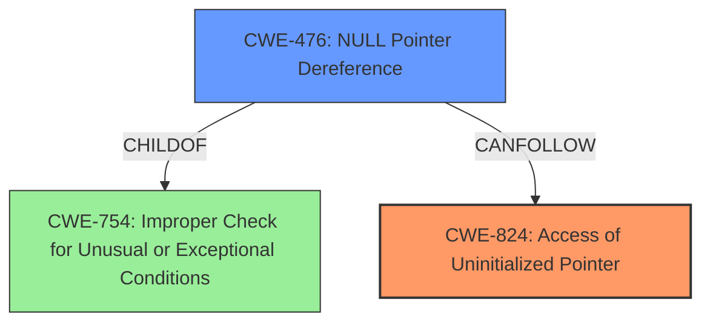

# Analysis Report for CVE-2024-53238

# Vulnerability Analysis Report: CVE-2024-53238

## Description

In the Linux kernel, the following vulnerability has been resolved Bluetooth btmtk adjust the position to init iso data anchor MediaTek iso data anchor init should be moved to where MediaTek claims iso data interface. If there is an unexpected BT usb disconnect during setup flow, it will cause a **NULL pointer crash** issue when releasing iso anchor since the anchor wasnt been init yet. Adjust the position to do iso data anchor init. [ 17.137991] pc usb_kill_anchored_urbs+0x60/0x168 [ 17.137998] lr usb_kill_anchored_urbs+0x44/0x168 [ 17.137999] sp ffffffc0890cb5f0 [ 17.138000] x29 ffffffc0890cb5f0 x28 ffffff80bb6c2e80 [ 17.144081] gpio gpiochip0 registered chardev handle for 1 lines [ 17.148421] x27 0000000000000000 [ 17.148422] x26 ffffffd301ff4298 x25 0000000000000003 x24 00000000000000f0 [ 17.148424] x23 0000000000000000 x22 00000000ffffffff x21 0000000000000001 [ 17.148425] x20 ffffffffffffffd8 x19 ffffff80c0f25560 x18 0000000000000000 [ 17.148427] x17 ffffffd33864e408 x16 ffffffd33808f7c8 x15 0000000000200000 [ 17.232789] x14 e0cd73cf80ffffff x13 50f2137c0a0338c9 x12 0000000000000001 [ 17.239912] x11 0000000080150011 x10 0000000000000002 x9 0000000000000001 [ 17.247035] x8 0000000000000000 x7 0000000000008080 x6 8080000000000000 [ 17.254158] x5 ffffffd33808ebc0 x4 fffffffe033dcf20 x3 0000000080150011 [ 17.261281] x2 ffffff8087a91400 x1 0000000000000000 x0 ffffff80c0f25588 [ 17.268404] Call trace [ 17.270841] usb_kill_anchored_urbs+0x60/0x168 [ 17.275274] btusb_mtk_release_iso_intf+0x2c/0xd8 [btusb (HASH5afe 6)] [ 17.284226] btusb_mtk_disconnect+0x14/0x28 [btusb (HASH5afe 6)] [ 17.292652] btusb_disconnect+0x70/0x140 [btusb (HASH5afe 6)] [ 17.300818] usb_unbind_interface+0xc4/0x240 [ 17.305079] device_release_driver_internal+0x18c/0x258 [ 17.310296] device_release_driver+0x1c/0x30 [ 17.314557] bus_remove_device+0x140/0x160 [ 17.318643] device_del+0x1c0/0x330 [ 17.322121] usb_disable_device+0x80/0x180 [ 17.326207] usb_disconnect+0xec/0x300 [ 17.329948] hub_quiesce+0x80/0xd0 [ 17.333339] hub_disconnect+0x44/0x190 [ 17.337078] usb_unbind_interface+0xc4/0x240 [ 17.341337] device_release_driver_internal+0x18c/0x258 [ 17.346551] device_release_driver+0x1c/0x30 [ 17.350810] usb_driver_release_interface+0x70/0x88 [ 17.355677] proc_ioctl+0x13c/0x228 [ 17.359157] proc_ioctl_default+0x50/0x80 [ 17.363155] usbdev_ioctl+0x830/0xd08 [ 17.366808] __arm64_sys_ioctl+0x94/0xd0 [ 17.370723] invoke_syscall+0x6c/0xf8 [ 17.374377] el0_svc_common+0x84/0xe0 [ 17.378030] do_el0_svc+0x20/0x30 [ 17.381334] el0_svc+0x34/0x60 [ 17.384382] el0t_64_sync_handler+0x88/0xf0 [ 17.388554] el0t_64_sync+0x180/0x188 [ 17.392208] Code f9400677 f100a2f4 54fffea0 d503201f (b8350288) [ 17.398289] ---[ end trace 0000000000000000 ]---

## Vulnerability Description Key Phrases

- **Weakness:** NULL pointer crash
- **Vector:** unexpected BT usb disconnect during setup flow
- **Product:** Linux kernel
- **Component:** Bluetooth btmtk

## Analysis (with Relationship Data)

# Summary
| CWE ID | CWE Name | Confidence | CWE Abstraction Level | CWE Vulnerability Mapping Label | CWE-Vulnerability Mapping Notes |
|---|---|---|---|---|---|
| CWE-824 | Access of Uninitialized Pointer | 0.9 | Base | Primary | Allowed |
| CWE-476 | NULL Pointer Dereference | 0.7 | Base | Secondary | Allowed |

## Evidence and Confidence

*   **Confidence Score:** 0.8
*   **Evidence Strength:** HIGH

## Relationship Analysis
The primary weakness is **CWE-824 (Access of Uninitialized Pointer)**, which directly aligns with the root cause of the vulnerability. The secondary weakness, **CWE-476 (NULL Pointer Dereference)**, is a consequence of the uninitialized pointer being dereferenced. CWE-476 is a child of CWE-754 (Improper Check for Unusual or Exceptional Conditions), which is related to the initial error handling. The relationship shows a chain of events: an uninitialized pointer (CWE-824) leads to a NULL pointer dereference (CWE-476), resulting in a kernel crash.



## Vulnerability Chain
The vulnerability chain starts with the **missing initialization** of the iso data anchor. This leads to a **NULL pointer**, which is then **dereferenced** during the disconnect process, causing a crash.
1.  **Root Cause:** Missing Initialization (CWE-824)
2.  **Intermediate State:** NULL Pointer
3.  **Impact:** NULL Pointer Dereference (CWE-476) leading to Kernel Crash

## Summary of Analysis
The analysis indicates that the root cause is the **failure to properly initialize** the ISO data anchor before a potential USB disconnect. The direct result of this is a **NULL pointer dereference**. Therefore, **CWE-824 (Access of Uninitialized Pointer)** is the primary CWE, accurately capturing the initial coding error. The subsequent **NULL pointer dereference** is represented by **CWE-476**. This mapping is based on the evidence from the vulnerability description, the retriever results, and the relationship analysis. The selected CWEs are at the Base level of abstraction, providing the necessary specificity for this vulnerability.

Relevant CWE Information:

# Enhanced Context (25 CWEs)
The following CWEs were identified as potentially relevant to this vulnerability:

## CWE-824: Access of Uninitialized Pointer
**Abstraction Level**: Base
**Similarity Score**: 0.79
**Source**: dense

**Description**:
The product accesses or uses a pointer that has not been initialized.

**Mapping Guidance**:
- Usage: Allowed
- Rationale: This CWE entry is at the Base level of abstraction, which is a preferred level of abstraction for mapping to the root causes of vulnerabilities.

## CWE-476: NULL Pointer Dereference
**Abstraction Level**: Base
**Similarity Score**: 0.76
**Source**: dense

**Description**:
The product dereferences a pointer that it expects to be valid but is NULL.

**Mapping Guidance**:
- Usage: Allowed
- Rationale: This CWE entry is at the Base level of abstraction, which is a preferred level of abstraction for mapping to the root causes of vulnerabilities.

**CWE-824**: The vulnerability occurs because the ISO data anchor is accessed without being properly initialized due to an unexpected USB disconnect during the setup flow. The vulnerability description states: "If there is an unexpected BT usb disconnect during setup flow, it will cause a **NULL pointer crash** issue when releasing iso anchor since the anchor wasnt been init yet." This clearly indicates that the pointer is accessed in an uninitialized state.

**CWE-476**: The direct consequence of accessing the uninitialized pointer is a **NULL pointer dereference**, leading to a crash. The vulnerability description explicitly mentions "**NULL pointer crash** issue when releasing iso anchor since the anchor wasnt been init yet". This confirms that the **NULL pointer** is being dereferenced.

**CWEs Considered But Not Used:**

*   **CWE-362 Concurrent Execution using Shared Resource with Improper Synchronization ('Race Condition')**: While there is a race condition element (USB disconnect occurring before initialization), the primary issue is the missing initialization itself, making CWE-824 a more direct and accurate mapping.
*   **CWE-401 Missing Release of Memory after Effective Lifetime**: This is not the primary issue, as the crash occurs due to accessing an uninitialized pointer, not due to a memory leak.
*   **CWE-755 Improper Handling of Exceptional Conditions**: Although a USB disconnect is an exceptional condition, the vulnerability's core is the missing initialization, not the handling of the disconnect event itself.
*   **CWE-909 Missing Initialization of Resource**: Similar to CWE-824, but CWE-824 is more specific as it involves a pointer.


## CWE Relationship Analysis

Current CWEs represent these abstraction levels: .


### Vulnerability Chain Analysis

**Chain starting from CWE-476:**
- 476 (NULL Pointer Dereference) - ROOT


**Chain starting from CWE-401:**
- 401 (Missing Release of Memory after Effective Lifetime) - ROOT


### CWE Relationship Diagram

```mermaid
graph TD
    classDef primary fill:#f96,stroke:#333,stroke-width:2px
    classDef secondary fill:#69f,stroke:#333
    classDef tertiary fill:#9e9,stroke:#333
```


*Report generated on 2025-07-13 21:47:26*
