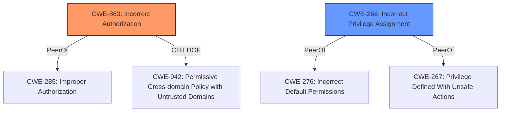

# Enhanced Analysis for CVE-2024-53244

# Summary
| CWE ID | CWE Name | Confidence | CWE Abstraction Level | CWE Vulnerability Mapping Label | CWE-Vulnerability Mapping Notes |
|---|---|---|---|---|---|
| CWE-863 | Incorrect Authorization | 0.9 | Class | Allowed-with-Review | Primary CWE. The product performs an authorization check but does not correctly perform the check. |
| CWE-266 | Incorrect Privilege Assignment | 0.7 | Base | Allowed | Secondary. The root cause may stem from an incorrect privilege assignment, leading to the authorization bypass. |

## Evidence and Confidence

*   **Confidence Score:** 0.8
*   **Evidence Strength:** HIGH

## Relationship Analysis
The primary CWE is CWE-863, which is a Class-level CWE. It describes a scenario where authorization checks are present but flawed. CWE-266 is a Base-level CWE describing incorrect privilege assignment. The vulnerability could be the result of incorrect privilege assignment, leading to the flawed authorization checks described by CWE-863. There's a potential hierarchical relationship where flawed privilege assignments (CWE-266) could contribute to incorrect authorization (CWE-863).



## Vulnerability Chain
The vulnerability chain starts with a low-privileged user and the **rootcause** of the **low-privileged user being able to run a saved search with risky commands using the permissions of a higher-privileged user**. This leads to the ability to bypass safeguards, potentially resulting in sensitive information access.
  - **Root Cause:** Incorrect Authorization (CWE-863) and possibly Incorrect Privilege Assignment (CWE-266).
  - **Weakness:** Bypassing SPL safeguards for risky commands.
  - **Impact:** Execution of risky commands with elevated privileges, potentially leading to access to sensitive information.
  - **Attack Vector:** Phishing a higher-privileged user into initiating a request within their browser.

## Summary of Analysis
The initial analysis and the retriever results pointed to several authorization and privilege-related CWEs. Given the description, the most fitting primary CWE is CWE-863 (**Incorrect Authorization**) because the vulnerability involves the application performing an authorization check, but that check is flawed, allowing a low-privileged user to execute commands with elevated privileges. The retriever results suggested CWE-732, CWE-269, CWE-285, and CWE-863, but after reviewing the details, CWE-863 is more accurate than CWE-285 because the authentication logic is present but flawed.

The evidence from the vulnerability description clearly states that a **low-privileged user can run a saved search with risky commands using the permissions of a higher-privileged user**. This directly supports the selection of CWE-863, where authorization checks are present but incorrectly implemented. The use of a higher-privileged user's permissions also suggests that an incorrect privilege assignment (CWE-266) may be a contributing factor, making it a secondary candidate.

The graph relationships show that CWE-863 has peer relationships with CWE-285 (Improper Authorization), which was considered but deemed less specific.

Relevant CWE Information:
- CWE-863 (**Incorrect Authorization**): The product performs an authorization check when an actor attempts to access a resource or perform an action, but it does not correctly perform the check. This aligns directly with the vulnerability description, where a low-privileged user is able to bypass SPL safeguards due to a flawed authorization mechanism.
- CWE-266 (**Incorrect Privilege Assignment**): A product incorrectly assigns a privilege to a particular actor, creating an unintended sphere of control for that actor. This could be a contributing factor to the authorization bypass, as incorrect privilege assignments might lead to the flawed authorization check.


## CWE Relationship Analysis

Current CWEs represent these abstraction levels: .


### Vulnerability Chain Analysis

**Chain starting from CWE-863:**
- 863 (Incorrect Authorization) - ROOT


**Chain starting from CWE-732:**
- 732 (Incorrect Permission Assignment for Critical Resource) - ROOT


### CWE Relationship Diagram

```mermaid
graph TD
    classDef primary fill:#f96,stroke:#333,stroke-width:2px
    classDef secondary fill:#69f,stroke:#333
    classDef tertiary fill:#9e9,stroke:#333
```