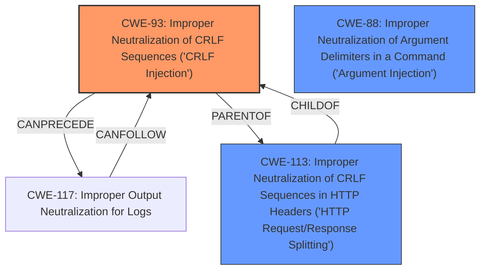

# Enhanced Analysis for CVE-2024-53263

# Summary
| CWE ID | CWE Name | Confidence | CWE Abstraction Level | CWE Vulnerability Mapping Label | CWE-Vulnerability Mapping Notes |
|---|---|---|---|---|---|
| CWE-93 | Improper Neutralization of CRLF Sequences ('CRLF Injection') | 0.9 | Base | Primary | Allowed |
| CWE-88 | Improper Neutralization of Argument Delimiters in a Command ('Argument Injection') | 0.7 | Base | Secondary | Allowed |
| CWE-113 | Improper Neutralization of CRLF Sequences in HTTP Headers ('HTTP Request/Response Splitting') | 0.6 | Variant | Secondary | Allowed |

## Evidence and Confidence

*   **Confidence Score:** 0.9
*   **Evidence Strength:** HIGH

## Relationship Analysis
The primary relationship influencing the choice of CWE-93 is its direct relevance to the **improper neutralization of CRLF sequences**. While CWE-113 is a variant specific to HTTP headers, the vulnerability description doesn't explicitly restrict the injection to only HTTP headers, making CWE-93 a more appropriate base-level classification. CWE-88 is considered due to the command-line context via `git-credential(1)`, suggesting argument injection is possible.



## Vulnerability Chain
The vulnerability chain starts with the **improper neutralization of CRLF sequences** in the URL, leading to potential **argument injection** when the URL is passed to the `git-credential(1)` command, and ultimately enabling the retrieval of Git credentials.

Vulnerability Chain:
1.  **Root Cause:** CWE-93 Improper Neutralization of CRLF Sequences ('CRLF Injection')
2.  CWE-88 Improper Neutralization of Argument Delimiters in a Command ('Argument Injection') (Possible secondary effect)
3.  Impact: Retrieval of Git credentials.

## Summary of Analysis
The primary assessment is based on the vulnerability description and the CVE Reference Links Content Summary, which explicitly mentions the **lack of checking for embedded line-ending control characters** in the URL. This directly corresponds to CWE-93. The retriever results also list CWE-93 as a top candidate.

The graph relationships influenced the decision by highlighting the connection between CWE-93 and CWE-113, however, the generic nature of the description and the lack of explicit mention of HTTP Headers influenced the decision to classify as CWE-93, a more generalized form of the **improper neutralization of CRLF sequences**. The `git-credential(1)` command creates a command-line context where CWE-88 is possible.

The selected CWEs are at the optimal level of specificity because CWE-93 directly addresses the **root cause** of the vulnerability, while CWE-113 is too specific, and CWE-88 is a possible secondary issue.

Relevant CWE Information:
*   **CWE-93: Improper Neutralization of CRLF Sequences ('CRLF Injection')**
    *   **Description:** The product uses CRLF (carriage return line feeds) as a special element, e.g. to separate lines or records, but it does not neutralize or incorrectly neutralizes CRLF sequences from inputs.
    *   **Mapping Guidance:** Usage: Allowed; Rationale: This CWE entry is at the Base level of abstraction, which is a preferred level of abstraction for mapping to the root causes of vulnerabilities.
    *   **Evidence:** "Git LFS did not check for embedded line-ending control characters in the URL passed to the `git-credential(1)` command."
*   **CWE-88: Improper Neutralization of Argument Delimiters in a Command ('Argument Injection')**
    *   **Description:** The product constructs a string for a command to be executed by a separate component in another control sphere, but it does not properly delimit the intended arguments, options, or switches within that command string.
    *   **Mapping Guidance:** Usage: Allowed; Rationale: This CWE entry is at the Base level of abstraction, which is a preferred level of abstraction for mapping to the root causes of vulnerabilities.
    *   **Evidence:** "passes portions of the hosts URL to the `git-credential(1)` command without checking for embedded line-ending control characters"
*   **CWE-113: Improper Neutralization of CRLF Sequences in HTTP Headers ('HTTP Request/Response Splitting')**
    *   **Description:** The product receives data from an HTTP agent/component (e.g., web server, proxy, browser, etc.), but it does not neutralize or incorrectly neutralizes CR and LF characters before the data is included in outgoing HTTP headers.
    *   **Mapping Guidance:** Usage: Allowed; Rationale: This CWE entry is at the Variant level of abstraction, which is a preferred level of abstraction for mapping to the root causes of vulnerabilities.
    *   **Evidence:** "inserting URL-encoded control characters such as line feed (LF) or carriage return (CR) characters into the URL"


## CWE Relationship Analysis

Current CWEs represent these abstraction levels: .


### Vulnerability Chain Analysis

**Chain starting from CWE-113:**
- 113 (Improper Neutralization of CRLF Sequences in HTTP Headers ('HTTP Request/Response Splitting')) - ROOT


**Chain starting from CWE-117:**
- 117 (Improper Output Neutralization for Logs) - ROOT


### CWE Relationship Diagram

```mermaid
graph TD
    classDef primary fill:#f96,stroke:#333,stroke-width:2px
    classDef secondary fill:#69f,stroke:#333
    classDef tertiary fill:#9e9,stroke:#333
```