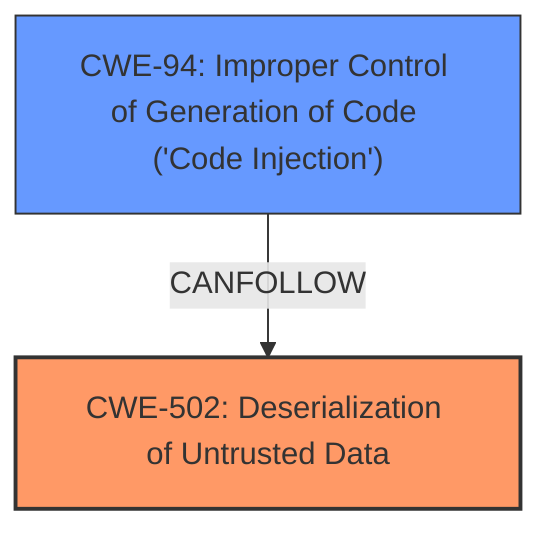

# Enhanced Analysis for CVE-2024-53305

# Summary
| CWE ID | CWE Name | Confidence | CWE Abstraction Level | CWE Vulnerability Mapping Label | CWE-Vulnerability Mapping Notes |
|---|---|---|---|---|---|
| CWE-502 | Deserialization of Untrusted Data | 1.0 | Base | Allowed | Primary CWE. The vulnerability stems from insecure deserialization of data using `pickle` in the `whoogle-search` application |
| CWE-94 | Improper Control of Generation of Code ('Code Injection') | 0.7 | Base | Allowed-with-Review | Secondary candidate. Deserialization leads to code injection.|

## Evidence and Confidence

*   **Confidence Score:** 0.9
*   **Evidence Strength:** HIGH

## Relationship Analysis
The primary weakness is **CWE-502 Deserialization of Untrusted Data**, which directly leads to **CWE-94 Improper Control of Generation of Code ('Code Injection')**. CWE-502 is the root cause, while CWE-94 is the direct consequence of the deserialization. CWE-94 is a parent of CWE-95, which is about Eval Injection but that is not the case here, as the deserialization directly leads to code execution.



## Vulnerability Chain
The vulnerability chain starts with **CWE-502 Deserialization of Untrusted Data** because the application uses `pickle.loads` on user-provided data without proper validation. This allows an attacker to inject arbitrary code, which is then executed, leading to **CWE-94 Improper Control of Generation of Code ('Code Injection')**.

## Summary of Analysis
The analysis strongly supports the selection of **CWE-502 Deserialization of Untrusted Data** as the primary CWE. The CVE description and summary clearly indicate that the root cause of the vulnerability is the insecure deserialization of data using `pickle`. The application **fails to validate** the data being deserialized, which allows an attacker to inject arbitrary code. The evidence is the following: "The vulnerability stems from insecure deserialization of data using `pickle` in the `whoogle-search` application" and "Using `pickle.loads` to deserialize data received from user input (preferences) is inherently dangerous, as it allows arbitrary code execution."
**CWE-94 Improper Control of Generation of Code ('Code Injection')** is selected as a secondary CWE because the deserialization directly leads to code execution.

Other CWEs considered but not used:

*   CWE-74, CWE-89, CWE-90, CWE-917, CWE-1336: These are all related to injection but are not the root cause in this case. The root cause is the deserialization of untrusted data, which then allows for code injection.
*   CWE-79: This is related to Cross-site Scripting, which is not relevant in this case.
*   CWE-425: This is related to Direct Request, which is not relevant in this case.
*   CWE-212, CWE-209: These are related to information exposure, which is not the primary concern in this vulnerability.
*   CWE-95: Eval injection is too specific, as other code injection methods are possible through deserialization.
*   CWE-184: Incomplete List of Disallowed Inputs is not the primary issue; the application shouldn't be using pickle to deserialize untrusted data in the first place.


## CWE Relationship Analysis

Current CWEs represent these abstraction levels: .


### Vulnerability Chain Analysis

**Chain starting from CWE-90:**
- 90 (Improper Neutralization of Special Elements used in an LDAP Query ('LDAP Injection')) - ROOT


**Chain starting from CWE-502:**
- 502 (Deserialization of Untrusted Data) - ROOT


### CWE Relationship Diagram

```mermaid
graph TD
    classDef primary fill:#f96,stroke:#333,stroke-width:2px
    classDef secondary fill:#69f,stroke:#333
    classDef tertiary fill:#9e9,stroke:#333
```