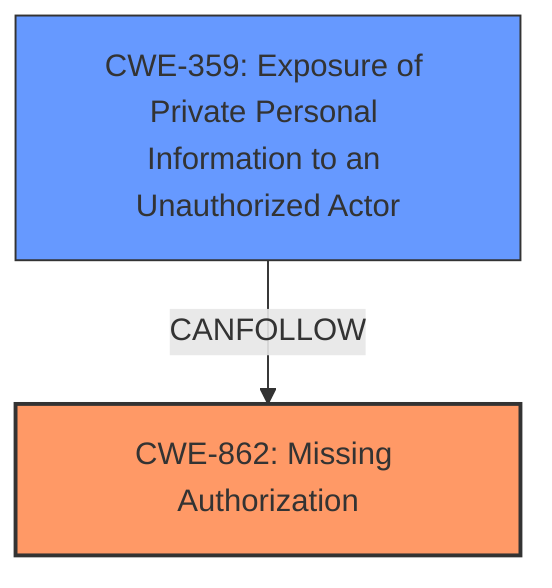

# Analysis for CVE-2024-5331

# Summary
| CWE ID | CWE Name | Confidence | CWE Abstraction Level | CWE Vulnerability Mapping Label | CWE-Vulnerability Mapping Notes |
|---|---|---|---|---|---|
| CWE-862 | Missing Authorization | 0.9 | Class | Primary CWE | Allowed-with-Review |
| CWE-359 | Exposure of Private Personal Information to an Unauthorized Actor | 0.7 | Base | Secondary Candidate | Allowed |

## Evidence and Confidence

*   **Confidence Score:** 0.8
*   **Evidence Strength:** HIGH

## Relationship Analysis
The primary relationship influencing the decision is that CWE-862 [CWE-862: Missing Authorization] is a class-level CWE, and while appropriate, it encourages review for more specific base-level children. While no direct child is a perfect fit, the concept of **unauthorized access** leading to information exposure suggests a potential chain. Therefore, CWE-359 [CWE-359: Exposure of Private Personal Information to an Unauthorized Actor] is considered as a secondary CWE to capture the impact.

## Vulnerability Chain
The vulnerability chain starts with a **missing authorization** check (CWE-862 [CWE-862: Missing Authorization]) that allows authenticated users with Contributor-level access or higher to export form submissions, leading to the potential exposure of sensitive information (CWE-359 [CWE-359: Exposure of Private Personal Information to an Unauthorized Actor]).

## Summary of Analysis
The initial assessment identified CWE-862 [CWE-862: Missing Authorization] as the primary weakness due to the **missing authorization** check, which is directly supported by the "CVE Reference Links Content Summary" stating "The vulnerability stems from a missing authorization check." The description also states "This makes it possible for authenticated attackers, with Contributor-level access and above, to export form submissions."

CWE-359 [CWE-359: Exposure of Private Personal Information to an Unauthorized Actor] was added as a secondary concern because the ability to export form submissions could lead to the exposure of sensitive information. This is supported by the "Impact of Exploitation" section, which mentions "Information Disclosure: Authenticated attackers with Contributor-level access or higher can export form submissions. This could potentially expose sensitive data collected through forms."

The selected CWEs are at an appropriate level of specificity. CWE-862 [CWE-862: Missing Authorization] is a class-level CWE but accurately captures the root cause. While a more specific base-level CWE would be ideal, none perfectly fit the scenario. CWE-359 [CWE-359: Exposure of Private Personal Information to an Unauthorized Actor] is a base-level CWE that captures the potential impact of the vulnerability.

Relevant CWE Information:
# Enhanced Context (25 CWEs)
The following CWEs were identified as potentially relevant to this vulnerability:

## CWE-352: Cross-Site Request Forgery (CSRF)
**Abstraction Level**: Compound
**Similarity Score**: 0.70
**Source**: dense

**Description**:
The web application does not, or can not, sufficiently verify whether a well-formed, valid, consistent request was intentionally provided by the user who submitted the request.

**Mapping Guidance**:
- Usage: Allowed
- Rationale: This is a well-known Composite of multiple weaknesses that must all occur simultaneously, although it is attack-oriented in nature.

*Not Selected*: CSRF is not applicable since the vulnerability described does not involve forging requests on behalf of a user.

## CWE-434: Unrestricted Upload of File with Dangerous Type
**Abstraction Level**: Base
**Similarity Score**: 0.69
**Source**: dense

**Description**:
The product allows the upload or transfer of dangerous file types that are automatically processed within its environment.

**Mapping Guidance**:
- Usage: Allowed
- Rationale: This CWE entry is at the Base level of abstraction, which is a preferred level of abstraction for mapping to the root causes of vulnerabilities.

*Not Selected*: This CWE is not relevant as the vulnerability does not involve unrestricted file uploads.

## CWE-639: Authorization Bypass Through User-Controlled Key
**Abstraction Level**: Base
**Similarity Score**: 0.69
**Source**: dense

**Description**:
The system's authorization functionality does not prevent one user from gaining access to another user's data or record by modifying the key value identifying the data.

**Mapping Guidance**:
- Usage: Allowed
- Rationale: This CWE entry is at the Base level of abstraction, which is a preferred level of abstraction for mapping to the root causes of vulnerabilities.

*Not Selected*: The vulnerability is due to a **missing authorization** check, not an authorization bypass through user-controlled keys.

## CWE-425: Direct Request ('Forced Browsing')
**Abstraction Level**: Base
**Similarity Score**: 0.69
**Source**: dense

**Description**:
The web application does not adequately enforce appropriate authorization on all restricted URLs, scripts, or files.

**Mapping Guidance**:
- Usage: Allowed
- Rationale: This CWE entry is at the Base level of abstraction, which is a preferred level of abstraction for mapping to the root causes of vulnerabilities.

*Not Selected*: While related to authorization, CWE-425 [CWE-425: Direct Request ('Forced Browsing')] implies inadequate enforcement, but the vulnerability is due to a completely **missing authorization** check.

## CWE-472: External Control of Assumed-Immutable Web Parameter
**Abstraction Level**: Base
**Similarity Score**: 0.68
**Source**: dense

**Description**:
The web application does not sufficiently verify inputs that are assumed to be immutable but are actually externally controllable, such as hidden form fields.

**Mapping Guidance**:
- Usage: Allowed
- Rationale: This CWE entry is at the Base level of abstraction, which is a preferred level of abstraction for mapping to the root causes of vulnerabilities.

*Not Selected*: The vulnerability does not involve external control of assumed-immutable web parameters.

## CWE-201: Insertion of Sensitive Information Into Sent Data
**Abstraction Level**: Base
**Similarity Score**: 0.67
**Source**: dense

**Description**:
The code transmits data to another actor, but a portion of the data includes sensitive information that should not be accessible to that actor.

**Mapping Guidance**:
- Usage: Allowed
- Rationale: This CWE entry is at the Base level of abstraction, which is a preferred level of abstraction for mapping to the root causes of vulnerabilities.

*Not Selected*: While sensitive information may be exposed, the root cause is the **missing authorization**, not the insertion of sensitive information into sent data.

## CWE-538: Insertion of Sensitive Information into Externally-Accessible File or Directory
**Abstraction Level**: Base
**Similarity Score**: 0.67
**Source**: dense

**Description**:
The product places sensitive information into files or directories that are accessible to actors who are allowed to have access to the files, but not to the sensitive information.

**Mapping Guidance**:
- Usage: Allowed
- Rationale: This CWE entry is at the Base level of abstraction, which is a preferred level of abstraction for mapping to the root causes of vulnerabilities.

*Not Selected*: The vulnerability doesn't involve placing sensitive information in externally accessible files or directories, but rather exporting data due to a **missing authorization** check.

## CWE-863: Incorrect Authorization
**Abstraction Level**: Class
**Similarity Score**: 0.66
**Source**: dense

**Description**:
The product performs an authorization check when an actor attempts to access a resource or perform an action, but it does not correctly perform the check.

**Mapping Guidance**:
- Usage: Allowed-with-Review
- Rationale: This CWE entry is a Class and might have Base-level children that would be more appropriate

*Not Selected*: The vulnerability stems from a **missing authorization** check, not an incorrect one.