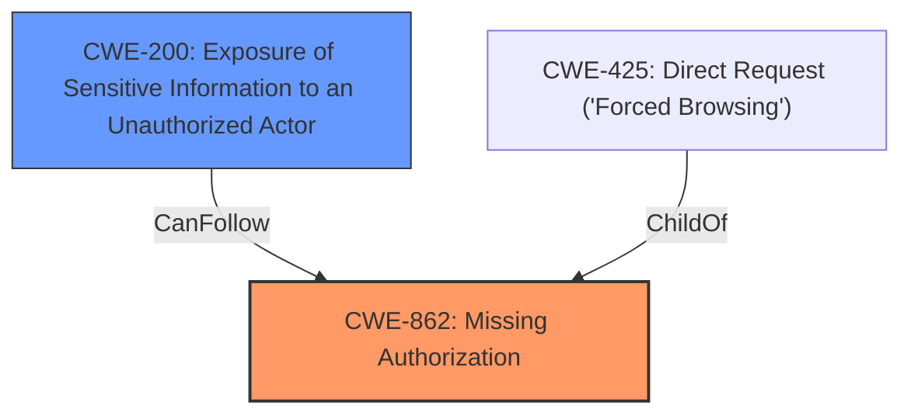

# Analysis Report for CVE-2024-5333

# Vulnerability Analysis Report: CVE-2024-5333

## Description

The Events Calendar WordPress plugin before 6.8.2.1 is **missing access checks** in the REST API, allowing for unauthenticated users to access information about password protected events.

## Vulnerability Description Key Phrases

- **Rootcause:** missing access checks
- **Impact:** access information about password protected events
- **Attacker:** unauthenticated users
- **Product:** Events Calendar WordPress plugin
- **Version:** before 6.8.2.1
- **Component:** REST API

## Analysis (with Relationship Data)

# Summary
| CWE ID | CWE Name | Confidence | CWE Abstraction Level | CWE Vulnerability Mapping Label | CWE-Vulnerability Mapping Notes |
|---|---|---|---|---|---|
| CWE-862 | Missing Authorization [CWE-862: Missing Authorization] | 1.0 | Class | Primary CWE | Allowed-with-Review |
| CWE-200 | Exposure of Sensitive Information to an Unauthorized Actor | 0.7 | Base | Secondary Candidate |  |

## Evidence and Confidence

*   **Confidence Score:** 0.85
*   **Evidence Strength:** HIGH

## Relationship Analysis
The primary relationship that influenced my decision was the parent-child relationship between CWE-862 [CWE-862: Missing Authorization] and its potential base-level children. Given that the vulnerability description explicitly states "missing access checks," CWE-862 [CWE-862: Missing Authorization] is the most fitting Class-level CWE. While a more specific base-level CWE might exist, the provided information doesn't offer enough detail to pinpoint it. CWE-200 [CWE-200: Exposure of Sensitive Information to an Unauthorized Actor] is the resulting impact from the **missing access checks**.



## Vulnerability Chain
The vulnerability chain starts with the **missing authorization** check (CWE-862 [CWE-862: Missing Authorization]) in the REST API. This leads directly to the exposure of sensitive information (CWE-200 [CWE-200: Exposure of Sensitive Information to an Unauthorized Actor]) about password-protected events to unauthenticated users.

## Summary of Analysis
The initial analysis focused on identifying the root cause of the vulnerability. The vulnerability description clearly states that the Events Calendar WordPress plugin before 6.8.2.1 is **missing access checks** in the REST API, allowing for unauthenticated users to access information about password protected events. The "CVE Reference Links Content Summary" confirms this by stating: "The vulnerability stems from **missing access checks** in the REST API of the "The Events Calendar" WordPress plugin. This oversight allows unauthenticated users to access information about password-protected events."

Based on this evidence, CWE-862 [CWE-862: Missing Authorization] (Missing Authorization) was chosen as the primary CWE. The retriever results also ranked CWE-862 [CWE-862: Missing Authorization] as the top candidate.

The evidence supports selecting CWE-862 [CWE-862: Missing Authorization] at the Class level. While a more specific Base CWE might be ideal, the current information doesn't provide enough detail to justify selecting a child of CWE-862 [CWE-862: Missing Authorization]. The "CVE Reference Links Content Summary" mentions OWASP's "A3: Sensitive Data Exposure" and CWE-200 [CWE-200: Exposure of Sensitive Information to an Unauthorized Actor] (Exposure of Sensitive Information to an Unauthorized Actor). CWE-200 [CWE-200: Exposure of Sensitive Information to an Unauthorized Actor] is a secondary CWE as it's the result of the **missing access checks**.

CWE-285 [CWE-285: Improper Authorization] was considered but not used as it is too general ("The product does not perform or incorrectly performs an authorization check when an actor attempts to access a resource or perform an action.") and is discouraged. CWE-863 [CWE-863: Incorrect Authorization] was also considered, but the vulnerability description says "**missing** access checks," not an incorrect check.

Relevant CWE Information:

# Enhanced Context (25 CWEs)
The following CWEs were identified as potentially relevant to this vulnerability:

## CWE-639: Authorization Bypass Through User-Controlled Key
**Abstraction Level**: Base
**Similarity Score**: 0.73
**Source**: dense

**Description**:
The system's authorization functionality does not prevent one user from gaining access to another user's data or record by modifying the key value identifying the data.

**Mapping Guidance**:
- Usage: Allowed
- Rationale: This CWE entry is at the Base level of abstraction, which is a preferred level of abstraction for mapping to the root causes of vulnerabilities.


## CWE-352: Cross-Site Request Forgery (CSRF)
**Abstraction Level**: Compound
**Similarity Score**: 0.72
**Source**: dense

**Description**:
The web application does not, or can not, sufficiently verify whether a well-formed, valid, consistent request was intentionally provided by the user who submitted the request.

**Mapping Guidance**:
- Usage: Allowed
- Rationale: This is a well-known Composite of multiple weaknesses that must all occur simultaneously, although it is attack-oriented in nature.


## CWE-425: Direct Request ('Forced Browsing')
**Abstraction Level**: Base
**Similarity Score**: 0.72
**Source**: dense

**Description**:
The web application does not adequately enforce appropriate authorization on all restricted URLs, scripts, or files.

**Mapping Guidance**:
- Usage: Allowed
- Rationale: This CWE entry is at the Base level of abstraction, which is a preferred level of abstraction for mapping to the root causes of vulnerabilities.


## CWE-472: External Control of Assumed-Immutable Web Parameter
**Abstraction Level**: Base
**Similarity Score**: 0.72
**Source**: dense

**Description**:
The web application does not sufficiently verify inputs that are assumed to be immutable but are actually externally controllable, such as hidden form fields.

**Mapping Guidance**:
- Usage: Allowed
- Rationale: This CWE entry is at the Base level of abstraction, which is a preferred level of abstraction for mapping to the root causes of vulnerabilities.


## CWE-862: Missing Authorization
**Abstraction Level**: Class
**Similarity Score**: 0.70
**Source**: dense

**Description**:
The product does not perform an authorization check when an actor attempts to access a resource or perform an action.

**Mapping Guidance**:
- Usage: Allowed-with-Review
- Rationale: This CWE entry is a Class and might have Base-level children that would be more appropriate


## CWE-201: Insertion of Sensitive Information Into Sent Data
**Abstraction Level**: Base
**Similarity Score**: 0.69
**Source**: dense

**Description**:
The code transmits data to another actor, but a portion of the data includes sensitive information that should not be accessible to that actor.

**Mapping Guidance**:
- Usage: Allowed
- Rationale: This CWE entry is at the Base level of abstraction, which is a preferred level of abstraction for mapping to the root causes of vulnerabilities.


## CWE-1390: Weak Authentication
**Abstraction Level**: Class
**Similarity Score**: 0.69
**Source**: dense

**Description**:
The product uses an authentication mechanism to restrict access to specific users or identities, but the mechanism does not sufficiently prove that the claimed identity is correct.

**Mapping Guidance**:
- Usage: Allowed-with-Review
- Rationale: This CWE entry is a Class and might have Base-level children that would be more appropriate


## CWE-863: Incorrect Authorization
**Abstraction Level**: Class
**Similarity Score**: 0.69
**Source**: dense

**Description**:
The product performs an authorization check when an actor attempts to access a resource or perform an action, but it does not correctly perform the check.

**Mapping Guidance**:
- Usage: Allowed-with-Review
- Rationale: This CWE entry is a Class and might have Base-level children that would be more appropriate


## CWE-116: Improper Encoding or Escaping of Output
**Abstraction Level**: Class
**Similarity Score**: 0.69
**Source**: dense

**Description**:
The product prepares a structured message for communication with another component, but encoding or escaping of the data is either missing or done incorrectly. As a result, the intended structure of the message is not preserved.

**Mapping Guidance**:
- Usage: Allowed-with-Review
- Rationale: This CWE entry is a Class and might have Base-level children that would be more appropriate


## CWE-208: Observable Timing Discrepancy
**Abstraction Level**: Base
**Similarity Score**: 0.68
**Source**: dense

**Description**:
Two separate operations in a product require different amounts of time to complete, in a way that is observable to an actor and reveals security-relevant information about the state of the product, such as whether a particular operation was successful or not.

**Mapping Guidance**:
- Usage: Allowed
- Rationale: This CWE entry


## CWE Relationship Analysis

Current CWEs represent these abstraction levels: .


### Vulnerability Chain Analysis

**Chain starting from CWE-1390:**
- 1390 (Weak Authentication) - ROOT


**Chain starting from CWE-863:**
- 863 (Incorrect Authorization) - ROOT


### CWE Relationship Diagram

```mermaid
graph TD
    classDef primary fill:#f96,stroke:#333,stroke-width:2px
    classDef secondary fill:#69f,stroke:#333
    classDef tertiary fill:#9e9,stroke:#333
```


*Report generated on 2025-07-13 21:52:45*
