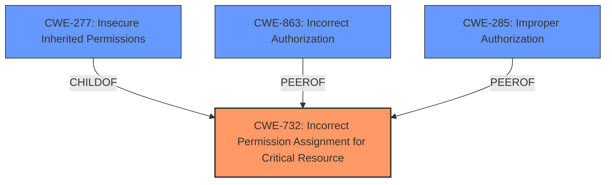

# Enhanced Analysis for CVE-2024-53349

# Summary
| CWE ID    | CWE Name                                                      | Confidence | CWE Abstraction Level | CWE Vulnerability Mapping Label | CWE-Vulnerability Mapping Notes |
| :-------- | :------------------------------------------------------------ | :--------- | :-------------------- | :------------------------------ | :------------------------------ |
| CWE-732   | Incorrect Permission Assignment for Critical Resource         | 0.9        | Class                 | Allowed-with-Review             | Primary CWE                     |
| CWE-266   | Incorrect Privilege Assignment                                | 0.7        | Base                  | Allowed                         | Secondary Candidate             |
| CWE-285   | Improper Authorization                                        | 0.6        | Class                 | Discouraged                     | Secondary Candidate             |
| CWE-863   | Incorrect Authorization                                        | 0.6        | Class                 | Allowed-with-Review             | Secondary Candidate             |

## Evidence and Confidence

*   **Confidence Score:** 0.9
*   **Evidence Strength:** HIGH

## Relationship Analysis

The primary CWE selected is CWE-732, "Incorrect Permission Assignment for Critical Resource". While it's a Class-level CWE, its description closely aligns with the vulnerability, specifically the **insecure permissions** that allow attackers to access the service account's token. The retriever results and the provided guidance on privileges vs. permissions also influenced this decision. CWE-732 has child CWEs like CWE-277 (Insecure Inherited Permissions), but the provided information doesn't give enough details to go to that level of specificity. CWE-285 and CWE-863 were considered as the authorization was not checked corrected, however, CWE-732 was chosen as the permissions were incorrectly set on the resources.



## Vulnerability Chain

The vulnerability chain starts with **insecure permissions** (CWE-732), leading to attackers gaining access to the service account token, and ultimately escalating privileges within the Kubernetes cluster. The chain can be represented as:

CWE-732 (Incorrect Permission Assignment) -> Access to Service Account Token -> Privilege Escalation.

## Summary of Analysis

The analysis focused on identifying the root cause of the vulnerability. The primary factor was the **insecure permissions** in kuadrant v0.11.3. The evidence from the vulnerability description and CVE Reference Links Content Summary clearly points to a problem with how permissions are assigned to critical resources.

The retriever results highlighted CWE-732 as a strong candidate, and the privileges vs. permissions guidance helped differentiate between privilege-related and permission-related CWEs. The decision to choose CWE-732 was further supported by the fact that the vulnerability allows attackers to gain access to the service account's token because of incorrectly set permissions for a critical resource.

While CWE-285 and CWE-863 (Improper/Incorrect Authorization) were considered, they describe problems where authorization checks are either missing or flawed, which is not the primary issue here. The core problem is the incorrect assignment of permissions on the critical resources.

The selected CWE is at the optimal level of specificity because it directly addresses the root cause: **incorrect permission assignment** for a security-critical resource.

Relevant CWE Information:

**CWE-732: Incorrect Permission Assignment for Critical Resource**

*   **How the vulnerability's details match the CWE's characteristics:** The vulnerability description states that **insecure permissions** allow attackers to gain access to the service accounts token. This aligns with CWE-732 because the permission assignment for a critical resource (service account token) is incorrect, allowing unauthorized access.
*   **The security implications and potential impact:** Attackers can escalate privileges and potentially take over the cluster.
*   **Any parent-child relationships or chain patterns that influenced your mapping:** CWE-732 has a child, CWE-277 (Insecure Inherited Permissions), but there is not enough information in the description to select CWE-277.
*   **Whether the weakness is primary or secondary in the vulnerability:** Primary.
*   **How the official MITRE mapping guidance influenced your decision:** The MITRE mapping guidance influenced the decision to select CWE-732 with review as it is a Class.

**CWE-266: Incorrect Privilege Assignment**

*   **How the vulnerability's details match the CWE's characteristics:** This CWE was considered because gaining access to a service account token could be seen as a privilege escalation. However, the root cause is not about assigning the wrong privilege to a user but about the incorrect permissions on the resource.
*   **The security implications and potential impact:** Escalation of privileges within the cluster.
*   **Any parent-child relationships or chain patterns that influenced your mapping:** N/A.
*   **Whether the weakness is primary or secondary in the vulnerability:** Secondary.
*   **How the official MITRE mapping guidance influenced your decision:** The MITRE mapping guidance was used to differentiate between privilege and permission issues.

**CWE-285: Improper Authorization**

*   **How the vulnerability's details match the CWE's characteristics:** This CWE was considered because the access to the service account token could be seen as an authorization bypass. However, the root cause is not about failing to perform an authorization check, but the incorrect assignment of the permission.
*   **The security implications and potential impact:** Escalation of privileges within the cluster.
*   **Any parent-child relationships or chain patterns that influenced your mapping:** N/A.
*   **Whether the weakness is primary or secondary in the vulnerability:** Secondary.
*   **How the official MITRE mapping guidance influenced your decision:** N/A

**CWE-863: Incorrect Authorization**

*   **How the vulnerability's details match the CWE's characteristics:** Similar to CWE-285, this CWE was considered because the access to the service account token could be seen as an authorization bypass. But the root cause is not about incorrectly performing the check but instead the incorrect permission assignment.
*   **The security implications and potential impact:** Escalation of privileges within the cluster.
*   **Any parent-child relationships or chain patterns that influenced your mapping:** N/A.
*   **Whether the weakness is primary or secondary in the vulnerability:** Secondary.
*   **How the official MITRE mapping guidance influenced your decision:** N/A


## CWE Relationship Analysis

Current CWEs represent these abstraction levels: .


### Vulnerability Chain Analysis

**Chain starting from CWE-863:**
- 863 (Incorrect Authorization) - ROOT


**Chain starting from CWE-732:**
- 732 (Incorrect Permission Assignment for Critical Resource) - ROOT


### CWE Relationship Diagram

```mermaid
graph TD
    classDef primary fill:#f96,stroke:#333,stroke-width:2px
    classDef secondary fill:#69f,stroke:#333
    classDef tertiary fill:#9e9,stroke:#333
```