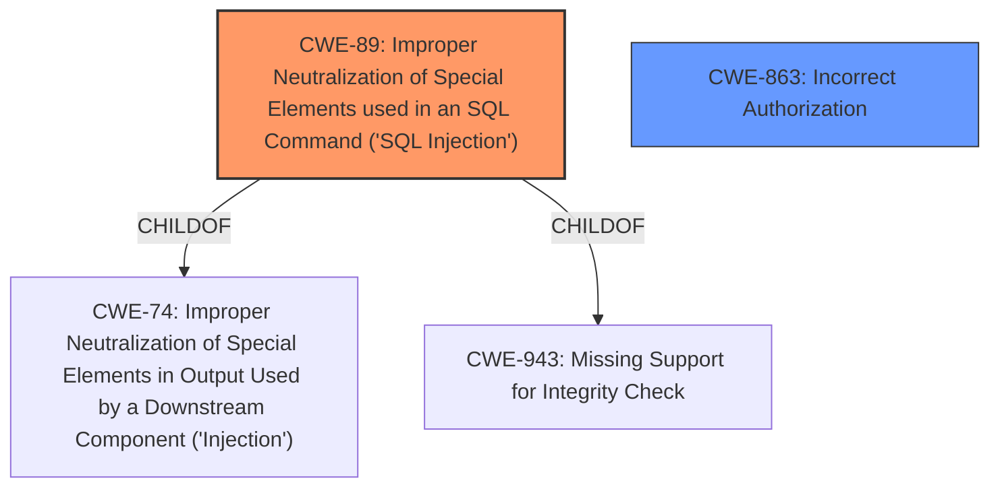

# Raw Analyzer Response for CVE-2024-53357

# Summary
| CWE ID | CWE Name | Confidence | CWE Abstraction Level | CWE Vulnerability Mapping Label | CWE-Vulnerability Mapping Notes |
|---|---|---|---|---|---|
| CWE-89 | Improper Neutralization of Special Elements used in an SQL Command ('SQL Injection') | 1.0 | Base | Primary | Allowed |
| CWE-863 | Incorrect Authorization | 0.5 | Class | Secondary Candidate | Allowed-with-Review |

## Evidence and Confidence

*   **Confidence Score:** 0.8
*   **Evidence Strength:** MEDIUM

## Relationship Analysis
The primary weakness is CWE-89, which is a base-level CWE describing SQL Injection. CWE-89 is a child of CWE-74 (Improper Neutralization of Special Elements in Output Used by a Downstream Component ('Injection')) and CWE-943 (Missing Support for Integrity Check). It can also be a parent of more specific SQL injection variants. CWE-863 is a class-level CWE that represents incorrect authorization, which could be a secondary weakness if the **SQL injection vulnerabilities** are exploited because of a flawed authorization mechanism.

## Vulnerability Chain
The vulnerability chain starts with the **SQL injection vulnerabilities** (CWE-89). This allows remote authenticated attackers with low privileges to perform unauthorized actions, such as adding an admin user, modifying a user, deleting users, etc. If the **SQL injection vulnerabilities** can be exploited due to flawed authorization checks or incorrect privilege assignments, then CWE-863 (Incorrect Authorization) could also be considered.

## Summary of Analysis
The primary weakness is clearly the **SQL injection vulnerabilities**, which directly align with CWE-89. The description states that there are multiple **SQL injection vulnerabilities**. The root cause is the improper handling of special elements in SQL commands, which allows attackers to manipulate database queries. The high retriever score and direct match with the vulnerability description confirm this assessment.

CWE-863 (Incorrect Authorization) is a potential secondary weakness. The vulnerability description mentions that authenticated attackers with low privileges can exploit the **SQL injection vulnerabilities** to perform actions they should not be authorized to do. This suggests that there might be a flaw in the authorization mechanism that allows these attackers to bypass checks and gain elevated privileges. However, without more information, it's unclear whether this is a direct authorization flaw or a consequence of the **SQL injection vulnerabilities**. Therefore, I am including CWE-863 with a lower confidence score.

The selected CWEs are at the optimal level of specificity. CWE-89 is a base-level CWE that directly describes the **SQL injection vulnerabilities**. While there might be more specific variants of SQL injection, the provided information is not detailed enough to determine which variant is most appropriate. CWE-863 is a class-level CWE that represents incorrect authorization, which could be a secondary weakness if the **SQL injection vulnerabilities** are exploited because of a flawed authorization mechanism.

Relevant CWE Information:

# Enhanced Context (25 CWEs)
The following CWEs were identified as potentially relevant to this vulnerability:

## CWE-89: Improper Neutralization of Special Elements used in an SQL Command ('SQL Injection')
**Abstraction Level**: base
**Similarity Score**: 3.14
**Source**: graph

**Description**:
CWE-89: Improper Neutralization of Special Elements used in an SQL Command ('SQL Injection')

**Mapping Guidance**:
- Usage: Allowed
- Rationale: This CWE entry is at the Base level of abstraction, which is a preferred level of abstraction for mapping to the root causes of vulnerabilities.

**Relationships**:
- PARENTOF -> CWE-564
- CANFOLLOW -> CWE-456
- CHILDOF -> CWE-74
- CHILDOF -> CWE-943
- PARENTOF -> CWE-89

## CWE-863: Incorrect Authorization
**Abstraction Level**: Class
**Similarity Score**: 1620.25
**Source**: sparse

**Description**:
The product performs an authorization check when an actor attempts to access a resource or perform an action, but it does not correctly perform the check.

**Mapping Guidance**:
- Usage: Allowed-with-Review
- Rationale: This CWE entry is a Class and might have Base-level children that would be more appropriate