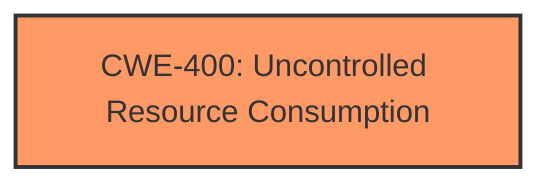

# Enhanced Analysis for CVE-2024-53423

# Summary
| CWE ID  | CWE Name                                                                  | Confidence | CWE Abstraction Level | CWE Vulnerability Mapping Label | CWE-Vulnerability Mapping Notes |
| :-------- | :------------------------------------------------------------------------ | :---------- | :-------------------- | :------------------------------ | :------------------------------ |
| CWE-400 | Uncontrolled Resource Consumption                                         | 0.9         | Class                 | Primary                         | Discouraged                    |

## Evidence and Confidence

*   **Confidence Score:** 0.9
*   **Evidence Strength:** HIGH

## Relationship Analysis
The primary CWE selected is CWE-400, which is a Class-level CWE. While more specific CWEs could exist, the provided information focuses on the impact of resource consumption leading to DoS. The retriever results and the summary both point to CWE-400, which is a parent of more specific resource exhaustion weaknesses. The relationships between CWE-400 and its children (like CWE-770, CWE-789) were considered, but the available evidence doesn't pinpoint a specific allocation issue, making CWE-400 the most appropriate choice.



## Vulnerability Chain
The vulnerability chain starts with the attacker **supplying crafted packets**, leading to **uncontrolled resource consumption** (CWE-400), and ultimately resulting in a **Denial of Service (DoS)**.

## Summary of Analysis
The initial analysis focused on the root cause "**supplying crafted packets**" and its impact, Denial of Service (DoS). The CVE Reference Links Content Summary highlighted "Uncontrolled Resource Consumption (CWE-400)" as a weakness. The retriever results also suggested CWE-400 as a potential candidate.

The decision to select CWE-400 is primarily based on the following evidence:

*   Vulnerability Description Key Phrases: "impact: Denial of Service (DoS)"
*   CVE Reference Links Content Summary: "Weaknesses/vulnerabilities present: Uncontrolled Resource Consumption (CWE-400)."

While CWE-400 is a Class-level CWE and is generally "Discouraged" for direct mapping, the provided evidence doesn't offer enough specifics to pinpoint a more granular CWE related to memory allocation or other resource management issues. Therefore, CWE-400 is the most appropriate choice given the available information.

Relevant CWE Information:

# Enhanced Context (25 CWEs)
The following CWEs were identified as potentially relevant to this vulnerability:

## CWE-400: Uncontrolled Resource Consumption
**Abstraction Level**: Class
**Similarity Score**: 0.73
**Source**: dense

**Description**:
The product does not properly control the allocation and maintenance of a limited resource, thereby enabling an actor to influence the amount of resources consumed, eventually leading to the exhaustion of available resources.

**Mapping Guidance**:
- Usage: Discouraged
- Rationale: CWE-400 is intended for incorrect behaviors in which the product is expected to track and restrict how many resources it consumes, but CWE-400 is often misused because it is conflated with the "technical impact" of vulnerabilities in which resource consumption occurs. It is sometimes used for low-information vulnerability reports. It is a level-1 Class (i.e., a child of a Pillar).


## CWE Relationship Analysis

Current CWEs represent these abstraction levels: .


### Vulnerability Chain Analysis

**Chain starting from CWE-400:**
- 400 (Uncontrolled Resource Consumption) - ROOT


**Chain starting from CWE-789:**
- 789 (Memory Allocation with Excessive Size Value) - ROOT


### CWE Relationship Diagram

```mermaid
graph TD
    classDef primary fill:#f96,stroke:#333,stroke-width:2px
    classDef secondary fill:#69f,stroke:#333
    classDef tertiary fill:#9e9,stroke:#333
```