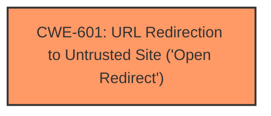

# Analysis Report for CVE-2024-53556

# Vulnerability Analysis Report: CVE-2024-53556

## Description

An Open Redirect vulnerability in Taiga v6.8.1 allows attackers to redirect users to arbitrary websites via appending a crafted link to /login?next= in the login page URL.

## Vulnerability Description Key Phrases

- **Weakness:** open redirect
- **Attacker:** attackers
- **Product:** Taiga
- **Version:** v6.8.1
- **Component:** /login?next= in the login page URL

## Analysis (with Relationship Data)

# Summary
| CWE ID | CWE Name | Confidence | CWE Abstraction Level | CWE Vulnerability Mapping Label | CWE-Vulnerability Mapping Notes |
|---|---|---|---|---|---|
| CWE-601 | URL Redirection to Untrusted Site ('Open Redirect') | 1.0 | Base | Allowed | Primary CWE. The application **allows redirection to an arbitrary URL** provided in the `next` parameter of the login page. |

## Evidence and Confidence

*   **Confidence Score:** 1.0
*   **Evidence Strength:** HIGH

## Relationship Analysis
The primary relationship that influenced the decision was the direct match of the vulnerability description to the definition of CWE-601. The description explicitly states an "Open Redirect vulnerability" where the application redirects users to arbitrary websites based on a crafted link, which aligns perfectly with the CWE's definition of accepting user-controlled input for redirection.



## Vulnerability Chain
The vulnerability chain consists of a single step:

1.  **Root Cause:** **Open Redirect** (**CWE-601**): The application **allows redirection to an arbitrary URL** provided in the `next` parameter of the login page.
2.  **Impact:** Users are redirected to malicious websites, potentially leading to credential theft or phishing attacks.

## Summary of Analysis
The primary CWE selected is based on the clear evidence within the vulnerability description and CVE Reference Links Content Summary, which directly points to an Open Redirect vulnerability. The application **allows redirection to an arbitrary URL** provided in the `next` parameter of the login page. This is a direct match to CWE-601.

The retriever results also strongly support this selection, with CWE-601 having the highest score. The confidence in this assessment is high due to the explicit nature of the vulnerability and the direct alignment with the CWE definition.

Other CWEs Considered:

*   CWE-79 (Improper Neutralization of Input During Web Page Generation ('Cross-site Scripting')): While redirection could potentially lead to XSS if the redirected URL is not properly handled by the browser, the primary issue is the open redirection itself, not the injection of script. Therefore, CWE-79 is not as directly relevant.
*   CWE-352 (Cross-Site Request Forgery (CSRF)): CSRF involves tricking a user into performing actions on a web application without their consent. While related to web application vulnerabilities, it does not directly describe the open redirect issue.
*   CWE-425 (Direct Request ('Forced Browsing')): This involves inadequate authorization on restricted URLs. While related to access control, the primary issue here is the ability to redirect users to arbitrary external sites, not the unauthorized access to internal resources.
*   CWE-74 (Improper Neutralization of Special Elements in Output Used by a Downstream Component ('Injection')): This CWE is too broad, as the specific injection issue is the open redirect.

The selected CWE-601 is at the optimal level of specificity because it directly addresses the weakness of **allowing redirection to an arbitrary URL**.


## CWE Relationship Analysis

Current CWEs represent these abstraction levels: .


### Vulnerability Chain Analysis

**Chain starting from CWE-601:**
- 601 (URL Redirection to Untrusted Site ('Open Redirect')) - ROOT


**Chain starting from CWE-79:**
- 79 (Improper Neutralization of Input During Web Page Generation ('Cross-site Scripting')) - ROOT


### CWE Relationship Diagram

```mermaid
graph TD
    classDef primary fill:#f96,stroke:#333,stroke-width:2px
    classDef secondary fill:#69f,stroke:#333
    classDef tertiary fill:#9e9,stroke:#333
```


*Report generated on 2025-07-13 21:59:28*
