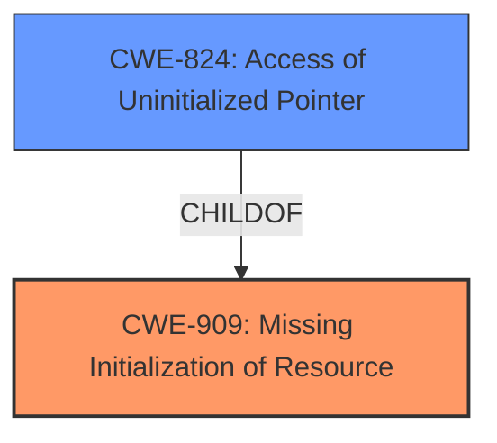

# Analysis for CVE-2024-53680

# Summary
| CWE ID | CWE Name | Confidence | CWE Abstraction Level | CWE Vulnerability Mapping Label | CWE-Vulnerability Mapping Notes |
|---|---|---|---|---|---|
| CWE-909 | Missing Initialization of Resource | 0.9 | Class | Primary | Allowed-with-Review |
| CWE-824 | Access of Uninitialized Pointer | 0.7 | Base | Secondary | Allowed |

## Evidence and Confidence

*   **Confidence Score:** 0.8
*   **Evidence Strength:** HIGH

## Relationship Analysis
The primary relationship influencing the decision is the parent-child relationship between CWE-909 (Missing Initialization of Resource) and CWE-824 (Access of Uninitialized Pointer). CWE-909 represents the broader class of missing initialization, while CWE-824 is a more specific case of accessing an uninitialized pointer. The vulnerability description clearly states an "**uninitialized stack access**" leading to **undefined behavior**. While the immediate issue is an access of uninitialized data, the root cause is the missing initialization.

## Vulnerability Chain
The vulnerability chain starts with the **missing initialization** of a stack buffer (`CWE-909`). This leads to the access of **uninitialized data** when `strnlen()` is called on the buffer, which can then lead to **undefined behavior** as LLVM optimizes away the code, causing a fall-through to the next function. This fall-through results in either a kernel oops or boot-time panic.

## Summary of Analysis
The analysis is based on the provided vulnerability description, which clearly indicates an **uninitialized stack access**. The description states "ip_vs_protocol_init() uses a on-stack buffer of 64 chars to store the registered protocol names and leaves it uninitialized after definition." This directly supports the selection of CWE-909 (Missing Initialization of Resource) as the primary cause. The LLVM optimization based on this uninitialized value leads to the "undefined behavior" and subsequent kernel failure. While other CWEs like CWE-789 (Memory Allocation with Excessive Size Value) and CWE-770 (Allocation of Resources Without Limits or Throttling) were considered due to the mention of memory and buffer, they don't accurately describe the core issue of missing initialization. CWE-824 is a valid secondary CWE because the code attempts to load from this uninitialized buffer.

Relevant CWE Information:

# Enhanced Context (25 CWEs)
The following CWEs were identified as potentially relevant to this vulnerability:

## CWE-909: Missing Initialization of Resource
**Abstraction Level**: Class
**Similarity Score**: 0.78
**Source**: dense

**Description**:
The product does not initialize a critical resource.

**Mapping Guidance**:
- Usage: Allowed-with-Review
- Rationale: This CWE entry is a Class and might have Base-level children that would be more appropriate

## CWE-824: Access of Uninitialized Pointer
**Abstraction Level**: Base
**Similarity Score**: 0.78
**Source**: dense

**Description**:
The product accesses or uses a pointer that has not been initialized.

**Mapping Guidance**:
- Usage: Allowed
- Rationale: This CWE entry is at the Base level of abstraction, which is a preferred level of abstraction for mapping to the root causes of vulnerabilities.