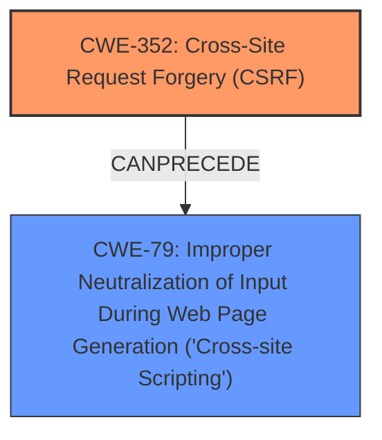

# Raw Analyzer Response for CVE-2024-53710

# Summary
| CWE ID | CWE Name | Confidence | CWE Abstraction Level | CWE Vulnerability Mapping Label | CWE-Vulnerability Mapping Notes |
|---|---|---|---|---|---|
| CWE-352 | Cross-Site Request Forgery (CSRF) | 1.0 | Compound | Primary | Allowed |
| CWE-79 | Improper Neutralization of Input During Web Page Generation ('Cross-site Scripting') | 1.0 | Base | Secondary | Allowed |

## Evidence and Confidence

*   **Confidence Score:** 1.0
*   **Evidence Strength:** HIGH

## Relationship Analysis
The primary weakness is **CWE-352 [Cross-Site Request Forgery (CSRF)]**, which allows an attacker to induce authenticated users into performing unwanted actions. The vulnerability then leads to Stored **XSS**, classified as **CWE-79 [Improper Neutralization of Input During Web Page Generation ('Cross-site Scripting')]**. **CWE-352** can **CANPRECEDE** **CWE-79**, as a successful CSRF attack can lead to injecting malicious scripts. Both are weaknesses at different stages. **CWE-352** is a Compound weakness and **CWE-79** is a Base weakness.

## Vulnerability Chain
The vulnerability chain starts with **CWE-352 [Cross-Site Request Forgery (CSRF)]** due to a **lack of CSRF protection**. This allows an attacker to trick an authenticated user into performing actions, leading to the injection of malicious scripts. The next weakness is **CWE-79 [Improper Neutralization of Input During Web Page Generation ('Cross-site Scripting')]**, because the injected script is not properly neutralized when it's rendered in a web page, resulting in Stored **XSS**.
  - **CWE-352** (Root Cause - **lack of CSRF protection**) -> **CWE-79** (Impact - Stored XSS)

## Summary of Analysis
The analysis identifies two weaknesses: **CWE-352 [Cross-Site Request Forgery (CSRF)]** and **CWE-79 [Improper Neutralization of Input During Web Page Generation ('Cross-site Scripting')]**. The primary weakness is **CWE-352**, as the **lack of CSRF protection** allows attackers to induce users to perform unwanted actions. This action then results in Stored **XSS** due to **improper neutralization of input**, which is **CWE-79**.

The vulnerability description clearly states that there is a **Cross-Site Request Forgery (CSRF)** vulnerability that leads to Stored **XSS**: "**Cross-Site Request Forgery** (CSRF) vulnerability in ITERAS ITERAS allows Stored **XSS**." The CVE Reference Links Content Summary reinforces this: "The ITERAS WordPress plugin <= 1.7.0 is vulnerable to Cross-Site Request Forgery (CSRF)." "The plugin lacks sufficient protection against CSRF attacks."

The retriever results also support this selection, with **CWE-79** and **CWE-352** being highly ranked.

**CWEs Considered but Not Used:**
- **CWE-89 [Improper Neutralization of Special Elements used in an SQL Command ('SQL Injection')]**: While injection is a broad category, the specific vulnerability is **XSS**, not SQL Injection, so this is not the correct CWE.
- **CWE-918 [Server-Side Request Forgery (SSRF)]**: This is not relevant as the vulnerability involves CSRF leading to XSS, not server-side requests.
- **CWE-80 [Improper Neutralization of Script-Related HTML Tags in a Web Page (Basic XSS)]**: This is a variant of **CWE-79**, but **CWE-79** is a better fit as it describes the general case of **improper neutralization**.