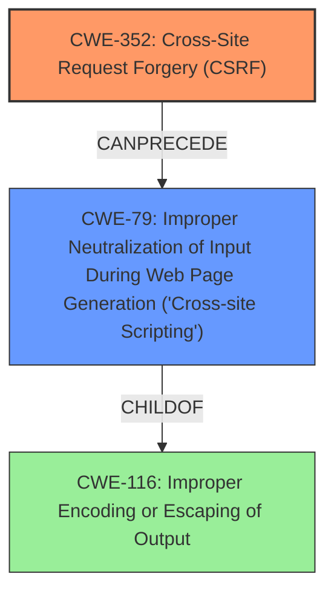

# Raw Analyzer Response for CVE-2024-53734

```markdown
# Summary
| CWE ID | CWE Name | Confidence | CWE Abstraction Level | CWE Vulnerability Mapping Label | CWE-Vulnerability Mapping Notes |
|---|---|---|---|---|---|
| CWE-352 | Cross-Site Request Forgery (CSRF) | 0.9 | Compound |  Primary | Allowed |
| CWE-79 | Improper Neutralization of Input During Web Page Generation ('Cross-site Scripting') | 0.9 | Base | Secondary | Allowed |

## Evidence and Confidence

*   **Confidence Score:** 0.9
*   **Evidence Strength:** HIGH

## Relationship Analysis
The vulnerability is a combination of **lack of CSRF protection** (CWE-352) and Stored **XSS** (CWE-79). CWE-352 allows an attacker to induce a user to perform actions they did not intend. If the application also **fails to neutralize input**, then this can lead to stored **XSS** (CWE-79) when the crafted request is executed. CWE-79 is a child of CWE-116 (Improper Encoding or Escaping of Output). I selected CWE-79 because the description explicitly mentions the weakness as **XSS** and the retriever results indicated it as the top match.



## Vulnerability Chain
The vulnerability chain starts with a **lack of CSRF protection** (CWE-352), which allows an attacker to craft malicious requests. Due to **improper neutralization of input** (CWE-79), these requests can inject malicious scripts that are then stored and executed in the application, leading to Stored **XSS**.
  - Root cause: CWE-352 (**lack of CSRF protection**)
  - Weakness: CWE-79 (**improper neutralization of input**)
  - Impact: Stored **XSS**

## Summary of Analysis
The initial analysis identified CWE-352 as the primary cause due to the **lack of CSRF protection**, which allows the attacker to craft a request. The **XSS** vulnerability (CWE-79) arises because the application **fails to neutralize input**, allowing the injected script to be stored and executed. The retriever results further support this, listing CWE-79 as the top match and CWE-352 as a secondary match.

The evidence from the vulnerability description includes:
- **Rootcause:** **lack of CSRF protection**
- **Weakness:** **XSS**
- **Impact:** Stored XSS
- "The Idealien Category Enhancements WordPress plugin **lacks proper CSRF protection**."
- "Cross-Site Request Forgery (CSRF) vulnerability in Idealien Studios Idealien Category Enhancements allows Stored **XSS**."

CWE-352 is the root cause because the **lack of CSRF protection** allows for the **XSS** attack (CWE-79) to occur by crafting malicious requests.

I considered other CWEs from the Retriever Results, such as CWE-89 (SQL Injection) and CWE-434 (Unrestricted Upload of File with Dangerous Type). However, these did not align as closely with the vulnerability description, which explicitly mentions **CSRF** and **XSS**. The selected CWEs are at the optimal level of specificity, with CWE-352 being a Compound weakness and CWE-79 being a Base weakness.

Relevant CWE Information:
```
```