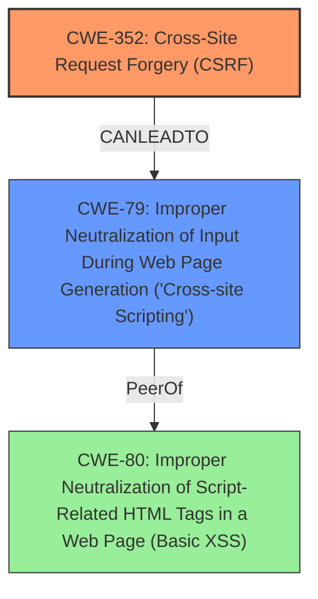

# Raw Analyzer Response for CVE-2024-53736

```markdown
# Summary
| CWE ID    | CWE Name                                                                        | Confidence | CWE Abstraction Level | CWE Vulnerability Mapping Label | CWE-Vulnerability Mapping Notes |
| --------- | ------------------------------------------------------------------------------- | ---------- | --------------------- | ------------------------------- | ----------------------------- |
| CWE-352   | Cross-Site Request Forgery (CSRF)                                               | 0.9        | Compound              | Primary                         | Allowed                       |
| CWE-79    | Improper Neutralization of Input During Web Page Generation ('Cross-site Scripting') | 0.9        | Base                  | Secondary                       | Allowed                       |

## Evidence and Confidence

*   **Confidence Score:** 0.9
*   **Evidence Strength:** HIGH

## Relationship Analysis
The primary weakness is the **lack of CSRF protection (CWE-352)**, which allows an attacker to trick a user into performing actions they did not intend. The resulting action in this case is the introduction of **stored XSS (CWE-79)**. CWE-352 can lead to other weaknesses, as shown by its "Requires" relationship with other CWEs. CWE-79 is a base level weakness.



## Vulnerability Chain
The vulnerability chain starts with the **lack of CSRF protection (CWE-352)**. An attacker leverages this to inject malicious code into the application. The application then fails to properly neutralize this input, leading to **Stored XSS (CWE-79)**.

## Summary of Analysis
The primary weakness is the **lack of CSRF protection**, which allows the injection of **XSS**. The evidence clearly indicates that the application is vulnerable to CSRF, as stated in the vulnerability description: "Cross-Site Request Forgery (CSRF) vulnerability in Jason Grim Custom Shortcode Sidebars allows Stored **XSS**."

The selection of CWE-352 and CWE-79 are at the optimal level of specificity. CWE-352 is a compound weakness, indicating that multiple conditions must be met for the vulnerability to exist, which aligns with the CSRF nature of the vulnerability. CWE-79 is a base weakness describing the root cause of the XSS.

**CWE Considerations:**

*   CWE-80: Improper Neutralization of Script-Related HTML Tags in a Web Page (Basic XSS): While related to XSS, CWE-79 is a broader category that encompasses various XSS scenarios, including those involving script-related HTML tags. Since the description only mentions XSS and not specific HTML tags, CWE-79 is more appropriate.
*   CWE-862: Missing Authorization: While the **lack of CSRF protection** can be seen as a form of missing authorization, CWE-352 is specifically designed for CSRF vulnerabilities and provides a more precise classification.
```