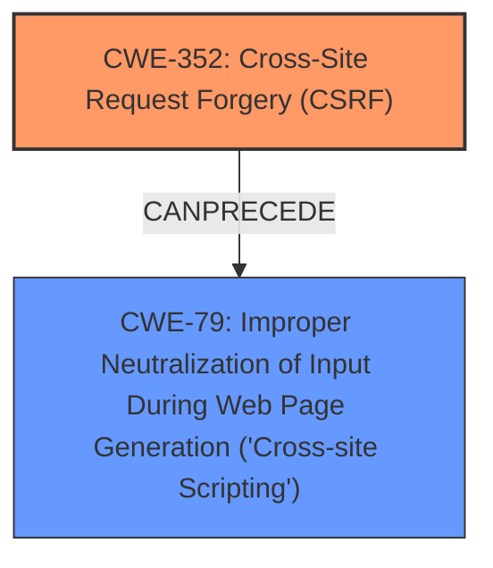

# Raw Analyzer Response for CVE-2024-53750

# Summary
| CWE ID | CWE Name | Confidence | CWE Abstraction Level | CWE Vulnerability Mapping Label | CWE-Vulnerability Mapping Notes |
|---|---|---|---|---|---|
| CWE-352 | Cross-Site Request Forgery (CSRF) | 1.0 | Compound | ROOTCAUSE | Allowed |
| CWE-79 | Improper Neutralization of Input During Web Page Generation ('Cross-site Scripting') | 1.0 | Base | WEAKNESS | Allowed |

## Evidence and Confidence

*   **Confidence Score:** 1.0
*   **Evidence Strength:** HIGH

## Relationship Analysis
The primary weakness is **CWE-352: Cross-Site Request Forgery (CSRF)**, which allows an attacker to induce users into performing actions they do not intend to. The secondary weakness is **CWE-79: Improper Neutralization of Input During Web Page Generation ('Cross-site Scripting')**, where the application does not properly neutralize user-controllable input before placing it in output that is used as a web page. These weaknesses are related in that a successful CSRF attack can be used to inject malicious scripts into the application, leading to XSS. There are no direct parent-child relationships but the Retriever Results show that CWE-79 can follow CWE-494 (Download of Code Without Integrity Check).

## Vulnerability Chain
The vulnerability chain begins with the **lack of CSRF protection** (**CWE-352**), which allows an attacker to perform actions on behalf of a user. This can lead to **Stored XSS** (**CWE-79**), where malicious scripts are injected into the application and executed by other users.

## Summary of Analysis
The vulnerability description clearly states that there is a Cross-Site Request Forgery (CSRF) vulnerability that leads to Stored XSS. The root cause is the **lack of CSRF protection**, which is best represented by **CWE-352: Cross-Site Request Forgery (CSRF)**. The resulting weakness is Stored XSS, which is best represented by **CWE-79: Improper Neutralization of Input During Web Page Generation ('Cross-site Scripting')**.

The Retriever Results also indicate that CWE-352 is the most relevant CWE for the 'lack of CSRF protection', 'XSS' and 'cross-site scripting' keyphrases. CWE-79 is also highly relevant for the 'XSS', 'cross-site scripting' and 'Stored XSS' keyphrases.

The selection of **CWE-352** and **CWE-79** is at the optimal level of specificity, as they directly represent the root cause and the resulting weakness, respectively.

CWEs considered but not used:

*   **CWE-434: Unrestricted Upload of File with Dangerous Type**: While this CWE is present in the Retriever Results, it is not relevant to the vulnerability description, which focuses on CSRF leading to XSS, not file uploads.
*   **CWE-116: Improper Encoding or Escaping of Output**: This CWE is present in the Retriever Results but is not as accurate as CWE-79 since the problem is not with encoding or escaping, but with the **improper neutralization** of the input.
*   **CWE-80: Improper Neutralization of Script-Related HTML Tags in a Web Page (Basic XSS)**: This CWE is a variant of CWE-79 and applies when specific HTML tags are not neutralized. Because the description does not specify what script-related HTML tags are not neutralized, it is more accurate to pick CWE-79 as a base class.
*   **CWE-1004: Sensitive Cookie Without 'HttpOnly' Flag**: Although this could be a contributing factor, it is not the primary cause of the vulnerability described.
*   **CWE-22: Improper Limitation of a Pathname to a Restricted Directory ('Path Traversal')**: This CWE is not relevant to the vulnerability description, which focuses on CSRF leading to XSS.
*   **CWE-89: Improper Neutralization of Special Elements used in an SQL Command ('SQL Injection')**: This CWE is not relevant to the vulnerability description, which focuses on CSRF leading to XSS.
*   **CWE-1315: Improper Setting of Bus Controlling Capability in Fabric End-point**: This CWE is not relevant to the vulnerability description.
*   **CWE-771: Missing Reference to Active Allocated Resource**: This CWE is not relevant to the vulnerability description.