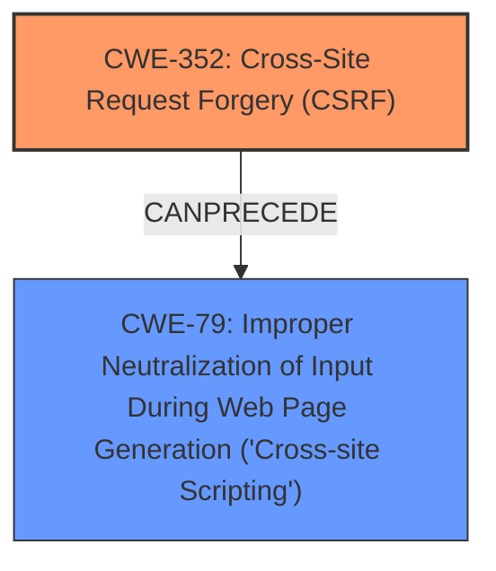

# Enhanced Analysis for CVE-2024-53765

# Summary
| CWE ID  | CWE Name                                                                  | Confidence | CWE Abstraction Level | CWE Vulnerability Mapping Label | CWE-Vulnerability Mapping Notes |
| :-------- | :------------------------------------------------------------------------ | :--------- | :-------------------- | :------------------------------ | :------------------------------ |
| CWE-352 | Cross-Site Request Forgery (CSRF)                                       | 1.0        | Compound              | Primary                         | Allowed                         |
| CWE-79  | Improper Neutralization of Input During Web Page Generation ('Cross-site Scripting') | 1.0        | Base                  | Secondary                       | Allowed                         |

## Evidence and Confidence

*   **Confidence Score:** 1.0
*   **Evidence Strength:** HIGH

## Relationship Analysis
The primary relationship is that the **lack of CSRF protection** (CWE-352) allows for **XSS** (CWE-79). CWE-352 is a compound weakness, reflecting the multiple conditions required for CSRF to occur. CWE-79 is the resulting impact due to the improper neutralization of input.



## Vulnerability Chain
The chain starts with the **lack of CSRF protection** (CWE-352). Because there is no CSRF protection, an attacker can trick a user into performing actions they did not intend to, such as submitting malicious input. This leads to Stored **XSS** (CWE-79) because the application does not properly neutralize the user-controllable input before placing it in the output.

## Summary of Analysis
The vulnerability description clearly states the presence of a Cross-Site Request Forgery (CSRF) vulnerability that leads to Stored **XSS**. The primary root cause is the **lack of CSRF protection**, which is best represented by CWE-352. The **XSS** vulnerability is a secondary weakness resulting from the **lack of input neutralization**, mapped to CWE-79.

The evidence for CWE-352 is the explicit mention of "Cross-Site Request Forgery (CSRF) vulnerability" and the **lack of CSRF protection**.

The evidence for CWE-79 is the presence of "Stored **XSS**" and the description implying that the application doesn't neutralize user input, which is then displayed on a web page.

CWE-80 (Improper Neutralization of Script-Related HTML Tags in a Web Page (Basic XSS)) was considered, but CWE-79 is a more general and appropriate fit since the description doesn't specify the neutralization failure to be specific to HTML tags.

CWE-116 (Improper Encoding or Escaping of Output) was considered, but CWE-79 is a better fit because the core issue is the improper neutralization of input before being placed in a web page, not necessarily a general encoding/escaping problem.


## CWE Relationship Analysis

Current CWEs represent these abstraction levels: .


### Vulnerability Chain Analysis

**Chain starting from CWE-352:**
- 352 (Cross-Site Request Forgery (CSRF)) - ROOT


**Chain starting from CWE-79:**
- 79 (Improper Neutralization of Input During Web Page Generation ('Cross-site Scripting')) - ROOT


### CWE Relationship Diagram

```mermaid
graph TD
    classDef primary fill:#f96,stroke:#333,stroke-width:2px
    classDef secondary fill:#69f,stroke:#333
    classDef tertiary fill:#9e9,stroke:#333
```