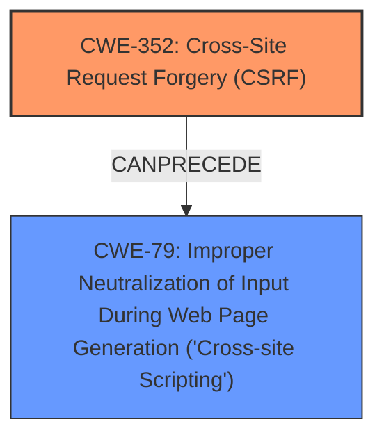

# Enhanced Analysis for CVE-2024-53777

# Summary
| CWE ID | CWE Name | Confidence | CWE Abstraction Level | CWE Vulnerability Mapping Label | CWE-Vulnerability Mapping Notes |
|---|---|---|---|---|---|
| CWE-352 | Cross-Site Request Forgery (CSRF) | 0.9 | Compound | Primary | Allowed |
| CWE-79 | Improper Neutralization of Input During Web Page Generation ('Cross-site Scripting') | 0.9 | Base | Secondary | Allowed |

## Evidence and Confidence

*   **Confidence Score:** 0.9
*   **Evidence Strength:** HIGH

## Relationship Analysis
The primary weakness is **CWE-352**, Cross-Site Request Forgery (CSRF), which allows an attacker to perform actions on behalf of an authenticated user. The secondary weakness is **CWE-79**, Improper Neutralization of Input During Web Page Generation ('Cross-site Scripting'), which results from the lack of CSRF protection and enables stored XSS. There is a potential chain where **CWE-352** can lead to **CWE-79** if the forged request injects malicious script into the web page. Both CWEs are at appropriate abstraction levels. **CWE-79** is a Base level weakness and **CWE-352** is a Compound level weakness.



## Vulnerability Chain
1.  **Root Cause:** **CWE-352** (Cross-Site Request Forgery) - The plugin lacks sufficient CSRF protection.
2.  **Weakness:** The lack of CSRF protection allows an attacker to forge requests.
3.  **Impact:** The forged requests can be used to inject malicious scripts into the web page, leading to **CWE-79** (Improper Neutralization of Input During Web Page Generation ('Cross-site Scripting')) and Stored XSS.

## Summary of Analysis
The analysis is based on the provided vulnerability description and CVE reference links. The primary root cause is the lack of CSRF protection (**CWE-352**), which enables an attacker to perform actions on behalf of an authenticated user. This can then lead to the injection of malicious scripts and Stored XSS (**CWE-79**).

Evidence:
*   "**Cross-Site Request Forgery** (CSRF) vulnerability in Alberto Reineri Simple Header and Footer allows Stored **XSS**."
*   "The WordPress Simple Header and Footer plugin (versions <= 1.0.0) is vulnerable to Cross-Site Request Forgery (CSRF)."
*   "The plugin lacks sufficient CSRF protection, allowing malicious actors to forge requests on behalf of authenticated users."
*   "An attacker can force a higher privileged user to execute unwanted actions under their current authentication."

The graph relationships highlight the chain of events, where **CWE-352** can precede and lead to **CWE-79**. The selected CWEs are at the optimal level of specificity, with **CWE-352** as a Compound weakness and **CWE-79** as a Base weakness.

Other CWEs considered but not used:
*   **CWE-89**: Improper Neutralization of Special Elements used in an SQL Command ('SQL Injection') - While injection is a possibility, the specific vulnerability description focuses on XSS, not SQL injection.
*   **CWE-113**: Improper Neutralization of CRLF Sequences in HTTP Headers ('HTTP Request/Response Splitting') - Not relevant to the described vulnerability.
*   **CWE-918**: Server-Side Request Forgery (SSRF) - Not relevant as the attack is client-side.
*   **CWE-80**: Improper Neutralization of Script-Related HTML Tags in a Web Page (Basic XSS) - **CWE-79** is more general and accurately describes the weakness.
*   **CWE-425**: Direct Request ('Forced Browsing') - Not relevant as the vulnerability involves forging requests, not directly accessing restricted resources.
*   **CWE-434**: Unrestricted Upload of File with Dangerous Type - Not relevant as the vulnerability involves script injection, not file uploads.
*   **CWE-184**: Incomplete List of Disallowed Inputs - While input validation might be a factor, the core issue is the lack of CSRF protection and subsequent XSS.


## CWE Relationship Analysis

Current CWEs represent these abstraction levels: .


### Vulnerability Chain Analysis

**Chain starting from CWE-89:**
- 89 (Improper Neutralization of Special Elements used in an SQL Command ('SQL Injection')) - ROOT


**Chain starting from CWE-80:**
- 80 (Improper Neutralization of Script-Related HTML Tags in a Web Page (Basic XSS)) - ROOT


### CWE Relationship Diagram

```mermaid
graph TD
    classDef primary fill:#f96,stroke:#333,stroke-width:2px
    classDef secondary fill:#69f,stroke:#333
    classDef tertiary fill:#9e9,stroke:#333
```