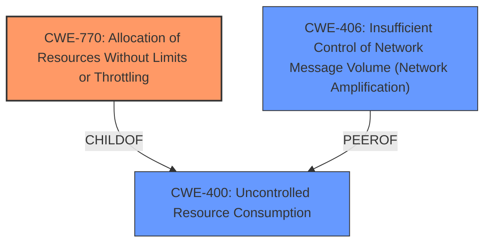

# Analysis Report for CVE-2024-53827

# Vulnerability Analysis Report: CVE-2024-53827

## Description

Ericsson Packet Core Controller (PCC) contains a vulnerability where an attacker sending a large volume of specially crafted messages may cause service degradation

## Vulnerability Description Key Phrases

- **Impact:** service degradation
- **Vector:** large volume of specially crafted messages
- **Attacker:** attacker
- **Product:** Ericsson Packet Core Controller (PCC)

## Analysis (with Relationship Data)

# Summary

| CWE ID | CWE Name | Confidence | CWE Abstraction Level | CWE Vulnerability Mapping Label | CWE-Vulnerability Mapping Notes |
|---|---|---|---|---|---|
| CWE-770 | Allocation of Resources Without Limits or Throttling | 0.8 | Base | Allowed | Primary CWE |
| CWE-400 | Uncontrolled Resource Consumption | 0.6 | Class | Discouraged | Secondary Candidate |
| CWE-406 | Insufficient Control of Network Message Volume (Network Amplification) | 0.6 | Class | Allowed-with-Review | Secondary Candidate |

## Evidence and Confidence

*   **Confidence Score:** 0.7
*   **Evidence Strength:** MEDIUM

## Relationship Analysis

The primary CWE selected is CWE-770, which is a base-level CWE. It has a parent-child relationship with CWE-400, which is a class-level CWE. CWE-770 is more specific than CWE-400 and thus is a better choice. CWE-770 also has a parent relationship to CWE-789 (Memory Allocation with Excessive Size Value) and CWE-774 (Allocation of Resources Without Limits).



## Vulnerability Chain

The vulnerability chain starts with the **uncontrolled allocation of resources (CWE-770)**, leading to **uncontrolled resource consumption (CWE-400)** and potentially causing service degradation.

## Summary of Analysis

The vulnerability description states that an attacker sending a **large volume of specially crafted messages** may cause service degradation in Ericsson Packet Core Controller (PCC). This suggests a lack of limits or throttling on resource allocation. The description directly implies that the system is allocating resources without proper controls, leading to potential exhaustion or degradation.

CWE-770 (Allocation of Resources Without Limits or Throttling) is selected as the primary CWE because it directly addresses the **root cause** of the vulnerability. The vulnerability occurs because the system **allocates resources without limits or throttling**. This aligns perfectly with the description of CWE-770.

CWE-400 (Uncontrolled Resource Consumption) is considered as a secondary CWE because it is a consequence of the **uncontrolled allocation of resources**. However, it is a more general CWE and less specific than CWE-770.

CWE-406 (Insufficient Control of Network Message Volume (Network Amplification)) is another secondary candidate. The vulnerability specifically mentions a "**large volume of specially crafted messages**", indicating that the network message volume is not being sufficiently controlled, but CWE-770 is a better fit describing the root cause.

The final selection is based on the evidence provided in the vulnerability description, the retriever results, and the CWE specifications. The graph relationships confirm the connection between the chosen CWEs. The selected CWEs are at the optimal level of specificity, with CWE-770 providing the most accurate representation of the **root cause** of the vulnerability.

Relevant CWE Information:

# Enhanced Context (25 CWEs)
The following CWEs were identified as potentially relevant to this vulnerability:

## CWE-696: Incorrect Behavior Order
**Abstraction Level**: Class
**Similarity Score**: 0.76
**Source**: dense

**Description**:
The product performs multiple related behaviors, but the behaviors are performed in the wrong order in ways which may produce resultant weaknesses.

**Mapping Guidance**:
- Usage: Allowed-with-Review
- Rationale: This CWE entry is a Class and might have Base-level children that would be more appropriate

*Not Selected*: This CWE does not fit the vulnerability description, as it focuses on incorrect behavior order rather than resource allocation issues.

## CWE-799: Improper Control of Interaction Frequency
**Abstraction Level**: Class
**Similarity Score**: 0.75
**Source**: dense

**Description**:
The product does not properly limit the number or frequency of interactions that it has with an actor, such as the number of incoming requests.

**Mapping Guidance**:
- Usage: Allowed-with-Review
- Rationale: This CWE entry is a Class and might have Base-level children that would be more appropriate

*Not Selected*: While related to the concept of limiting resource usage based on frequency, it is not as direct a match as CWE-770 or CWE-406.

## CWE-134: Use of Externally-Controlled Format String
**Abstraction Level**: Base
**Similarity Score**: 0.74
**Source**: dense

**Description**:
The product uses a function that accepts a format string as an argument, but the format string originates from an external source.

**Mapping Guidance**:
- Usage: Allowed
- Rationale: This CWE entry is at the Base level of abstraction, which is a preferred level of abstraction for mapping to the root causes of vulnerabilities.

*Not Selected*: This CWE is not relevant, as it relates to format string vulnerabilities, not resource allocation.

## CWE-406: Insufficient Control of Network Message Volume (Network Amplification)
**Abstraction Level**: Class
**Similarity Score**: 0.74
**Source**: dense

**Description**:
The product does not sufficiently monitor or control transmitted network traffic volume, so that an actor can cause the product to transmit more traffic than should be allowed for that actor.

**Mapping Guidance**:
- Usage: Allowed-with-Review
- Rationale: This CWE entry is a Class and might have Base-level children that would be more appropriate

*Considered and Selected as Secondary*: This CWE is potentially relevant because the vulnerability involves a **large volume of messages**. However, the root cause is more accurately described by CWE-770.

## CWE-755: Improper Handling of Exceptional Conditions
**Abstraction Level**: Class
**Similarity Score**: 0.74
**Source**: dense

**Description**:
The product does not handle or incorrectly handles an exceptional condition.

**Mapping Guidance**:
- Usage: Discouraged
- Rationale: This CWE entry is a level-1 Class (i.e., a child of a Pillar). It might have lower-level children that would be more appropriate

*Not Selected*: This CWE is too general and doesn't directly relate to resource allocation issues.

## CWE-668: Exposure of Resource to Wrong Sphere
**Abstraction Level**: Class
**Similarity Score**: 0.73
**Source**: dense

**Description**:
The product exposes a resource to the wrong control sphere, providing unintended actors with inappropriate access to the resource.

**Mapping Guidance**:
- Usage: Discouraged
- Rationale: CWE-668 is high-level and is often misused as a catch-all when lower-level CWE IDs might be applicable. It is sometimes used for low-information vulnerability reports [REF-1287]. It is a level-1 Class (i.e., a child of a Pillar). It is not useful for trend analysis.

*Not Selected*: This CWE is not applicable, as it relates to access control issues, not resource allocation.

## CWE-703: Improper Check or Handling of Exceptional Conditions
**Abstraction Level**: Pillar
**Similarity Score**: 0.73
**Source**: dense

**Description**:
The product does not properly anticipate or handle exceptional conditions that rarely occur during normal operation of the product.

**Mapping Guidance**:
- Usage: Discouraged
- Rationale: This CWE entry is extremely high-level, a Pillar.

*Not Selected*: This CWE is too general and does not provide specific information about the vulnerability.

## CWE-346: Origin Validation Error
**Abstraction Level**: Class
**Similarity Score**: 0.73
**Source**: dense

**Description**:
The product does not properly verify that the source of data or communication is valid.

**Mapping Guidance**:
- Usage: Allowed-with-Review
- Rationale: This CWE entry is a Class and might have Base-level children that would be more appropriate

*Not Selected*: This CWE is not relevant, as the vulnerability doesn't focus on origin validation.

## CWE-131: Incorrect Calculation of Buffer Size
**Abstraction Level**: Base
**Similarity Score**: 0.73
**Source**: dense

**Description**:
The product does not correctly calculate the size to be used when allocating a buffer, which could lead to a buffer overflow.

**Mapping Guidance**:
- Usage: Allowed
- Rationale: This CWE entry is at the Base level of abstraction, which is a preferred level of abstraction for mapping to the root causes of vulnerabilities.

*Not Selected*: While it involves resource allocation, it is specific to buffer sizes and doesn


## CWE Relationship Analysis

Current CWEs represent these abstraction levels: .


### Vulnerability Chain Analysis

**Chain starting from CWE-400:**
- 400 (Uncontrolled Resource Consumption) - ROOT


**Chain starting from CWE-770:**
- 770 (Allocation of Resources Without Limits or Throttling) - ROOT


### CWE Relationship Diagram

```mermaid
graph TD
    classDef primary fill:#f96,stroke:#333,stroke-width:2px
    classDef secondary fill:#69f,stroke:#333
    classDef tertiary fill:#9e9,stroke:#333
```


*Report generated on 2025-07-13 22:15:54*
