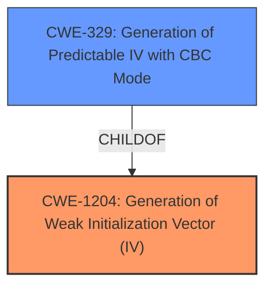

# Analysis Report for CVE-2024-53845

# Vulnerability Analysis Report: CVE-2024-53845

## Description

ESPTouch is a connection protocol for internet of things devices. In the ESPTouchV2 protocol, while there is an option to use a custom AES key, there is no option to set the IV (Initialization Vector) prior to versions 5.3.2, 5.2.4, 5.1.6, and 5.0.8. The IV is set to zero and remains constant throughout the products lifetime. In AES/CBC mode, if the IV is not properly initialized, the encrypted output becomes deterministic, leading to potential data leakage. To address the aforementioned issues, the application generates a random IV when activating the AES key starting in versions 5.3.2, 5.2.4, 5.1.6, and 5.0.8. This IV is then transmitted along with the provision data to the provision device. The provision device has also been equipped with a parser for the AES IV. The upgrade is applicable for all applications and users of ESPTouch v2 component from ESP-IDF. As it is implemented in the ESP Wi-Fi stack, there is no workaround for the user to fix the application layer without upgrading the underlying firmware.

## Vulnerability Description Key Phrases

- **Rootcause:** The IV (Initialization Vector) is set to zero and remains constant throughout the products lifetime
- **Impact:** encrypted output becomes deterministic, leading to potential data leakage
- **Product:** ESPTouchV2 protocol
- **Version:** prior to versions 5.3.2, 5.2.4, 5.1.6, and 5.0.8

## Analysis (with Relationship Data)

# Summary
| CWE ID    | CWE Name                                                                                                                                     | Confidence | CWE Abstraction Level | CWE Vulnerability Mapping Label | CWE-Vulnerability Mapping Notes |
| :--------- | :------------------------------------------------------------------------------------------------------------------------------------------- | :--------- | :---------------------- | :------------------------------ | :------------------------------ |
| CWE-1204 | Generation of Weak Initialization Vector (IV)                                                                                              | 1          | Base                    | Primary                         | Allowed                         |
| CWE-329 | Generation of Predictable IV with CBC Mode                                                                                                 | 0.8          | Variant                 | Secondary                       | Allowed                         |

## Evidence and Confidence

*   **Confidence Score:** 0.9
*   **Evidence Strength:** HIGH

## Relationship Analysis
The primary relationship influencing the selection is that CWE-329 is a variant of CWE-1204, providing a more specific description of the vulnerability when using CBC mode. CWE-1204 is the more general case and represents the root cause, while CWE-329 is a specific instantiation of that root cause. The hierarchical relationship (CWE-329 ChildOf CWE-1204) guides the selection of the more specific CWE-329 when the details support it.



## Vulnerability Chain
The vulnerability chain starts with the **generation of a weak IV (CWE-1204)**, which leads to a specific instance in CBC mode (**CWE-329**). The impact of this is deterministic encrypted output, potentially resulting in data leakage.

## Summary of Analysis
The analysis is based on the provided vulnerability description and the CVE reference links. The vulnerability lies in the **lack of proper initialization of the Initialization Vector (IV)** in the ESPTouchV2 protocol. The **IV is set to zero and remains constant**, which leads to predictable encrypted output when using AES/CBC mode.

The primary CWE selected is CWE-1204: Generation of Weak Initialization Vector (IV), as this accurately represents the **root cause** of the vulnerability. The IV is not sufficiently unpredictable or unique.

CWE-329: Generation of Predictable IV with CBC Mode is considered as a secondary CWE because the vulnerability description specifically mentions the use of AES/CBC mode, making this a relevant variant.

The selection of CWE-1204 as the primary CWE and CWE-329 as a secondary CWE is based on the evidence from the vulnerability description, the CVE reference links, and the hierarchical relationship between the CWEs.

Relevant CWE Information:

# Enhanced Context (25 CWEs)
The following CWEs were identified as potentially relevant to this vulnerability:

## CWE-1204: Generation of Weak Initialization Vector (IV)
**Abstraction Level**: Base
**Similarity Score**: 0.79
**Source**: dense

**Description**:
The product uses a cryptographic primitive that uses an Initialization
			Vector (IV), but the product does not generate IVs that are
			sufficiently unpredictable or unique according to the expected
			cryptographic requirements for that primitive.
			

**Mapping Guidance**:
- Usage: Allowed
- Rationale: This CWE entry is at the Base level of abstraction, which is a preferred level of abstraction for mapping to the root causes of vulnerabilities.


## CWE-1391: Use of Weak Credentials
**Abstraction Level**: Class
**Similarity Score**: 0.72
**Source**: dense

**Description**:
The product uses weak credentials (such as a default key or hard-coded password) that can be calculated, derived, reused, or guessed by an attacker.

**Mapping Guidance**:
- Usage: Allowed-with-Review
- Rationale: This CWE entry is a Class and might have Base-level children that would be more appropriate


## CWE-203: Observable Discrepancy
**Abstraction Level**: Base
**Similarity Score**: 0.72
**Source**: dense

**Description**:
The product behaves differently or sends different responses under different circumstances in a way that is observable to an unauthorized actor, which exposes security-relevant information about the state of the product, such as whether a particular operation was successful or not.

**Mapping Guidance**:
- Usage: Allowed
- Rationale: This CWE entry is at the Base level of abstraction, which is a preferred level of abstraction for mapping to the root causes of vulnerabilities.


## CWE-319: Cleartext Transmission of Sensitive Information
**Abstraction Level**: Base
**Similarity Score**: 0.71
**Source**: dense

**Description**:
The product transmits sensitive or security-critical data in cleartext in a communication channel that can be sniffed by unauthorized actors.

**Mapping Guidance**:
- Usage: Allowed
- Rationale: This CWE entry is at the Base level of abstraction, which is a preferred level of abstraction for mapping to the root causes of vulnerabilities.


## CWE-330: Use of Insufficiently Random Values
**Abstraction Level**: Class
**Similarity Score**: 0.71
**Source**: dense

**Description**:
The product uses insufficiently random numbers or values in a security context that depends on unpredictable numbers.

**Mapping Guidance**:
- Usage: Discouraged
- Rationale: This CWE entry is a level-1 Class (i.e., a child of a Pillar). It might have lower-level children that would be more appropriate


## CWE-1188: Initialization of a Resource with an Insecure Default
**Abstraction Level**: Base
**Similarity Score**: 0.71
**Source**: dense

**Description**:
The product initializes or sets a resource with a default that is intended to be changed by the administrator, but the default is not secure.

**Mapping Guidance**:
- Usage: Allowed
- Rationale: This CWE entry is at the Base level of abstraction, which is a preferred level of abstraction for mapping to the root causes of vulnerabilities.


## CWE-824: Access of Uninitialized Pointer
**Abstraction Level**: Base
**Similarity Score**: 0.70
**Source**: dense

**Description**:
The product accesses or uses a pointer that has not been initialized.

**Mapping Guidance**:
- Usage: Allowed
- Rationale: This CWE entry is at the Base level of abstraction, which is a preferred level of abstraction for mapping to the root causes of vulnerabilities.


## CWE-294: Authentication Bypass by Capture-replay
**Abstraction Level**: Base
**Similarity Score**: 0.70
**Source**: dense

**Description**:
A capture-replay flaw exists when the design of the product makes it possible for a malicious user to sniff network traffic and bypass authentication by replaying it to the server in question to the same effect as the original message (or with minor changes).

**Mapping Guidance**:
- Usage: Allowed
- Rationale: This CWE entry is at the Base level of abstraction, which is a preferred level of abstraction for mapping to the root causes of vulnerabilities.


## CWE-329: Generation of Predictable IV with CBC Mode
**Abstraction Level**: Variant
**Similarity Score**: 0.70
**Source**: dense

**Description**:
The product generates and uses a predictable initialization Vector (IV) with Cipher Block Chaining (CBC) Mode, which causes algorithms to be susceptible to dictionary attacks when they are encrypted under the same key.

**Mapping Guidance**:
- Usage: Allowed
- Rationale: This CWE entry is at the Variant level of abstraction, which is a preferred level of abstraction for mapping to the root causes of vulnerabilities.


## CWE-755: Improper Handling of Exceptional Conditions
**Abstraction Level**: Class
**Similarity Score**: 0.70
**Source**: dense

**Description**:
The product does not handle or incorrectly handles an exceptional condition.

**Mapping Guidance**:
- Usage: Discouraged
- Rationale: This CWE entry is a level-1 Class (i.e., a child of a Pillar). It might have lower-level children that would be more appropriate


## CWE-1204: Generation of Weak Initialization Vector (IV)
**Abstraction Level**: Base
**Similarity Score**: 1443.00
**Source**: sparse

**Description**:
The product uses a cryptographic primitive that uses an Initialization
			Vector (IV), but the product does not generate IVs that are
			sufficiently unpredictable or unique according to the expected
			cryptographic requirements for that primitive.
			

**Mapping Guidance**:
- Usage: Allowed
- Rationale: This CWE entry is at the Base level of abstraction, which is a preferred level of abstraction for mapping to the root causes of vulnerabilities.


## CWE-329: Generation of Predictable IV with CBC Mode
**Abstraction Level**: Variant
**Similarity Score**: 1280.44
**Source**: sparse

**Description**:
The product generates and uses a predictable initialization Vector (IV) with Cipher Block Ch


## CWE Relationship Analysis

Current CWEs represent these abstraction levels: .


### Vulnerability Chain Analysis

**Chain starting from CWE-203:**
- 203 (Observable Discrepancy) - ROOT


**Chain starting from CWE-330:**
- 330 (Use of Insufficiently Random Values) - ROOT


### CWE Relationship Diagram

```mermaid
graph TD
    classDef primary fill:#f96,stroke:#333,stroke-width:2px
    classDef secondary fill:#69f,stroke:#333
    classDef tertiary fill:#9e9,stroke:#333
```


*Report generated on 2025-07-13 22:17:07*
