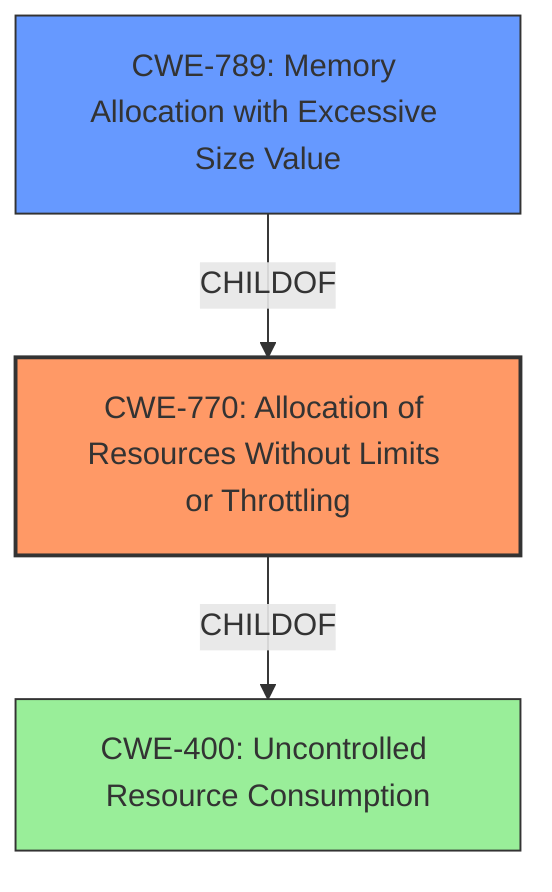

# Analysis Report for CVE-2024-53857

# Vulnerability Analysis Report: CVE-2024-53857

## Description

rPGP is a pure Rust implementation of OpenPGP. Prior to 0.14.1, rPGP allows attackers to trigger **resource exhaustion vulnerabilities** in rpgp by providing crafted messages. This affects general message parsing and decryption with symmetric keys.

## Vulnerability Description Key Phrases

- **Weakness:** resource exhaustion vulnerabilities
- **Vector:** crafted messages
- **Attacker:** attackers
- **Product:** rPGP
- **Version:** Prior to 0.14.1

## Analysis (with Relationship Data)

# Summary
| CWE ID | CWE Name | Confidence | CWE Abstraction Level | CWE Vulnerability Mapping Label | CWE-Vulnerability Mapping Notes |
|---|---|---|---|---|---|
| CWE-770 | Allocation of Resources Without Limits or Throttling | 0.9 | Base | Allowed | Primary CWE |
| CWE-789 | Memory Allocation with Excessive Size Value | 0.7 | Variant | Allowed | Secondary Candidate |
| CWE-400 | Uncontrolled Resource Consumption | 0.5 | Class | Discouraged | Secondary Candidate |

## Evidence and Confidence

*   **Confidence Score:** 0.8
*   **Evidence Strength:** HIGH

## Relationship Analysis
The primary CWE selected is CWE-770 (Allocation of Resources Without Limits or Throttling), which is a Base level CWE. CWE-789 (Memory Allocation with Excessive Size Value) is a Variant of CWE-770 and was also considered because the vulnerability involves memory allocation with large size values. However, CWE-770 is a more general case that includes other types of resource allocation and is therefore a better fit as the primary CWE. CWE-400 (Uncontrolled Resource Consumption) is a parent Class of CWE-770, but it's less specific and the mapping guidance discourages its use.



## Vulnerability Chain
The vulnerability chain starts with the **improper handling of OpenPGP packets**, specifically the **lack of limits or throttling on resource allocation**. This leads to **excessive memory allocation**, which in turn causes **resource exhaustion** and a **denial of service**.
- Root Cause: **Allocation of Resources Without Limits or Throttling (CWE-770)**
- Resulting Weakness: **Memory Allocation with Excessive Size Value (CWE-789)**
- Impact: Resource exhaustion, Denial of Service

## Summary of Analysis
The primary weakness is the **uncontrolled allocation of resources** when parsing OpenPGP packets. The **root cause** is the **lack of limits or throttling on resource allocation (CWE-770)**. The evidence includes:
- "Insufficient upper limits on the total reserved amount of memory when parsing long sequences of partial OpenPGP packets."
- "Excessive memory allocation for fixed-size OpenPGP packets with large length fields, even if less data is received."
- "Lack of restrictions on Argon2 parameters within the `Symmetric Key Encrypted Session Key` (SKESK) packet processing."

CWE-770 accurately captures this **root cause**. CWE-789 is a more specific case related to memory allocation, and while relevant, it doesn't fully encompass the broader issue of resource allocation without limits. CWE-400 is too general and is discouraged for this type of vulnerability.

The hierarchical relationships influenced the selection by guiding the choice towards the most specific and relevant CWE. CWE-770 is at the Base level and accurately describes the weakness, making it a better choice than its parent Class CWE-400.

# Relevant CWE Information:

## Vulnerability Description
rPGP is a pure Rust implementation of OpenPGP. Prior to 0.14.1, rPGP allows attackers to trigger **resource exhaustion vulnerabilities** in rpgp by providing crafted messages. This affects general message parsing and decryption with symmetric keys.

### Vulnerability Description Key Phrases
- **weakness:** **resource exhaustion vulnerabilities**
- **vector:** crafted messages
- **attacker:** attackers
- **product:** rPGP
- **version:** Prior to 0.14.1

## CVE Reference Links Content Summary
- **Root cause of vulnerability:**
  - Insufficient upper limits on the total reserved amount of memory when parsing long sequences of partial OpenPGP packets.
  - Excessive memory allocation for fixed-size OpenPGP packets with large length fields, even if less data is received.
  - Lack of restrictions on Argon2 parameters within the `Symmetric Key Encrypted Session Key` (SKESK) packet processing.
- **Weaknesses/vulnerabilities present:**
  - Resource exhaustion due to excessive memory allocation.
  - Denial of service (DoS) due to memory exhaustion.
  - Potential system instability due to memory exhaustion.
  - Long processing times due to excessive Argon2 computations.
- **Impact of exploitation:**
  - Out-of-memory conditions leading to program crashes.
  - System instability due to memory resource exhaustion.
  - Program unresponsiveness due to long computations.
- **Attack vectors:**
  - Network-based attack where an attacker sends crafted OpenPGP messages.
- **Required attacker capabilities/position:**
  - The attacker needs to be able to send crafted OpenPGP messages to a victim.
  - The attacker does not need knowledge of the symmetric secret used by the victim for the Argon2-based attack.

The provided content offers more detail than the basic CVE description by specifying the root causes, the vulnerable components (message parsing, symmetric key decryption with Argon2), and the different attack vectors.

## Retriever Results

### Top Combined Results

| Rank | CWE ID | Name | Abstraction | Usage  | Retrievers | Individual Scores |
|------|--------|------|-------------|-------|------------|-------------------|
| 1 | 400 | Uncontrolled Resource Consumption | Class | Discouraged | alternate_terms | 0.800 |
| 2 | 770 | Allocation of Resources Without Limits or Throttling | Base | Allowed | sparse | 0.212 |
| 3 | 789 | Memory Allocation with Excessive Size Value | Variant | Allowed | sparse | 0.206 |
| 4 | 1284 | Improper Validation of Specified Quantity in Input | Base | Allowed | sparse | 0.192 |
| 5 | 674 | Uncontrolled Recursion | Class | Allowed-with-Review | sparse | 0.191 |
| 6 | 401 | Missing Release of Memory after Effective Lifetime | Variant | Allowed | sparse | 0.186 |
| 7 | 835 | Loop with Unreachable Exit Condition ('Infinite Loop') | Base | Allowed | sparse | 0.175 |
| 8 | 203 | Observable Discrepancy | Base | Allowed | sparse | 0.174 |
| 9 | 335 | Incorrect Usage of Seeds in Pseudo-Random Number Generator (PRNG) | Base | Allowed | dense | 0.443 |
| 10 | 476 | NULL Pointer Dereference | Base | Allowed | graph | 0.002 |

# Complete CWE Specifications

CWE-400: Uncontrolled Resource Consumption
CWE-770: Allocation of Resources Without Limits or Throttling
CWE-789: Memory Allocation with Excessive Size Value
CWE-1284: Improper Validation of Specified Quantity in Input
CWE-674: Uncontrolled Recursion
CWE-401: Missing Release of Memory after Effective Lifetime
CWE-835: Loop with Unreachable Exit Condition ('Infinite Loop')
CWE-203: Observable Discrepancy
CWE-335: Incorrect Usage of Seeds in Pseudo-Random Number Generator (PRNG)
CWE-476: NULL Pointer Dereference

## CWE Details and Justifications

*   **CWE-770: Allocation of Resources Without Limits or Throttling**
    *   Technical Explanation: The application allocates resources without properly limiting the quantity or size, which allows an attacker to exhaust available resources. The vulnerability description states, "Insufficient upper limits on the total reserved amount of memory when parsing long sequences of partial OpenPGP packets," indicating a **lack of limits**.
    *   Security Implications: An attacker can cause a denial of service by exhausting system resources, leading to program crashes or unresponsiveness.
    *   Relationship: This is the **root cause** of the vulnerability, leading to resource exhaustion. CWE-770 is a parent of CWE-789.
    *   Mapping Guidance: Usage: Allowed. The CWE is at the Base level of abstraction.
    *   Confidence: 0.9
*   **CWE-789: Memory Allocation with Excessive Size Value**
    *   Technical Explanation: The application allocates memory based on an untrusted size value without validating that the size is within expected limits. The vulnerability description mentions "Excessive memory allocation for fixed-size OpenPGP packets with large


## CWE Relationship Analysis

Current CWEs represent these abstraction levels: .


### Vulnerability Chain Analysis

**Chain starting from CWE-1284:**
- 1284 (Improper Validation of Specified Quantity in Input) - ROOT


**Chain starting from CWE-400:**
- 400 (Uncontrolled Resource Consumption) - ROOT


### CWE Relationship Diagram

```mermaid
graph TD
    classDef primary fill:#f96,stroke:#333,stroke-width:2px
    classDef secondary fill:#69f,stroke:#333
    classDef tertiary fill:#9e9,stroke:#333
```


*Report generated on 2025-07-13 22:17:48*
