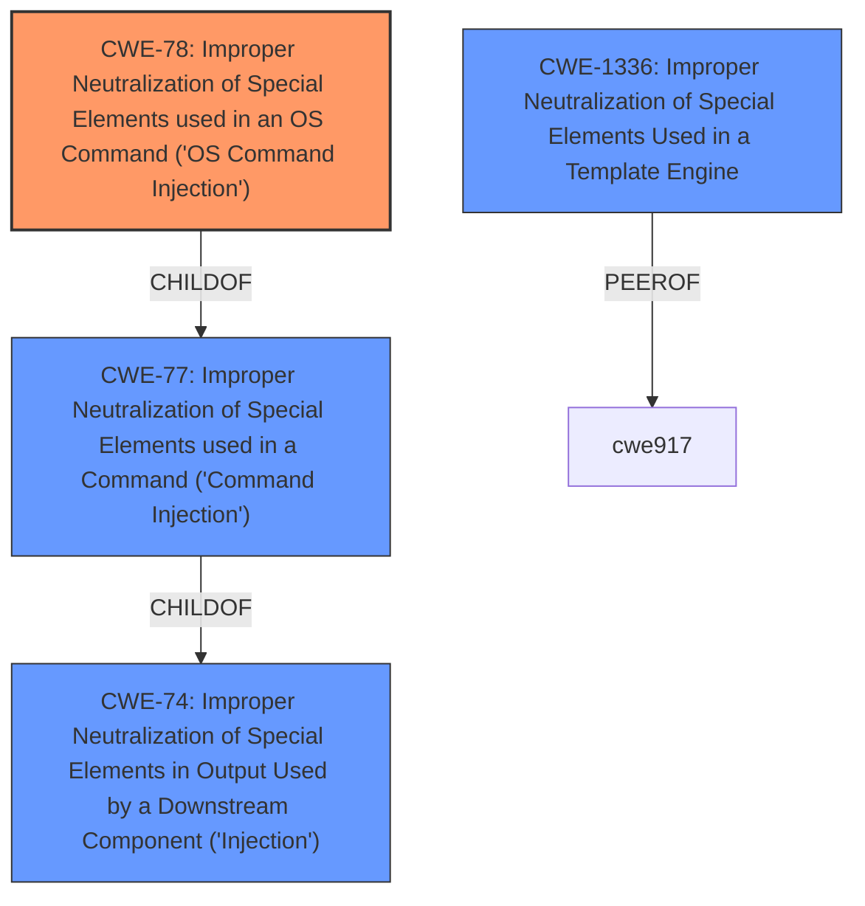

# Raw Analyzer Response for CVE-2024-53899

# Summary
| CWE ID | CWE Name | Confidence | CWE Abstraction Level | CWE Vulnerability Mapping Label | CWE-Vulnerability Mapping Notes |
|---|---|---|---|---|---|
| CWE-78 | Improper Neutralization of Special Elements used in an OS Command ('OS Command Injection') | 1.0 | Base | Primary CWE | Allowed |
| CWE-77 | Improper Neutralization of Special Elements used in a Command ('Command Injection') | 0.8 | Class | Secondary Candidate | Allowed-with-Review |
| CWE-1336 | Improper Neutralization of Special Elements Used in a Template Engine | 0.6 | Base | Secondary Candidate | Allowed |

## Evidence and Confidence

*   **Confidence Score:** 0.9
*   **Evidence Strength:** HIGH

## Relationship Analysis
The primary CWE selected is CWE-78, which is a Base level weakness and a child of the Class level CWE-77. The vulnerability involves injecting OS commands, making CWE-78 a more specific and accurate fit than its parent. CWE-1336 is related as it involves template injection, but the core issue is the execution of OS commands, not the template engine itself.

## Vulnerability Chain
The vulnerability chain starts with the **improper handling of template strings**, leading to **command injection** when a crafted virtual environment path is used. This results in the execution of arbitrary OS commands.

Template Injection -> **Improper Neutralization** -> OS Command Execution

The **Primary CWE** is **CWE-78: Improper Neutralization of Special Elements used in an OS Command ('OS Command Injection')**, which identifies the issue that led to the vulnerability.

## Summary of Analysis
The initial analysis identified several potential CWEs based on the vulnerability description. The key phrase "**command injection**" immediately suggests CWE-78 and CWE-77. Further analysis of the CVE reference content confirms that the root cause is the **improper neutralization** of special elements in OS commands.

The selection of CWE-78 is based on the following evidence:
*   The vulnerability description explicitly mentions "**command injection**".
*   The CVE reference content states that the root cause is the **improper handling of template strings** leading to the ability to inject and execute arbitrary shell commands.
*   The attack vector involves crafting a virtual environment path with malicious code and executing it via `source ./bin/activate`.

CWE-77 is a valid, but less specific, candidate, as it is a class-level CWE. CWE-1336 was considered due to the mention of template strings, but the core issue is the execution of OS commands, making CWE-78 a more accurate fit.

The final decision to select CWE-78 is based on the specificity of the weakness and the evidence from the vulnerability description and CVE reference content. The confidence score is high (0.9) due to the clear evidence supporting the mapping. The selected CWE is at the optimal level of specificity, providing a clear and accurate representation of the vulnerability.

Relevant CWE Information:
*   **CWE-78: Improper Neutralization of Special Elements used in an OS Command ('OS Command Injection')**
    *   This CWE describes a vulnerability where the product constructs an OS command using externally influenced input, but it does not neutralize or incorrectly neutralizes special elements. This perfectly matches the vulnerability description, where the virtualenv activation script uses a crafted environment path to execute arbitrary shell commands.
    *   The security implication is arbitrary code execution, allowing attackers to gain control of the system.
    *   CWE-78 is a child of CWE-77 (Improper Neutralization of Special Elements used in a Command ('Command Injection')), providing a hierarchical relationship.
    *   MITRE mapping guidance ALLOWS the usage of CWE-78.
*   **CWE-77: Improper Neutralization of Special Elements used in a Command ('Command Injection')**
    *   This CWE describes a vulnerability where the product constructs a command using externally influenced input, but it does not neutralize or incorrectly neutralizes special elements.
    *   The security implication is arbitrary code execution.
    *   CWE-77 is a parent of CWE-78, but less specific.
    *   MITRE mapping guidance ALLOWS the usage of CWE-77 with review.
*   **CWE-1336: Improper Neutralization of Special Elements Used in a Template Engine**
    *   This CWE describes a vulnerability where a product uses a template engine but does not neutralize special elements.
    *   While template strings are involved, the primary issue is the execution of OS commands, making this less relevant than CWE-78.
    *   MITRE mapping guidance ALLOWS the usage of CWE-1336.
*   **CWE-74: Improper Neutralization of Special Elements in Output Used by a Downstream Component ('Injection')**
    *   This CWE is a high-level class that is often misused when lower-level weaknesses are more appropriate. Since CWE-78 and CWE-77 are more specific, CWE-74 is not suitable.
    *   MITRE mapping guidance DISCOURAGES the usage of CWE-74.